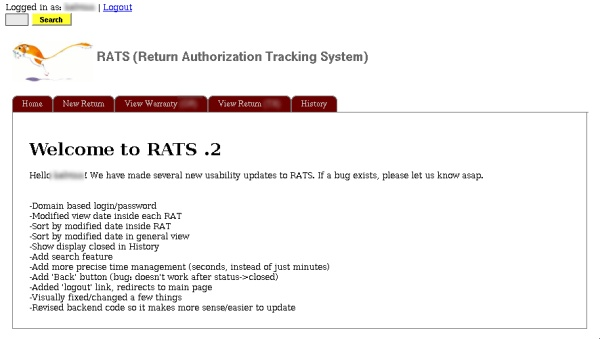
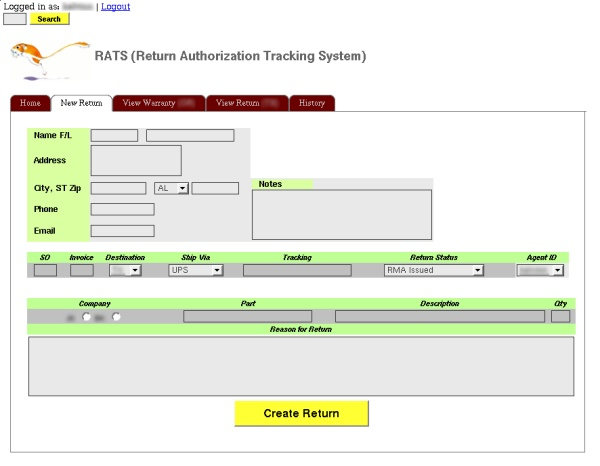
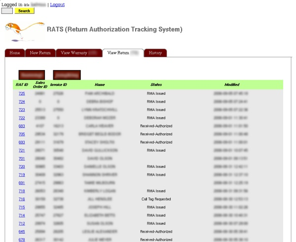
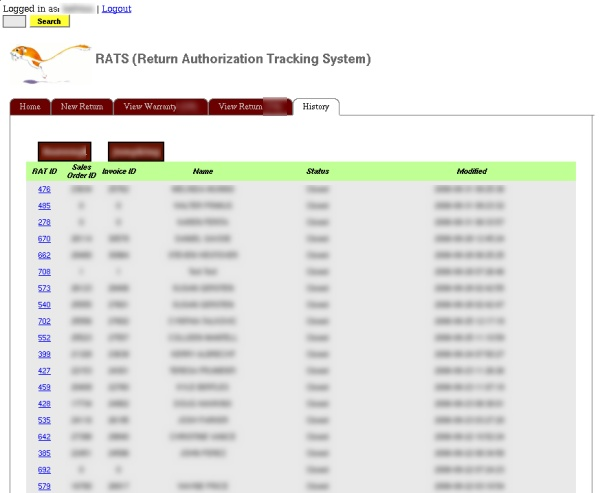
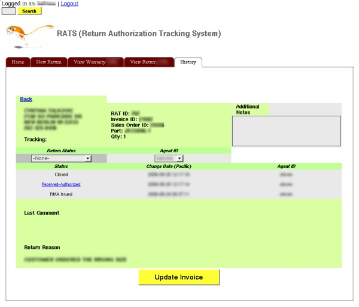
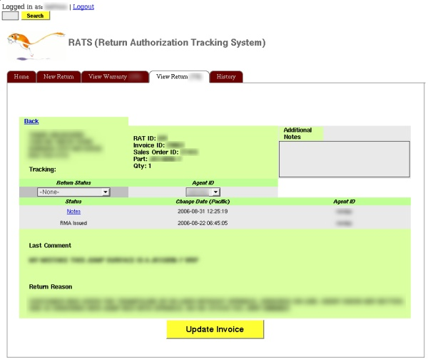

Status:  ✅ 
  
RATS, or Return Authorization Tracking System, is a way for us to handle RMAs.

The site uses modified TOES code (although cleaned up significantly) to track returns and warranty claims (and depending on which type of claim it, this determines which part of the U.S. the warehouse will be shipped). It categorizes where they order is going, the status of the order, which company the return belongs to and customer information. Nothing too complicated, although I'm contemplating integrating it with our website so customers can check the status of their returns online.

  
  
  

**Welcome screen**

  
  
  
  
  
  
  

**Initiating a new return**  

  

**Viewing the list of returns**  

  
  
  

**Viewing the overall history of returns AND warranties**  

  

  
  

**The detailed look of an item in history**

  
  

**The detailed look of a return item**