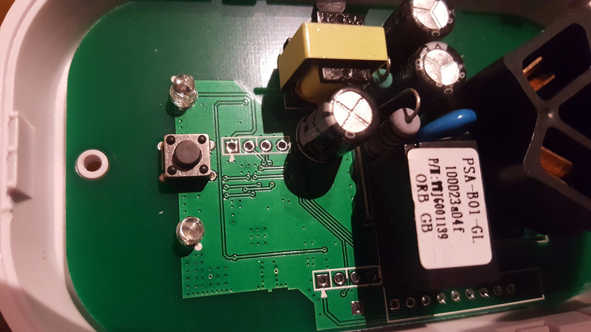
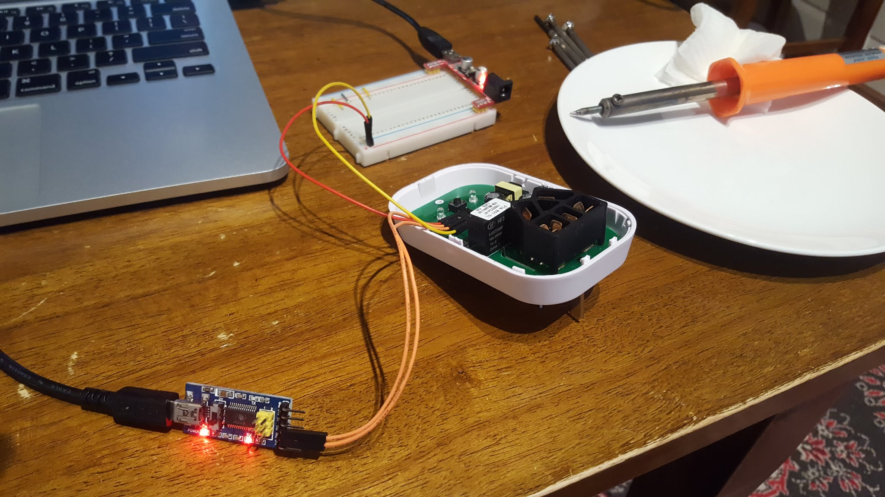

I recently purchased an Echo from Amazon, and we were contemplating how else to better integrate it with our somewhat minimalistic home. I thought it would be interesting to get it to link to a WiFi-enabled power outlet, but unfortunately they are pretty expensive in Australia.  
  
Then I stumbled across the [Sonoff](http://sonoff.itead.cc/en/) devices by Itead, and learned that they were somewhat hackable via a [custom firmware](https://github.com/arendst/Sonoff-Tasmota). Coincidentally I received the two devices on the same day my daughter was off sick, so when she had her nap, I got hacking.  
  
The first bottleneck was discovering that the units I received did not have any headers. A little quick soldering later, and we had headers.  
  

No headers mom :(

  

Now we have headers!

A few notes of warning: the $2 programmer I got from AliExpress has 3.3v and 5v, but the _output_ is 5v. I'm glad I measured it with my multimeter, and used a random 3.3v breadboard supply instead.  
  
In hindsight I wish I had just purchased the [FTDI programmer](https://www.itead.cc/foca.html) from Itead. It looks pretty neat.  
  
After following the rest of the Tasmoto [hardware instructions](https://github.com/arendst/Sonoff-Tasmota/wiki/Sonoff-S20-Smart-Socket), and then the [PlatformIO instructions](https://github.com/arendst/Sonoff-Tasmota/wiki/Upload), I was able to successfully flash both my units with the custom firmware.  
  
I then created a Lambda function that sends a signal to CloudMQTT, and connected the two devices.  
  
Voila!