My image of Kathmandu was something like a Swiss winter wonderland, but in Asia. The second the plane dropped below the clouds, I realised how wrong I was: the entire city was dotted with four- and five-storey buildings and surrounded by a dark haze of pollution.

The airport was simple. I had already prepared my visa application, the required $25, and two photos, so I moved quickly through the line. Outside the airport, taxis were everywhere. The prepaid counter quoted 650 RS, which gave me a baseline. Of course, that may have been the point.

I immediately received an offer of 500 RS. The guide I tended to use, Triposo, said the counter would charge 450, that travellers should aim for 400, and that skilled negotiators might pay 300. Given that the counter was 200 RS more than the guide suggested, I did not expect to pay less than 300 RS. Newer updates said even 350 RS was difficult to achieve.

I kept walking to the corner of the parking lot, where more drivers were waiting. One approached me: "650 to Thamel." I replied, "I can use the prepaid counter for 650!" "Hmm, okay, 500." "The guy parked outside the airport will do 460. I am looking for 400." "No, nobody will do 400. How about 500?" "I can do 440, but that's it." "Okay, you're a lucky man." The money did not matter too much to me; unlike on my earlier travels through Southeast Asia, when I might walk 10 kilometres to save $20, I now had more resources. I jumped into the taxi and headed into the city.

These were my first impressions of Kathmandu: dense, busy, and chaotic. People ran in front of the taxi everywhere, while horns sounded constantly. My taxi wove through every kind of traffic: buses, other taxis, motorbikes, and cows. Having learned from my trip to Bali, I had downloaded an offline map of Kathmandu and had my GPS running as soon as I landed. When the taxi left the main road for an extremely bumpy back alley, I could see that we were still heading towards my hotel rather than in some random direction. The view from the taxi looked like something from a movie: rubbish piled along the roads, many buildings in need of repair, dirt roads full of potholes, and people everywhere.

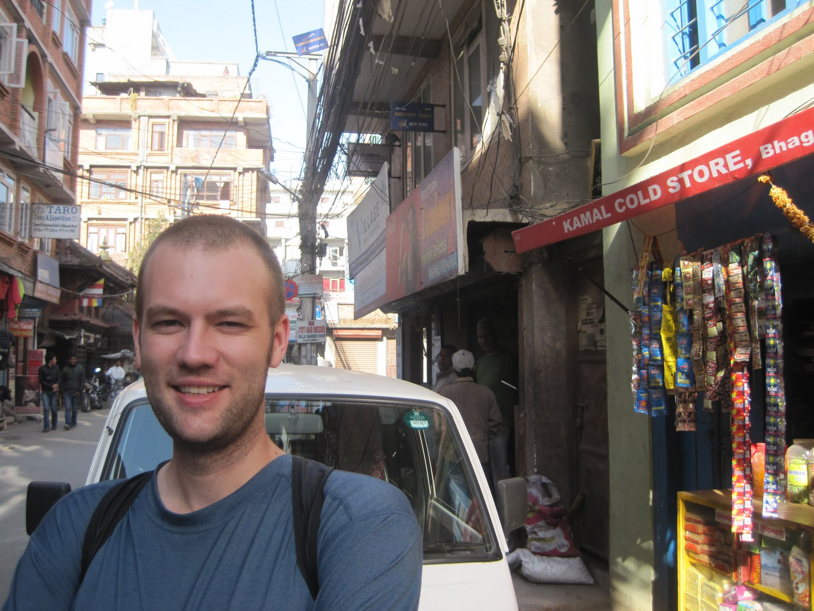
Navigating traffic around a white van in Thamel

At one point the driver said "here is the brochure to my hotel", just as I was about to pass it. "I can take you here, how much you pay?" "$12/night" "I can match that, no problem. I have hot water, you like?" I said I had already paid, hoping to end the sales pitch, and he dropped the subject.

I entered the main road again, able to smell the fumes of the traffic from half a block away, and coasted around one corner. I could see from my phone (thank you Google Maps!) that my hotel was located in the next alley, so when the taxi driver slowed and made a left hand turn signal with a confused expression on his face, I could say "yes, down there". I don't know what normal tourists would have done...

The taxi came to a stop and I jumped out. I gave him $500 and at that point realised I had &nbsp;messed up: 1) I didn't have him state that $440 was the fare, and 2) I didn't have exact change. He said "thank you", waited a minute for me to argue, and started to get back in his taxi. Lesson learned - I can't compete with these guys - yet.

I found the Laughing Buddha Home, a small guest house, through an online forum, so it was not surprising that many people from Taiwan had signed the guest book. Someone from the guest house came out to greet me, coughing slightly, showed me two rooms, and asked which I preferred; I chose room 4. It was basic but clean, with two beds, a bedside table, two windows, and a bathroom. One of the guest house's biggest advantages was its location next to a hospital, from which it could somehow "buy" electricity during neighbourhood blackouts. I did not need much power beyond recharging my phones and GPS logger, but the access was helpful. I also brought flashlights in case a blackout struck while I was out walking or needed something in the middle of the night.

I needed to bring my laptop, but in such a basic room I struggled to find a secure place for it. My solution was to keep the laptop bag and Kindle out of sight, then store the laptop itself beneath the bedside table. There was barely enough room, so I kept valuables concealed rather than leave them in plain view. It was not a substitute for proper security, but it helped me feel more comfortable.

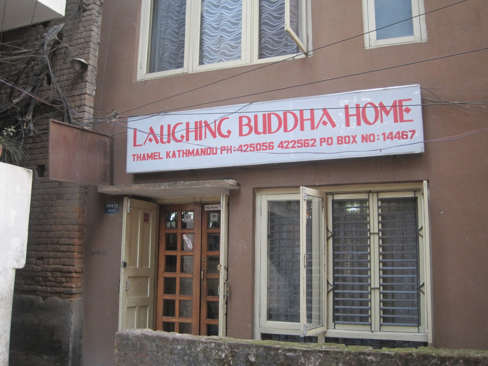
The Laughing Buddha Home, or basic stay in Kathmandu

My guest house was set back from the main roads and peacefully tucked away in Thamel, Kathmandu's main tourist district.

After hiding the laptop, I set off to explore Thamel. The entire district resembled a large market, with shops lining both sides of every street. Most sold trekking equipment. I am a fan of trekking gear, but was hesitant to buy anything. I prefer products that will not fall apart immediately, and the quality of some bags made their authenticity difficult to believe. I did not want to buy a $40 "Gore-Tex" jacket made from an inferior material that would fail within six months. I also believe in supporting companies that make high-quality products, although I remain less certain about digital ones. I still considered buying a yak blanket.

One thing I did not expect from Kathmandu was the traffic. It was everywhere and comically bad. The streets of Thamel were lined with people as mopeds zipped through the crowds at high speed. Each moped or motorcycle had small guards resembling the cattle guards on trucks, which I joked were "pedestrian guards." Somehow nobody was hit while I was there, although there were plenty of close calls. Allowing motorcycles into the area seemed to offer little benefit beyond helping riders avoid the main street, and it certainly made the district less appealing.

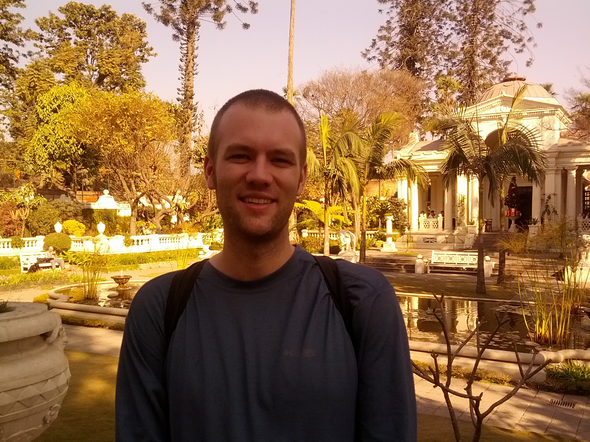
Inside the Garden of Dreams

I soon reached one of the main roads and, after only half a block, was ready to call it quits. Luckily, I looked up and saw a sign for the walled area I had been walking around: the Garden of Dreams. I recognised the name and went inside. Entry cost 200 RS, but escaping the traffic alone made it worthwhile. The privately held gardens had fallen into disrepair around 50 years earlier but had recently been renovated. They were now well maintained, with many young couples relaxing throughout the grounds. Cars could still be heard outside, but the noise finally faded into the background.

Wandering around the garden, I explored its nooks and crannies before deciding to escape the sun with a beer. I ordered two San Miguels and relaxed. When the bill arrived, I discovered they had served the large bottles, which at about $5 each were extraordinarily expensive. They may even have been $6. Alcohol in Nepal was generally costly, not compared with Sydney, but relative to almost everything else. I paid and left the gardens.

Back on the main road, I quickly made my way into Thamel and stepped into a small curry restaurant for dinner. The menu looked good, so I ordered, wondering whether the meal might ruin the rest of my trip, and dug in. The fresh naan was delicious and, at 30 cents each, inexpensive. The curry was also tasty. I initially ordered two naan and, after eating a few slices, ordered another two. Unfortunately, each naan had been cut into quarters rather than halves, so I had eaten only one. The next two arrived, and I barely managed to finish them. The entire meal cost about $3, and I left content.

A surprise highlight: super cheap curry

Back at the guest house, I showered and crawled into bed. There were two twin beds, each less than a metre wide, but because I was cold I curled up in one. Luckily, I do not move much in my sleep, so the narrow bed worked. I tried watching a television show, but by 5:30 p.m. I was sound asleep.

After 13 hours of sleep, I woke and prepared for the day. Entering Thamel, I had a general route in mind and soon stumbled upon the Kathesimbu Stupa, nestled in a small square off the road. Many people were observing religious practices around the pigeon-covered stupa. The birds were everywhere, reminiscent of Krakow's Main Square or the area outside Istanbul's Blue Mosque. I circled the stupa clockwise, hopefully following the local custom, and took photos every few metres. Once satisfied that I had captured every lion and tiger around it, I returned to the road, avoiding the spit "land mines," and continued my walk. I came across several more small temples, where some men gave me uncomfortable looks. At the end of the road, right on track, I reached Durbar Square. The moment I stepped in to take a photo, guards approached me: entering the outdoor square cost 750 RS. I decided to give it a pass for the moment and continued around the side. A narrow alley lined with knick-knacks, and more spit land mines, brought me back to a main road. I walked one block, saw an open area, and went in.

I had entered another part of the square, a section that was closed to cars. This portion of the square felt like something you might see in Lhasa, with a market in the middle, where old ladies were selling their toys and&nbsp;souvenirs&nbsp;on brightly coloured blankets. I walked around a bit, found where I was on the map, and departed out the side.

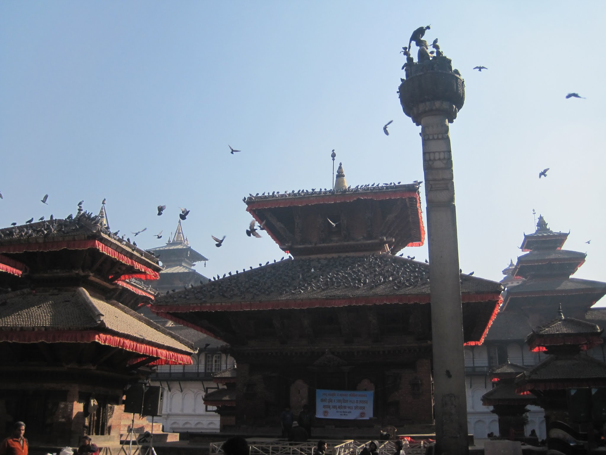
A view near Durbar Square

After circling for a little longer, I ended up near Durbar Square. I realised that the entrance I had found was not the ticketed route, so I did not enter and continued on.

In a hunt to find a large six-story tower, the Dharahara, I found myself on a main road with the Rani Pokhari to my left. The Rani Pokhari, from what I can tell, is a building surrounded by water with one long, small ramp leading to it. I am not certain what the purpose of the building is, but the garden I walked through (i.e. the dirt patch with a few shrubs) was littered with people basking in the sun. The pollution from the main road completely covered this dirt patch. I hope the Rani Pokhari was not a palace by some king or government head, as that would be quite a cruel view to subject your&nbsp;local residents&nbsp;to.

After walking partway around the moat, we agreed: "No more roads." I appreciated the request, feeling my brain cells dissipate with each new breath of carbon monoxide. I could not imagine driving in that traffic every day.

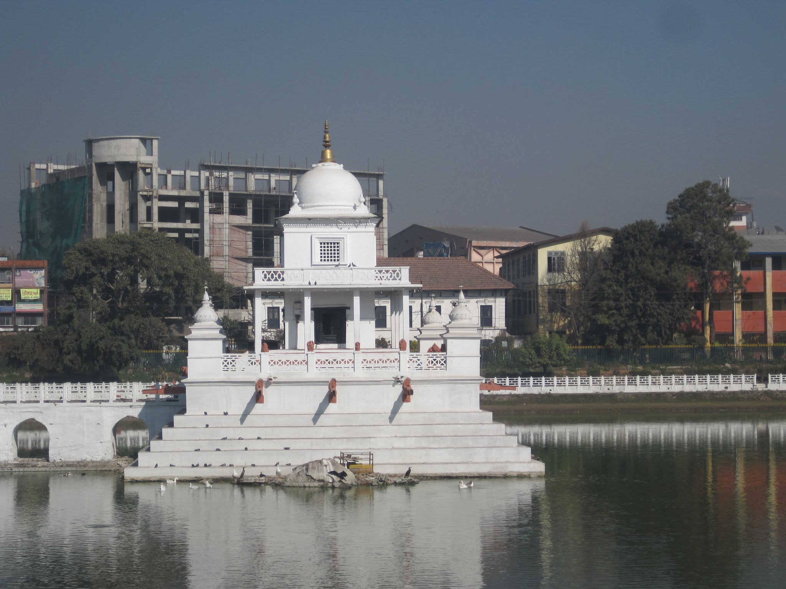
The [Rani Pokhari](http://goo.gl/maps/egqKl), surrounded by water and busy streets

I entered the Thamel area again, swapping polluted main streets for dangerous side streets.

Following a recommendation from either Triposo or an online forum, I found a small restaurant called MoMo Star. Momo is a classic Nepalese dish, essentially a dumpling that may be fried and can be round or oblong. I ordered two dishes, one chicken and one buffalo, and both were excellent. The tea was also delightful. After a dreadful experience with tea in Tibet, where I could not stop going to the bathroom until I took a Gastro-Stop and then could not go at all, I was sceptical. This tea, however, was clean and tasty, and I never became ill. I also ordered a beer, which seemed to confuse the waiter: "Tea and beer? Which do you want first?" I think he liked me, though, unlike some of the other tourists who entered the restaurant.

I soon found myself back at my home and researching what to do the next day; I decided to go visit Swayambhunath.

Swayambhunath is an ancient complex built atop a hill within five kilometres of Thamel. After eating, I set off in the morning and navigated side streets to the main road, then crossed the river. The neighbourhoods became poorer the farther I travelled, and by the river the area was especially run-down. Litter was everywhere, and the river was one of the dirtiest I had ever seen, even more polluted than those I had encountered in China. It was a shame: Nepal apparently had the world's second-largest supply of water, yet only 25 per cent of the population had access to clean water.

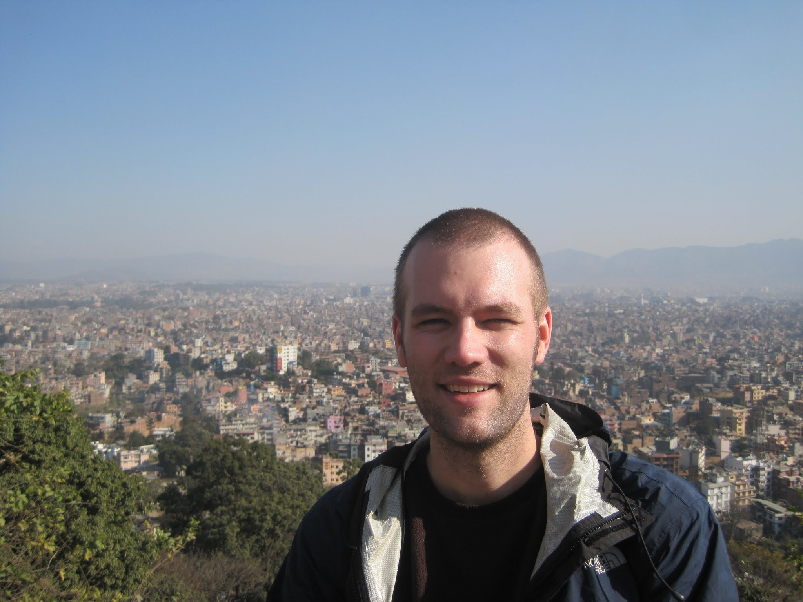
Overlooking Kathmandu from Swayambhunath

After checking the GPS again I wandered through a few more hillside streets, and then could see my destination: Swayambhunath. Placed high on top of the hill, it was obvious there were going to be a number of steps involved. I started hiking. And hiking. After about 400 steps I was ushered into the little ticket gate (locals and visitors from India were exempt), and paid 200RS to go the remaining 15 steps. Once on top it was worth it: I had broad views of the entire Kathmandu Valley, all its glory and pollution clearly visible. The stupa at Swayambhunath was photographed from every angle, with locals and tourists ringing the various bells surrounding it. Several tourists were playing with the [prayer wheels](http://en.wikipedia.org/wiki/Prayer_wheel), something I never had the courage to do.

One thing I had forgotten before climbing Swayambhunath was that it is known as the monkey mountain, and monkeys were everywhere. Some appeared injured or unwell, but the monkeys generally seemed safe. They did not mind the locals or us tourists. Some even launched surprise raids on people who were praying, probably trying to take their silver headbands.

I walked to a less-visited part of the complex, which had even more monkeys. Returning to the main area, I noticed a crowd around the Wishing Well, where everyone was trying to toss coins onto a plate in the water. One Westerner landed a coin on the plate and shouted, "Wishes for all!" Shortly afterwards, I heard screeching and glanced over just in time to see a small monkey, perhaps a baby, knocked into the well. A commotion erupted among the adults. The baby climbed onto the pole holding the plate and scampered to the top, close enough to see its family but too far to cross the fence. People continued tossing coins. The baby's cries seemed to summon every monkey in the hills, and the well was soon bordered by tourists on one side and monkeys on the other. I also noticed a few people treating the animals roughly, including kicking at monkeys and dogs. It was hard to watch.

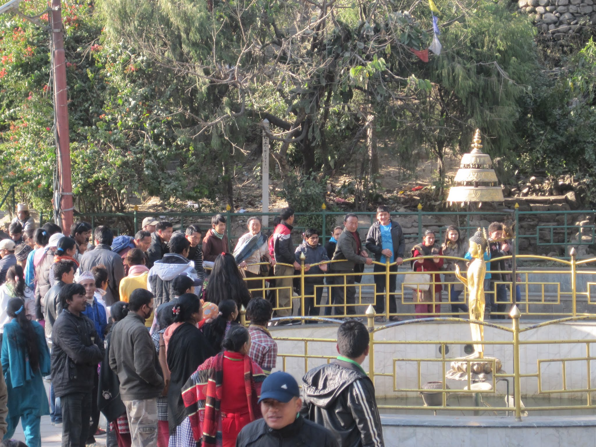
Monkeys

I left pondering how to save the monkey, my only hope that the ticket staff would assist.

I headed back down the stairs, all 403 of them, and began walking towards Thamel. A hidden staircase led me across the river and through the back alleys, and I soon reached one of my two regular restaurants. Back at the Laughing Buddha, I paid for my stay and the next day's bus tickets, then bought food from a local bakery for the journey.

Having been almost run over for an entire day, I was excited to hear about a small city called&nbsp;Bhaktapur, just outside Kathmandu. I asked the owner of the Laughing Buddha how to get there, and he told me which bus to catch, and that it would be 20-30RS each way.

Early in the morning I departed for the bus stop, which was somewhere near the Rani Pokhari, so not too far from my stay. I walked along the barren park to get a little away from the road, used the overhead&nbsp;intersection&nbsp;crossing, and saw the bus stop, or bus corner, alleyway.

In the total free-for-all, I asked someone how to reach&nbsp;Bhaktapur&nbsp;and was soon ushered onto a 1960s-era bus leaving the city. Toxic fumes filled the cabin as we slowly rumbled out of central Kathmandu. Every few kilometres the bus stopped for more passengers, and within 30 minutes it was full. The conductor hung faithfully from the moving bus, trying to attract passengers by whistling or hooting, though I never decoded what the sounds meant. Several people were interested in my phone and its cached copy of Google Maps, poking the screen and moving the map around.

The scariest moment came when the driver sped through a village, seemingly out of control, as children jumped aside to avoid being hit.

Eventually, I arrived in&nbsp;Bhaktapur. The city was said to have no cars, but that was not entirely true. There were fewer vehicles than in Thamel, but trucks and motorbikes remained, and their drivers still assumed they had the right of way.

I spent the day wandering and taking photos. There was plenty to see, with almost none of Kathmandu's pollution. I had a pleasant lunch at the Rooftop Cafe overlooking one of the temples. After several hours of walking around Bhaktapur, I found the return bus and rode back to Kathmandu. I ate dinner and prepared to wake early for my next adventure.

After a few more episodes of Sons of Anarchy I went to sleep, ready for my early journey to Pokhara the next day.

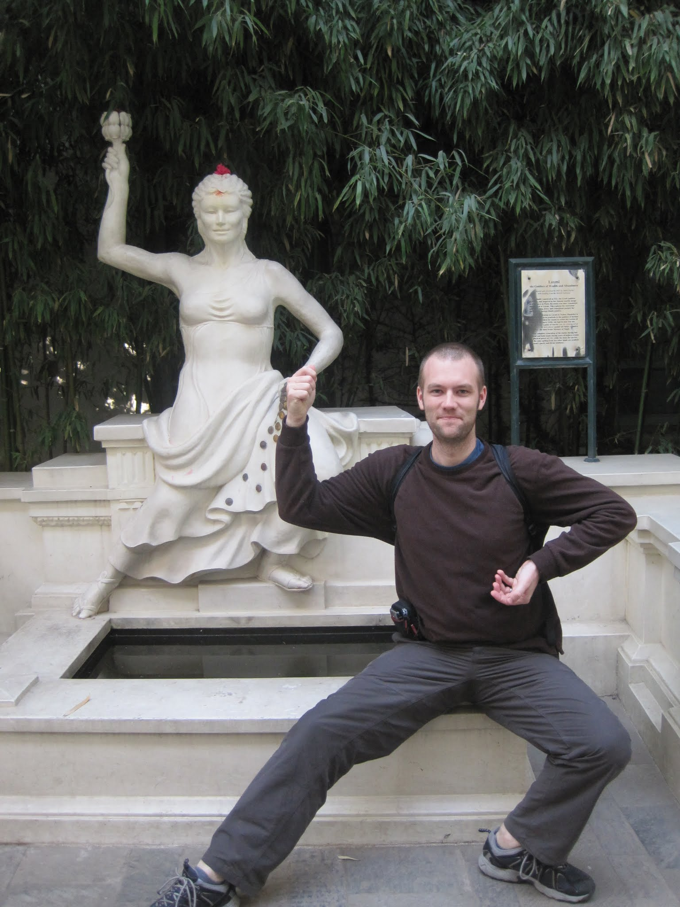

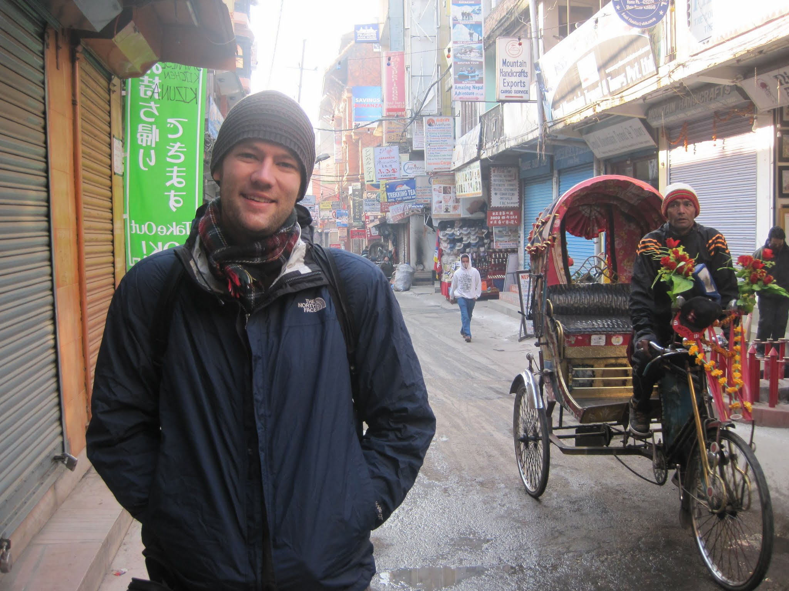

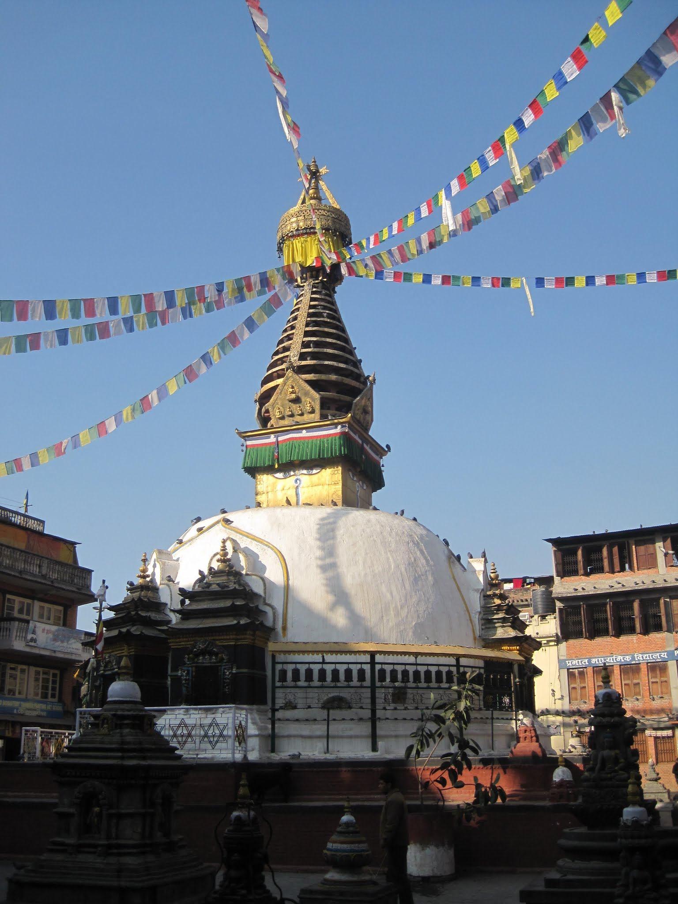

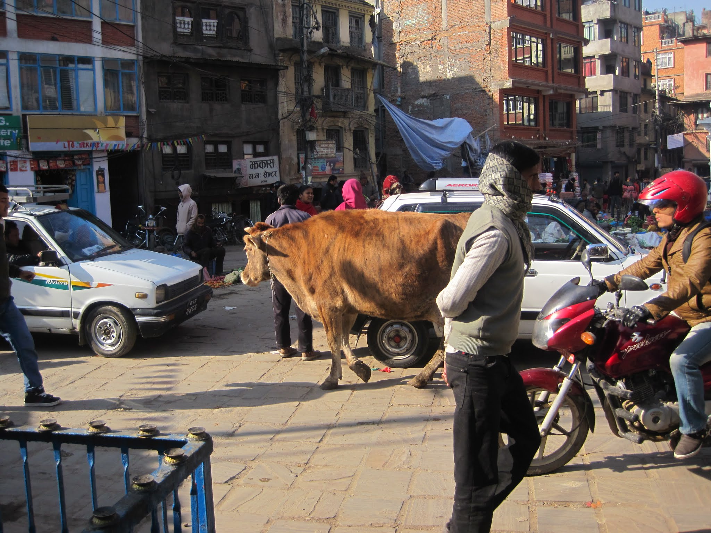

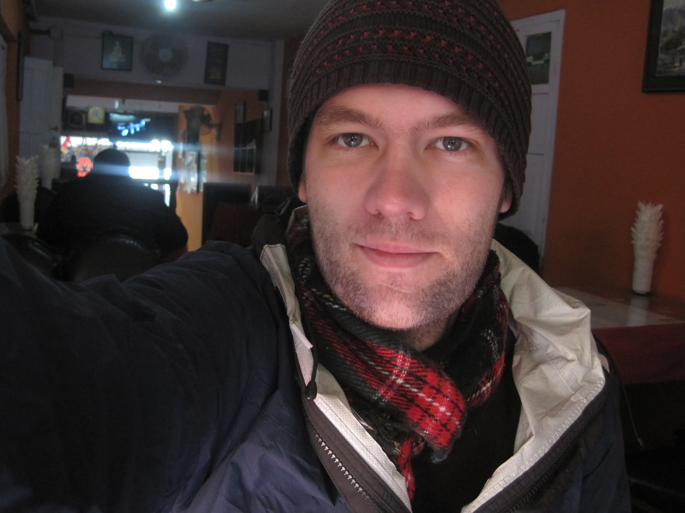

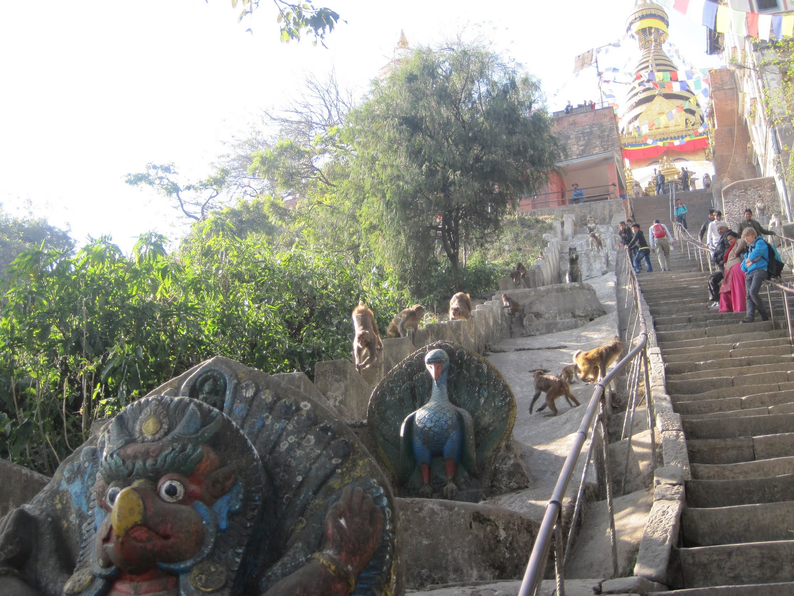

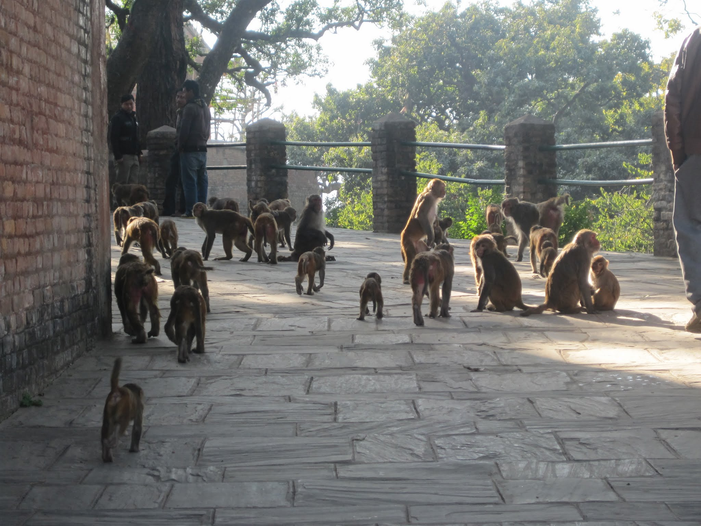

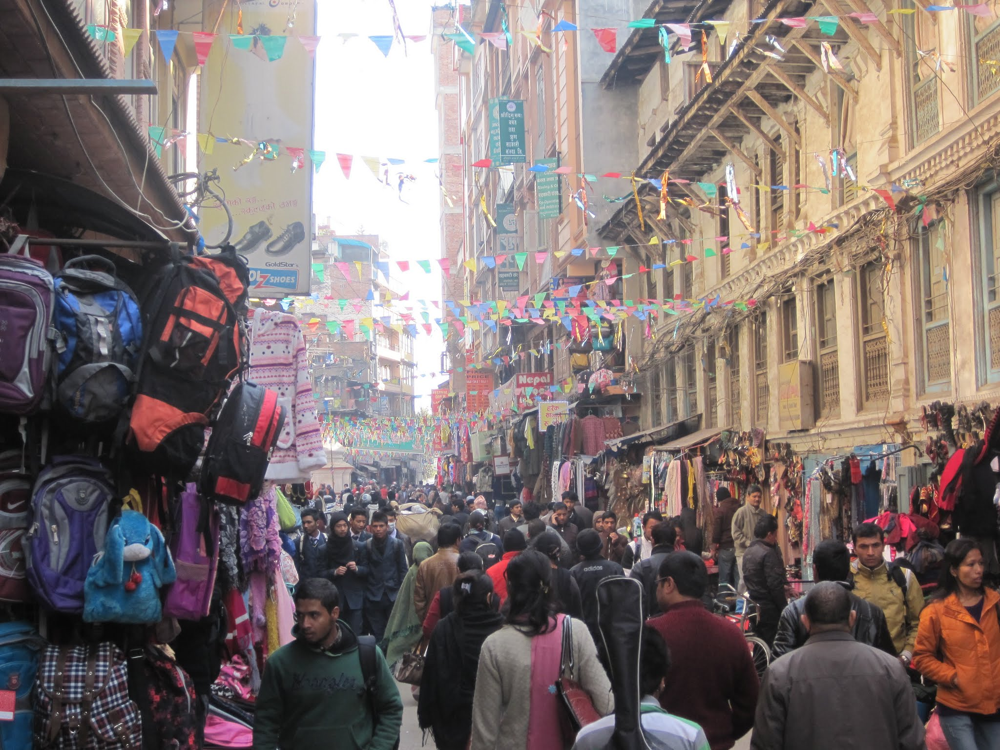

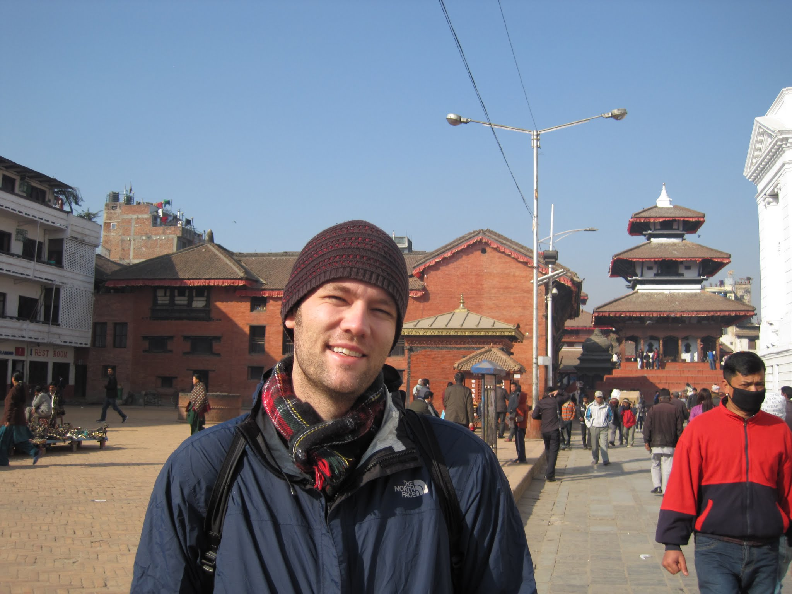

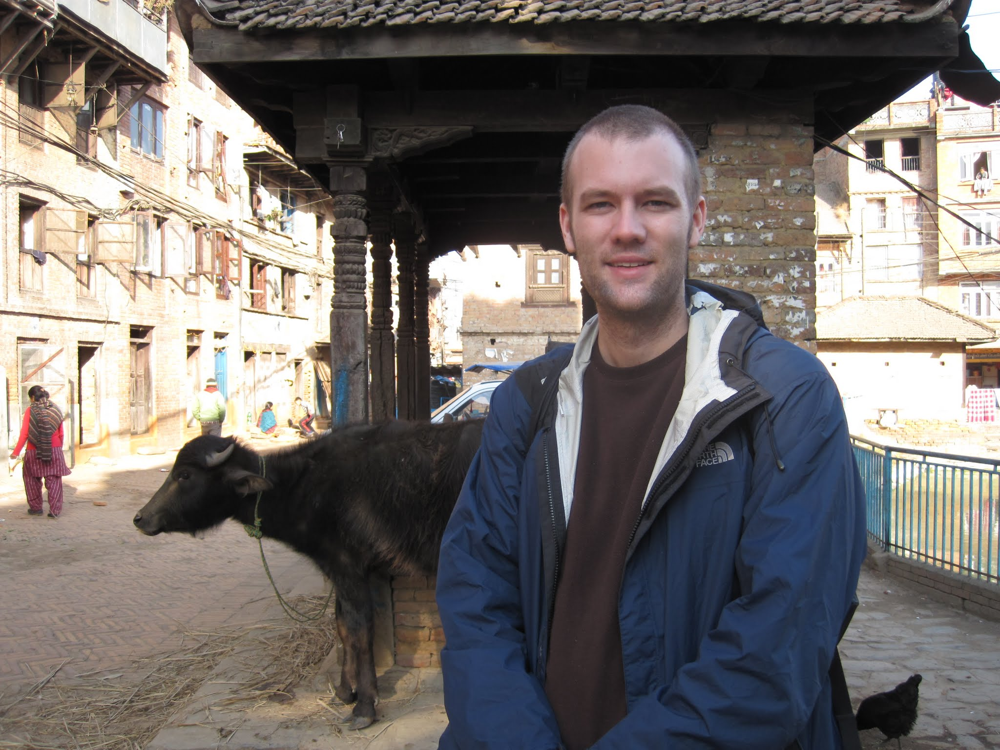
