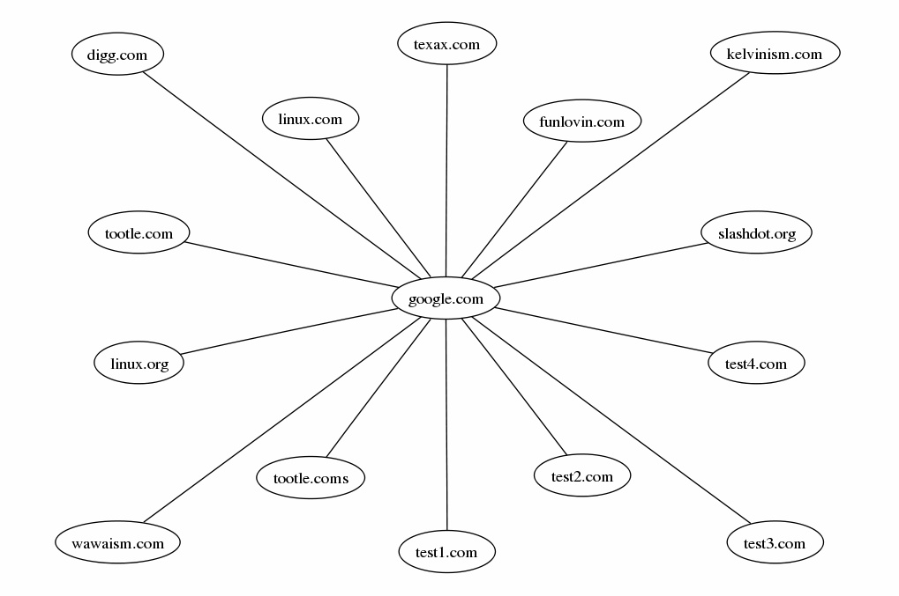
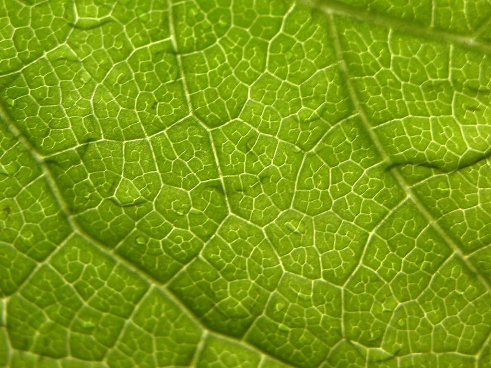

For one of my [webapp projects](http://www.brokebutnot.com/) I'm needing to layer two images. This isn't a problem on my laptop -- I just fire up GIMP, do some copy 'n pasting, and I'm done. However, since everything needs to be automated (scripted), and on a server -- well, you get the point.  
The great [ImageMagick](http://www.imagemagick.org/) toolkit comes to the rescue. This is highly documented elsewhere, so I'm going to be brief.  

#### Take this:

  
  
[](world.jpg)  
  

#### And add it to this:

  
  
[](bg.jpg)  
  
I first tried to use the following technique:  
```bash
convert bg.jpg -gravity center world.png -composite test.png
```  
This generated a pretty picture, what I wanted. What I didn't want was the fact that the picture was freaking 1.5 megs large, not to mention the resources were a little high:  
```bash
real    0m7.405s
user    0m7.064s
sys     0m0.112s
```  
  
Next, I tried to just use composite.  
```bash
composite -gravity center world.png bg.png output.png
```  
Same results, although the resource usage was just a tad lower. So, what was I doing wrong? I explored a little and realized I was slightly being a muppet. I was using a bng background that was 1.2 megs large (long story). I further changed the compose type to "atop," as that is what appeared to have the lowest resource usage. I modified things appropriately:  
```bash
 composite -compose atop -gravity center world.png bg.jpg output.jpg
```  
  
This also yielded an acceptable resource usage.  

#### The result:

  
  
[](output.jpg)