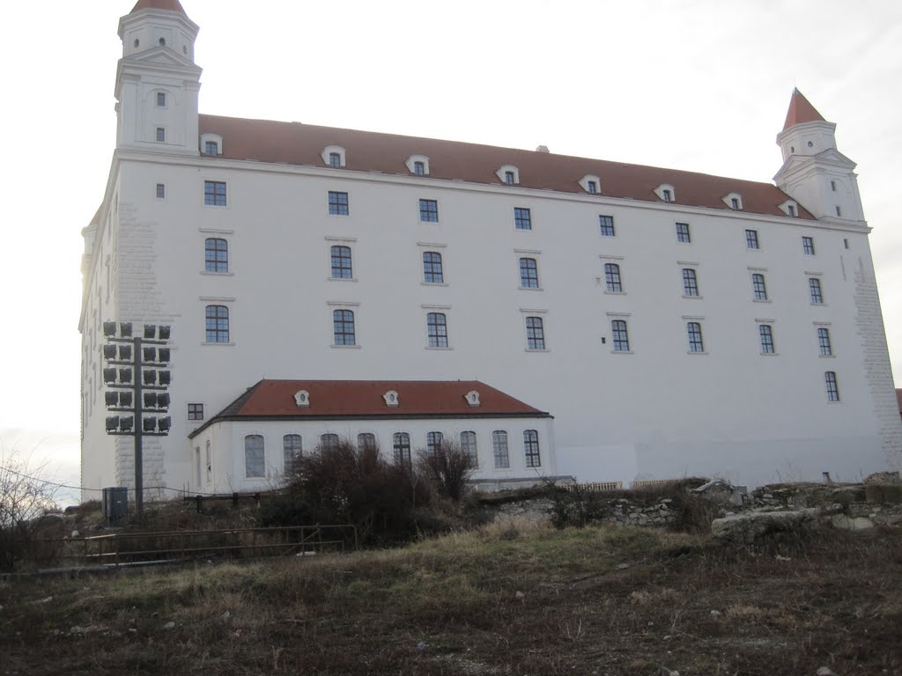
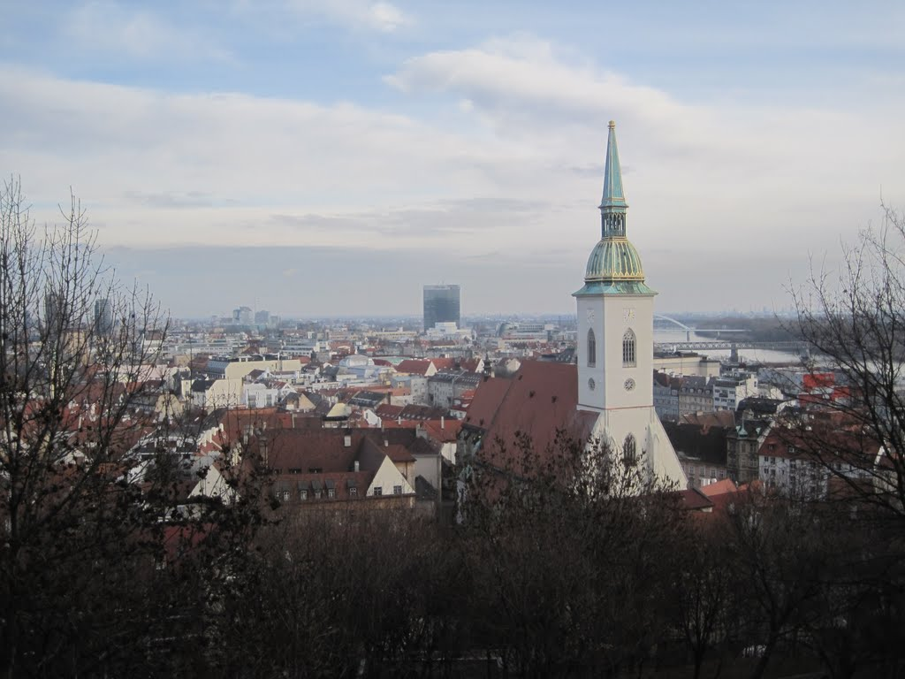
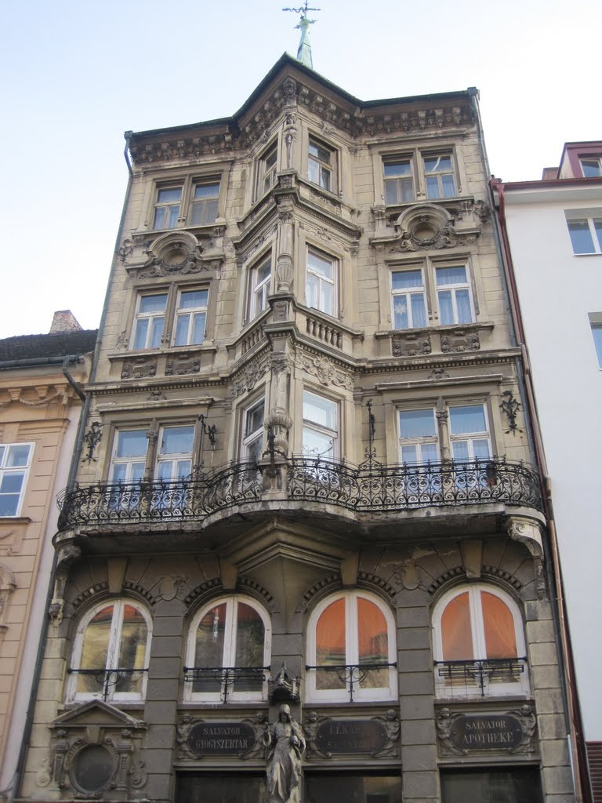
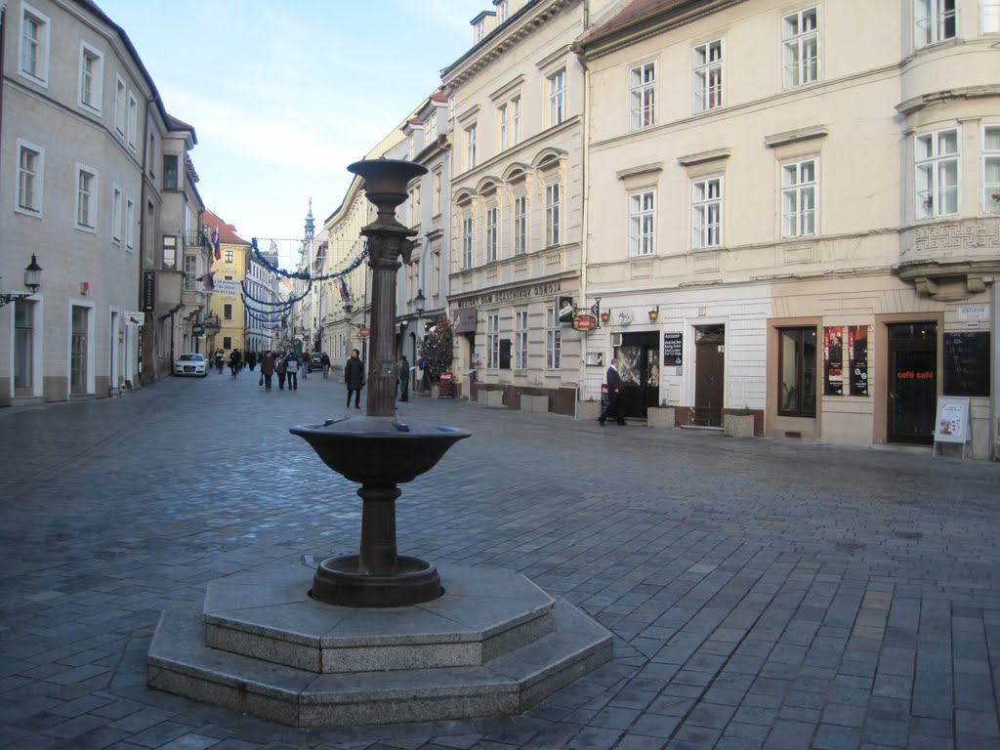
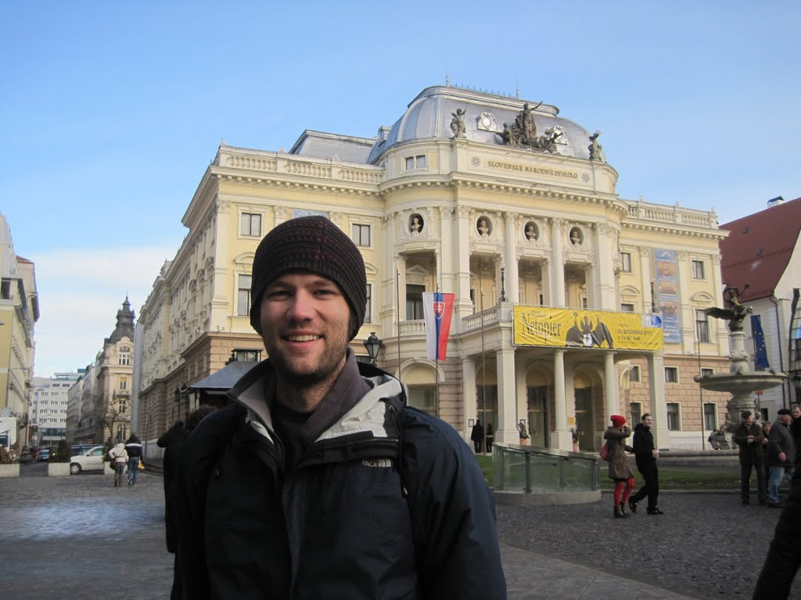
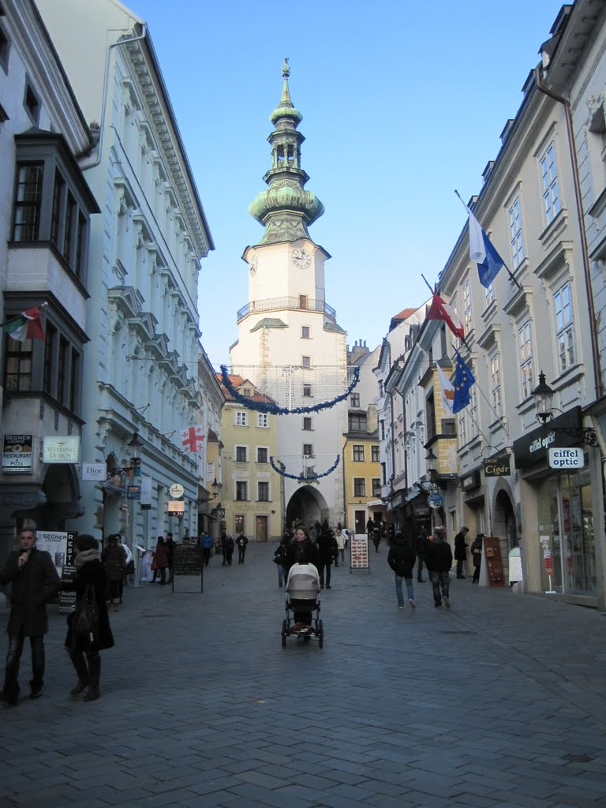

Although it would mean cutting my time in Budapest short, I thought it would be worthwhile to take a day trip to&nbsp;Bratislava,&nbsp;the capital of Slovakia. The journey would take roughly the same amount of time as going directly to Vienna, while giving me a sliver of a new country, city, and culture.

I departed Budapest fairly early to take the train to&nbsp;Bratislava.&nbsp;After the 900-metre walk back to the train station, I purchased my ticket and waited for departure.

My natural inclination was to get a coffee, and with McDonald's again so near, I bought two cappuccinos. Another advantage of stopping there was that I could email my mom to let her know about my stop in&nbsp;Bratislava,&nbsp;which had not originally been on my itinerary. The train departed, and I patiently waited through the two-hour journey.

Given only a few hours in a city, I tend to maximise what I can see, which means walking quickly and, to quote Boston Legal, allowing no jibber-jabber. Given its prominence over the city and its usefulness as a landmark, I set off for Bratislavský hrad, a recently rebuilt castle atop a hill with evidence of human settlement dating to the Stone Age. The views of&nbsp;Bratislava&nbsp;were lovely, even with overcast skies.

It was interesting to look across the horizon and see communist-era, high-density housing arranged neatly in rows. My tour guide in Budapest had commented on the poor quality of the building materials. I&nbsp;marvelled&nbsp;at how each building had been repainted a new colour, perhaps in an attempt to give it some individuality. The sky turned into a bright blue canvas with only a few scattered clouds.

My walk took me down a different route from the castle and into the historic district, where I photographed anything that looked impressive. My guidebook explained the history and significance of some of the sites, but I knew I was missing some of their context.

I debated whether to visit the first pub in Slovakia or the Dubliner advertising Guinness on the street where I was walking. The Dubliner won; I ordered one Guinness and one&nbsp;Kilkenny&nbsp;to share, although I think I mainly enjoyed the&nbsp;Kilkenny.

I left the pub promptly and made my way back to the train station, picking up a kebab along the way and trying not to get lost. My return was uneventful, despite two strangers nearly coming to blows next to me, and I contacted my friends in Vienna to let them know I was on my way.
