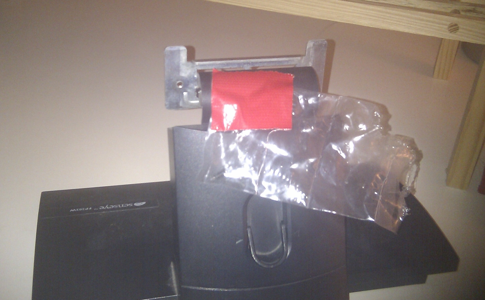

I don't know how many times I've lost tiny parts and had to spend time trying to find them. I realized after removing the back of my monitor that I'm starting to learn from those mistakes; instead of just sticking the screws in a box with other screws, and then having to dig them out, I taped them to the back of the monitor.

  
  

This sounds small, but after doing it I realised how many times I had to hunt through a box of screws trying to find the exact one that fit. Lesson learned.