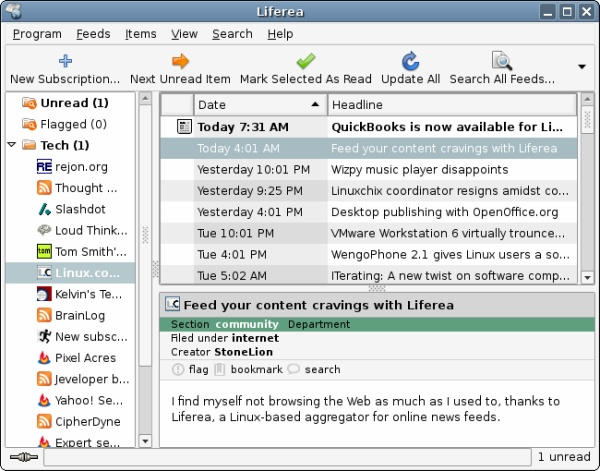

Today on [Linux.com, Liferea was mentioned](http://community.linux.com/article.pl?sid=07/06/07/1458229) I find this particularly because I've been using Liferea for quite a few months, and haven't been able to find anything that better suits my needs. It sits quietly in the corner until a new RSS is available, and slightly changes color. Plus, it integrates wonderfully into GNOME.

Well, the Linux.com article does a great job summarizing the reader, so if you are in the market, I'd take a look. For posterities sake, I took a screenshot of the Linux.com feed of Liferea, in Liferea.

