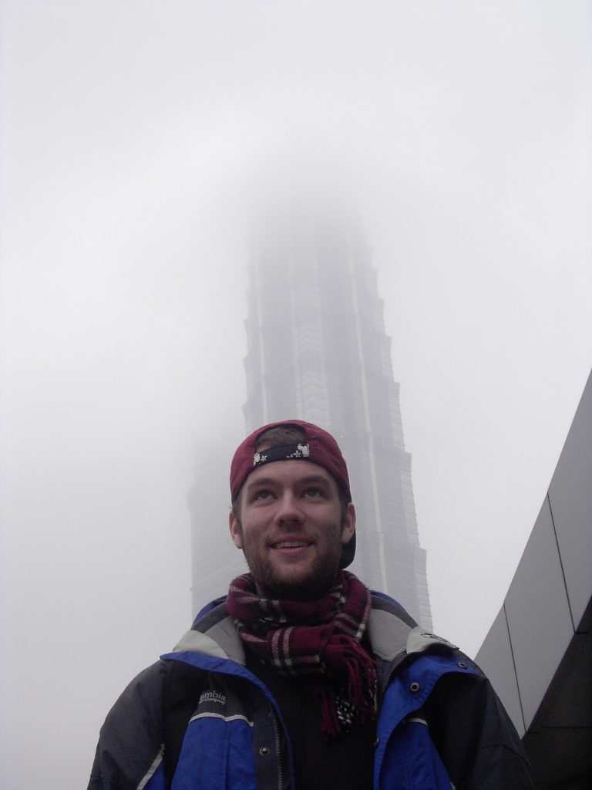
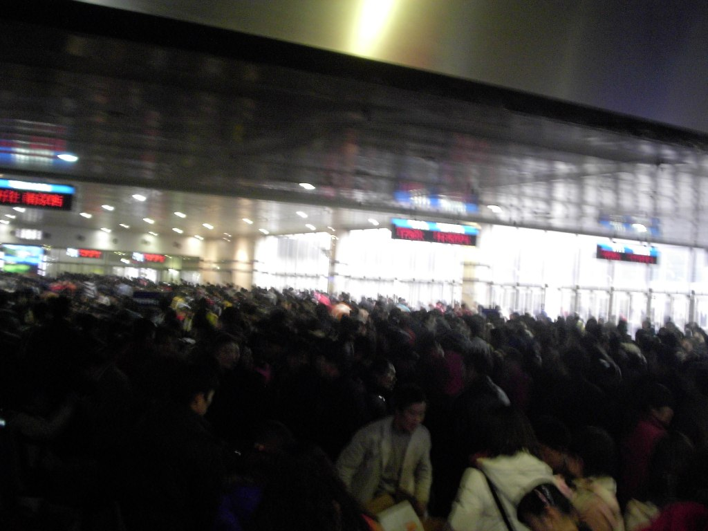

I will need to get used to writing '2007', but I think it will be a great year. At least it has started wonderfully!

 

After waking up, I packed my things, cleaned the room a little, and left the nearly empty guest house. I decided to take one more look at the modern district during the day and take a few more photos. I found the Jin Mao Tower, took my photos, and jumped back on the subway. After a quick ride to the train station, I purchased my tickets.

 

The train stations here, at least the ones I had seen, are among the busiest places in each city. I could also feel people sizing me up to decide whether I would be a good target. By following a few simple practices, I had fortunately never had anything stolen from me (pei pei pei).

 

After buying my tickets, I purchased some water down the road, took a short walk, and returned to the station. Inside, I went to Jhonghe Dao Wan (yes, that is the same Jhonghe where I live). Interestingly, the breakfast-shop style familiar from my neighbourhood is popular everywhere. Similar breakfast shops can be found all over China, serving much the same food. I ordered some soy milk and a little food, then started walking towards my train.

 

Once at my train "gate," I realised something was wrong. My train was scheduled to leave at 3:00, and the time was approaching. A huge crowd was lined up for the train. The departure time kept shifting: first by ten minutes, then by half an hour. I started to get frustrated by the crowd. I put my bag down, placed my coat on top of it, found some paper to sit on, and, voila, started playing cards. Everybody around me looked on, bored out of their minds, while I was at least somewhat entertained. The mess created by so many people was staggering. Orange peels, sunflower seeds, and scraps of paper were all thrown on the ground. Once the crowd began boarding, I could finally see the seats intended for waiting passengers. The area looked as though a garbage truck had emptied itself in the middle of the room.

 

There was also an interesting episode involving a pickpocket. While I was playing cards, the police began questioning a man behind me. I could not understand their conversation, but eventually he got up and left. My translator later explained that he had witnessed an attempted theft, and the police wanted him to identify the person they had caught. He said he was afraid of the consequences, so the officer replied, "I'll let you in through the side door so you don't have to wait in line." He got up and left.

 

The train was crowded, so I first brought out the food. I made peanut butter crackers and ate them like candy. Trying to be a considerate traveller, I offered some to everybody around me. Nobody accepted, but at least I offered. I finally arrived in Suzhou, only about an hour and a half from Shanghai. The difficulty was the time: it was already quite late. I also had no directions to the hostel, only an address. After finding what appeared to be the correct bus stop, I did not know which bus to take. I am generally a little shy about asking strangers for help, but I was the one who could speak enough Chinese to be understood. I approached a friendly-looking couple about my age and asked them. They had not heard of either the hostel or the street, but someone had given them a hostel card as they left the station; dozens of people outside were trying to persuade arriving passengers to stay with them. I took the card, and the couple happened to be waiting for the same bus. I squeezed aboard the packed, unlit bus. Nobody spoke as we travelled across the city. Eventually they said, "Get off here; it should be somewhere over there." I thanked them and jumped off.

 

Crossing the street, I entered what appeared to be student accommodation and somehow chose the correct building. I stepped into a pitch-black elevator, went up to the seventh floor, and found the "hostel." It was still in its early stages and was used mostly by students from Suzhou University across the street. The owner told me they had no room available just then, but would shortly. Puzzled, I said OK and joined him for dinner. The situation seemed a little odd, but my instincts were not sounding any alarms, and I was hungry. The food was excellent: a large plate of curry rice cost about 75 cents. I then walked to the supermarket across the motorway, bought water and snacks, and returned to the hostel. Sure enough, a room was available.

 

I learned that someone had overstayed his rent, but they had not yet moved him out. Whether they put him in another room or launched him out the window remains unknown to me. The room was bare but acceptable, even by my fairly undemanding standards. I assumed it would eventually be used for dormitory-style accommodation. Since the weather was colder than I was used to, I curled up on the bed and fell asleep.

 

A few hours later, I woke up, took a shower, watched some educational TV, and fell asleep again, this time for real.

