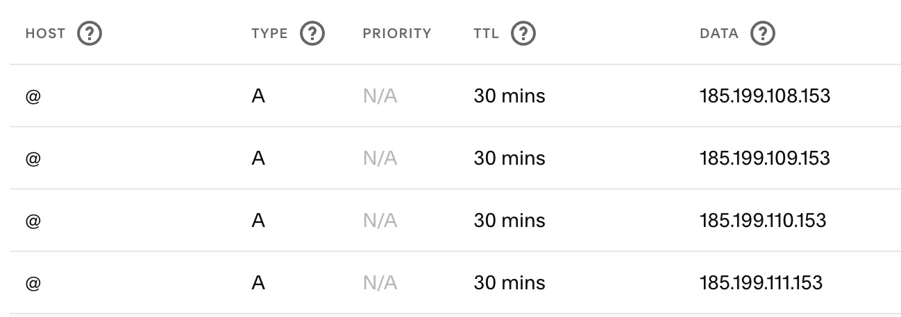
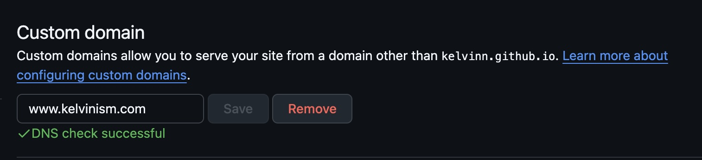

I started this website 20 years ago as a means to learn Django, which made sense, as at the time I wished to do _everything_ myself: website and hosting, running my own mail server, dns server, and probably something else, too. Over time my desire to spend time on these activities dwindled, and I [move my content](/2013/01/migrate-custom-blog-to-blogger.html) to blogger.

Year by year I wrote fewer articles, and then it became years since I wrote anything. Perhaps it was the UI for blogger or the niggling feeling that Google could kill it off at any time, or perhaps it was having a kid. Eventually the libraries were no longer maintained. This weekend I opted to:

- Remove as many libraries as possible
- Move from Blogger to Github Pages

Intially I gave Jekyll a go, as GH Pages natively supports it, but Jekyll seems to be on its way out as a static site generator (e.g. the pagenate plugin hasn't been updated in like 7 years, and you can't natively use other plugsin in Github). I gave [Hugo](https://gohugo.io/) a go, and it worked incredibly well. 

Here is an overview of what I had to do:

- Read [this page](https://www.henryleach.com/2021/10/moving-from-blogger-to-hugo/) and follow almost all of the steps. 
- Created [this script](https://github.com/kelvinn/kelvinn.github.io/blob/main/src/download_images.py) to download the _full size_ images from Blogger. Run it with `python src/download_images.py` after installing by `pip install requests`. I had about 250MB of images, so beware if you have a lot, at Pages has a limit of 1GB storage.
- Created [this script](https://github.com/kelvinn/kelvinn.github.io/blob/main/src/fix_picasaweb_urls.py) to replace any remaining links to picasaweb or blogger with just the image name located next to it. You might not need to run this.
- Leveraged a lot of concepts from the [PaperMod theme](https://github.com/adityatelange/hugo-PaperMod), but kept the theme as close to my original theme as possible.
- If you want to use an apex ('naked') domain, then you need to use the entire Github Pages domain as your entire repo name. For example, `username.github.io`, or see [here for an example](https://github.com/kelvinn/kelvinn.github.io/)
- Added a custom domain, which I found the documentation to be a bit out of date. From what I remember just point the apex domain to Github's IPs, and use a CNAME for the `www` subdomain.

#### Github IPs

- 185.199.108.153
- 185.199.109.153
- 185.199.110.153
- 185.199.111.153

#### Updating DNS records

