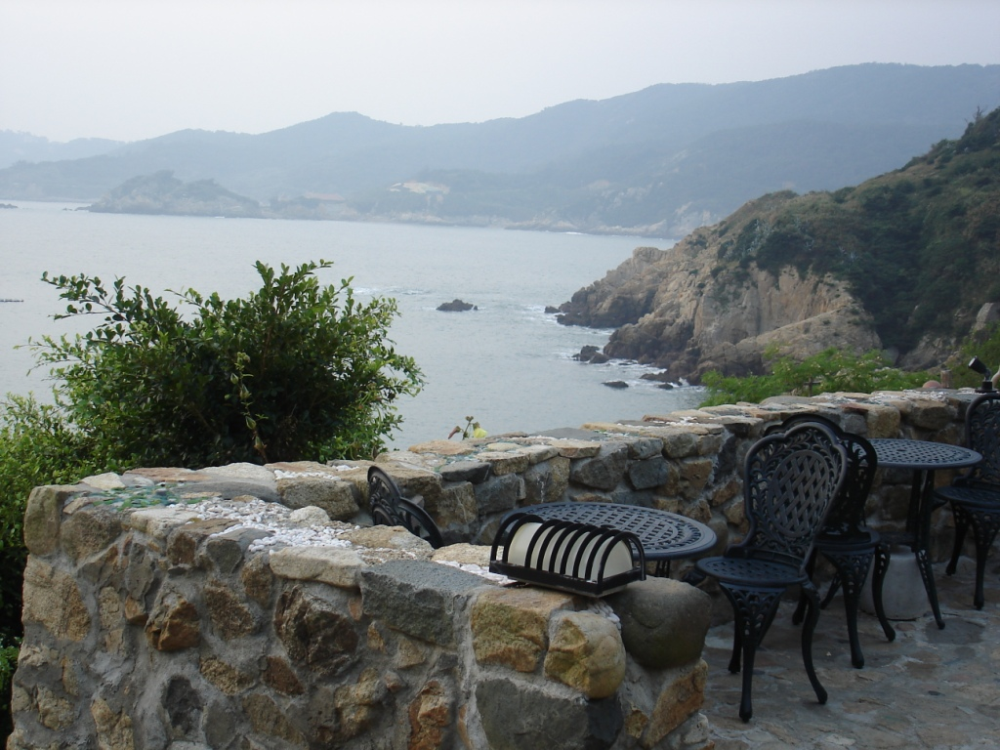

Between Taiwan and China lies the Taiwan Strait, an area frequently discussed by policymakers. The strait contains more than water: it is also home to a chain of islands with a diverse and interesting history.

The plane, a small aircraft carrying fewer than 50 people, leaves Taipei for a short flight east. Everyone receives a newspaper and, almost in unison, turns to the sports page to read about Wang's success in Major League Baseball. The newspapers are soon folded away, and we begin to descend. I look expectantly out the window, but the runway materialises only at the last moment. We land on a small airstrip tucked among the hills, and I immediately begin absorbing the island's atmosphere.

My pseudo-tour guide back home tells me that my ride to the guest house will be a silver car, and, as promised, one is waiting outside.

Soon I am winding through the streets, observing that the island consists of many small villages. She drops me at a temple dedicated to Matsu, Queen of the Sea, and tells me that I should wait until sunset.

Matsu presents an interesting contrast. Years ago, residents chose to renovate old buildings and turn them into guest houses rather than demolish them and build anew. The few modern buildings scattered across the landscape stand out like scars among the beautiful stone houses. These villages support a relaxed way of life and are beginning to attract more tourism. They are especially popular with Taiwanese visitors, although international tourism has not yet flourished. The islands are also home to Taiwanese military bases and training facilities. Photographing declassified outposts feels unusual, particularly when a passing Hummer provides a reminder that the military presence remains. Uniformed personnel are scattered throughout the islands, and eventually the camouflage becomes part of the scenery.

I walk away from the temple and its beautiful sunset, winding through the hills and along the coast towards my guest house, simply named "Fu Ren Kafe Guan." Small wooden signs display the characters along the road, so I follow the trail home.

I wind my way down the hillside and through the greenery into a small brick house. Looking out across the bay I am reminded of Nice on the French Riviera, or perhaps the Cinque Terre. The tour lasts only a few minutes; the guest house has two large rooms, each accommodating eight people. The walls are strewn with pictures of people sending evidence of their good times back, some old rain coats, and some military artifacts.

Similar to the island, my guesthouse has a unique history as well. When the tension between China and Taiwan heightened, the majority of Matsu's residents fled to Taiwan. The last to leave, and the first to come back, is the grandmother who owns this guesthouse. With the help of a daughter-in-law, she remodelled the house and opened it to guests. The walls are evidence of her success.

After my tour I settled down for dinner. Two soldiers behind me quietly exclaimed to each other "oh where is my food, I am sooo screwed." I ordered my dinner, two plates of black chicken rice, covered in cheese, with soup. Not in a hurry, I talked the evening away, feeling the privilege of staying at such a beautiful place. Some time later my food arrived, toasty hot and surpassing my expectations. Everything tasted wonderful, which made sense once I learned that the daughter-in-law had owned a steak restaurant before coming to Matsu.

Somehow I made my way upstairs to the loft for a two-hour nap. After digesting the good food and beautiful scenery, I woke with a smile. On my way to the shower room, of which there was only one and it was not fancy, I glanced at the sky and noticed the moon smiling back at me. It was the kind of vivid sight that inspires children to dream of becoming astronauts. Matsu Island felt like a gem waiting to be discovered.

