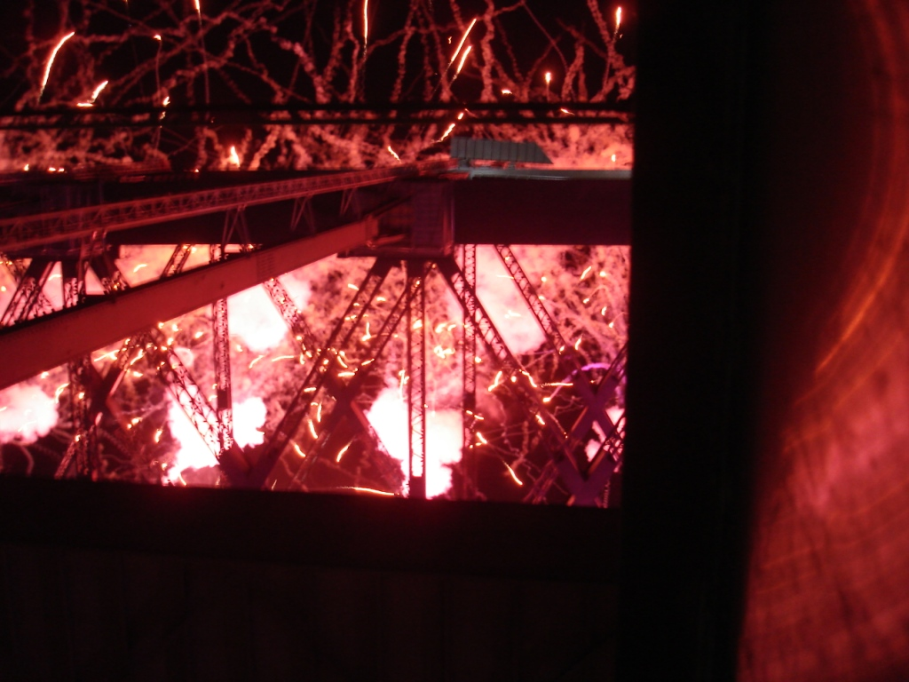
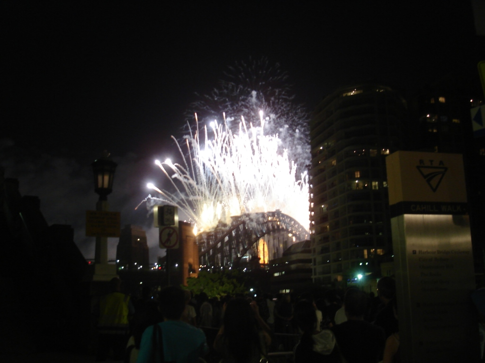
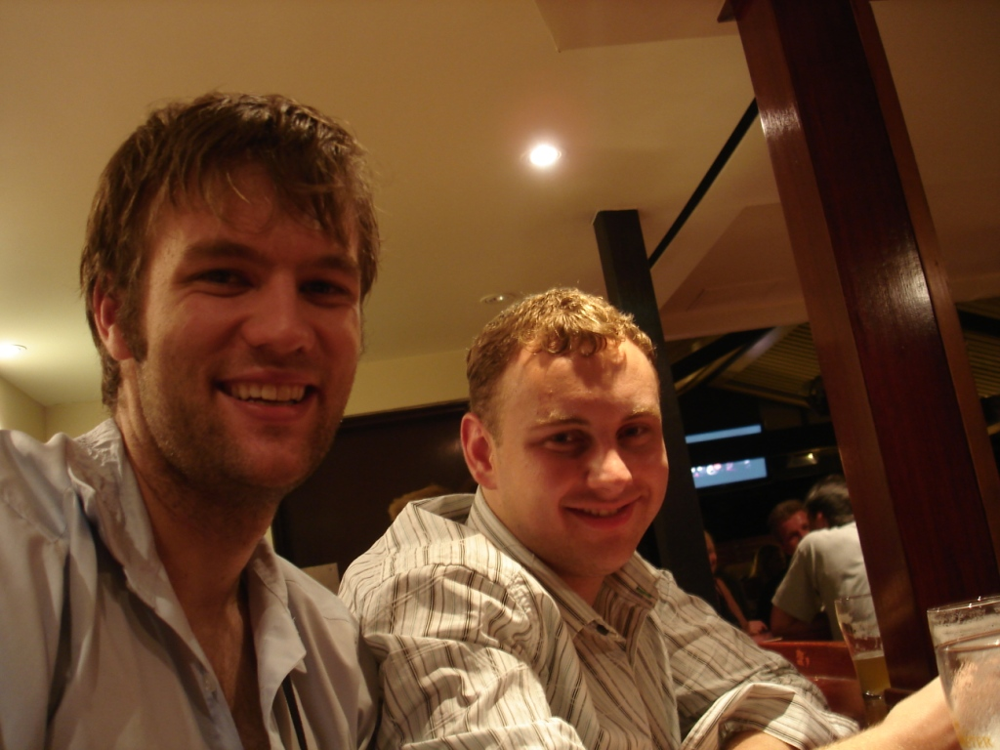
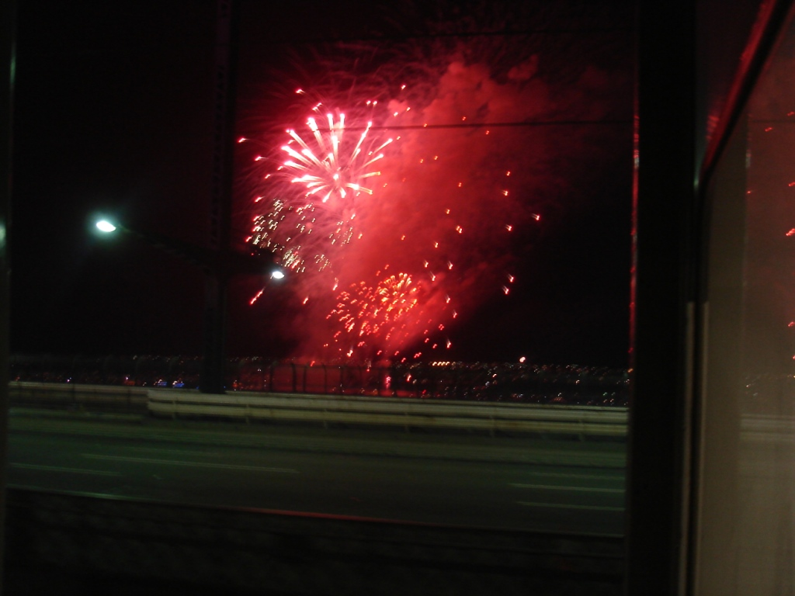

Last year I had a very special New Year's Eve on one of the private piers next to the Harbour Bridge (arguably one of the largest displays of fireworks in the world). I had great food, good company, and jaw-dropping views. A friend was not in the country this year, so I had to find an alternative.

Fireworks debris was falling around the train.

My first plan was to try and go into one of the parks on the north side, thinking that somehow the view would be better. I quickly realized that I wouldn't be able to get into the city until pretty late, and all the parks would likely be filled up. I pondered for a little while, and we came up with an idea: the train. Last year I noticed that the train still crossed the bridge while the fireworks were going off. I looked up the schedule, checked for delays, and at 11:03, caught the train. I was scheduled to arrive at 11:55 and thought I would simply wait on the platform, but the driver had other ideas. The train left the CBD very slowly and began crossing the bridge at midnight. It is hard to describe what the view is like, but it was nothing short of spectacular. While last year I had a holistic view of the fireworks, this year I had a close-up view from inside the train. Fireworks debris was falling around the train.

From inside the carriage, I could see the fireworks in every direction.

I got off the train, caught the last few minutes from near Milson's Point, and was among the first to enter one of the local pubs. After a short stop I was standing in line for the train, but the line at Milson's Point was just too slow (they weren't letting people in). After considering my options, I decided to walk briskly to North Sydney, where I promptly got on the train. Not only was I on the train, I was the only person on it!

I need to preface something: I like trains. I don't think it is just that I don't like driving, nor traffic, but that moving people interests me. One trait a public transportation user must have, especially in a city not known for public transport, is patience. And last night, I had to have a lot of it.

 I had no idea why anybody would break the windows of a train, but the circumstances were difficult to make sense of.

The train ride from North Sydney to Central took nearly an hour; it usually takes about 15 minutes during normal hours. As we approached Auburn, the announcer came over the intercom and said: "there's been an assault at the next station, so I need to wait here for a while." Twenty minutes later, after sitting in a crowded and messy train, we started moving. Once it reached Auburn the train doors started to close, then open, then close, then open. It turned out that a group of people on my train were fighting, although I never learned why. I had to wait 30 minutes for security to take care of them, and finally I was on my way. One odd thing about the station was an abundance of glass, not bottles but shattered panes, as though somebody had broken the train windows. I had no idea why anybody would break the windows of a train, but the circumstances were difficult to make sense of.

At 4:00 a.m. I called my mom, wished her a happy New Year, and hit the sack. Welcome 2009!
