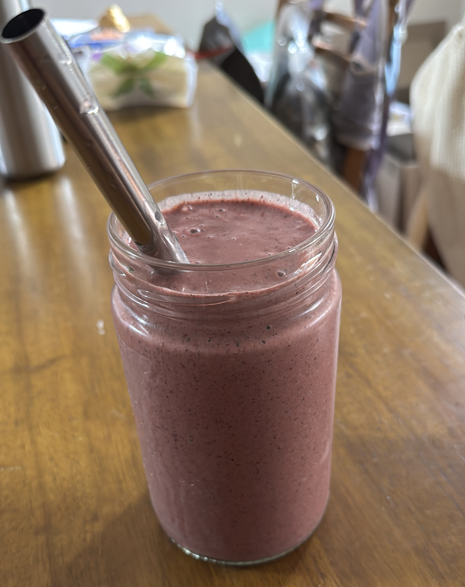

+++
date = '2025-03-19T06:35:20+11:00'
draft = false
title = 'Nutty Pudding Modified Recipe (Australia)'
tags = ['articles', 'longevity']
+++

### OG

It has now been quite some time since I've been making [Blueprint's](https://protocol.bryanjohnson.com/Step-1-Step-2-Step-3) [Nutty Pudding](https://www.youtube.com/watch?v=8eb_41ZpyOQ). For future reference, in case the Blueprint site stops showing recipes, here is the OG:

- 50-100 mL Macadamia Nut Milk
- 3 tbsp ground macadamia nuts 
- 2 tsp of ground walnuts
- 2 tbsp chia seeds
- 1 tsp of ground flaxseed (seed that is ground into flour)
- 1/4 brazil nut
- 6 grams of Blueprint cocoa 
- 1 tsp sunflower lecithin
- 1/2 tsp ceylon cinnamon
- 1/2 cup blueberries/raspberries/strawberries (your choice)
- 3 cherries
- 2 oz pomegranate juice

### My Tweaks

Some of these items are a little hard to get in Australia, or have (in my opinion) below average value-to-benefit ratios, and I've decided to swap them out. Instead, this is the recipe I am currently (24-07-2025) using:

##### Powders / Base

- 30g whole macadamia nuts
- 15g whole walnuts
- 2 tbsp chia seeds
- 1 tsp whole linseed/flaxseed
- 1/4 brazil nut
- 1 tbsp cacao powder (that's CACAO, not COCOA)
- 1 tbsp soy lecithin granules
- 1/2 tsp ceylon cinnamon
- 1/2 tsp mustard seeds
- 2g TMG powder
- 1 tsp matcha powder
- 1 tsp taurine
- 1 tbsp wheat germ
- 1 tsp turmeric
- 1/4 tsp ground ginger
- 1/8 tsp black pepper
- 1 tsp of creatine
- 1 tsp inulin

##### Liquids / Add Consumption

- 200g frozen mixed berries
- 400ml of water

Almost all of this is just from Woolies or Coles, but I did buy the TMG from iHerb, the Creatine from Bulk Nutrients, and the cacao powder and ceylon cinnamon from Amazon. Here is my justification for the adjustments.

1. I've used **whole nuts** instead of ground, as my blender (Vitamix) does a perfectly adequate job of grinding everything up. Anecdotally, I believe that ground nuts spoil more quickly than whole nutes.
2. I've swapped out cocoa powder for **cacao powder**, and it is less processed. It should have higher antioxidants, more nutrients, and fewer additives.
3. I'm experimenting swapping out the sunflower lecithin with **soy lecithin granules**. It is my understanding that there are two reasons for including lecithin in Nutty Pudding: firstly, because it adds choline, and secondly, because it improves the texture. Choline probably isn't a challenge for people consuming a lot of meat or dairy, but consider I tend to avoid both, there is the chance that I need more. Of course, choline combined with meat consumption can be problematic, [apparently](https://nutritionfacts.org/video/carnitine-choline-cancer-and-cholesterol-the-tmao-connection/). So, why soy lecithin? Simply because it is easier to get in Australia, cheaper, and has a higher amount of choline.
4. I've taken out the **pomegranate juice** because it is expensive, and the research seemed limited when it came to benefits.
5. I've added **mustard seeds** to boost sulforaphane, which is an antioxidant. Given I cook almost all my vegetables, it is my understanding that this diminishes the sulforaphane content of them. This is from How Not To Age.
6. I've added **TMG** to help with methylation and reduce homocysteine.
7. I've added **taurine** because it is apparently harder to get from a whole foods plant based diet.
8. **Wheat germ** is for **spermidine**, which is a compound linked to **autophagy**. This is from How Not To Age.
9. **Turmeric** is for it's active component **curcumin**, which is anti-inflammatory. This is from How Not To Age.
10. **Black Pepper** to increase absorption of turmeric.
11. **Creatine** is to increase ATP production and hopefully allow me to build muscle faster. Apparently there are also some studies indicating it may be helpful to push back Alzheimer’s and Parkinson’s.
12. Removed **Macadamia Nut Milk**, as I just use water. Macadamia Nut Milk is expensive in Australia.
13. **HCP** for skin health, muscle recovery (glycine) and joint/bone support. I'm on the fence if there is enough evidence to show efficacy here, and then there is the fear of contamination during the manufacturing process. Edit: I've taken out in an effort to try and decrease my IGF-1.
14. **Pea Protein Powder** to slightly up my protein intake. I'm currently 77kg and aim for around 125g per day, but don't track macros anymore. As we know, protein is a double edged sword: on one side we build muscle to fend off sarcopenia, an on the other side we activate MTOR which inhibits autophagy.  Edit: I've taken out in an effort to try and decrease my IGF-1.

### Prep and Storage

I prepare about 15 days worth of dry powders ahead of time. I typically add some water in the blender and put the dry powders in, and then go on a run. My hypothesis here is that this helps with bioavailability, even though the blender chops things up perfectly fine. After my run I dump the frozen mixed berries in, and have a shower. After my shower I finally blend it all up, and enjoy!

### Consumption

I make mine rather liquid-y, and use a metal boba straw to drink it. These are large peanut butter jars that I've stocked up on and re-use.

