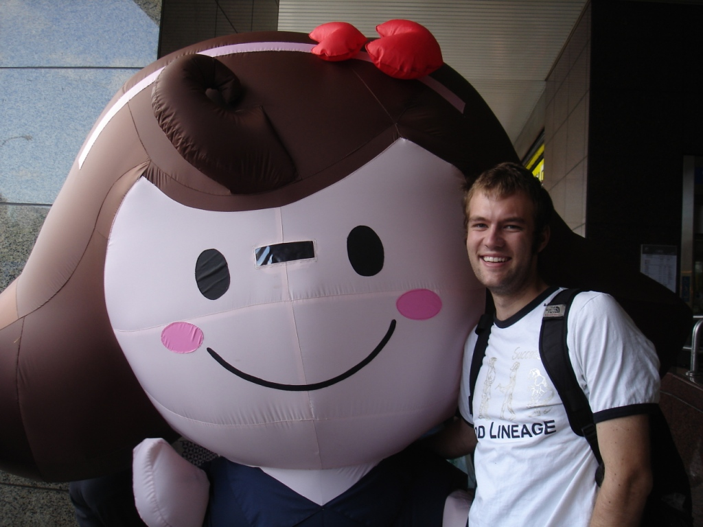
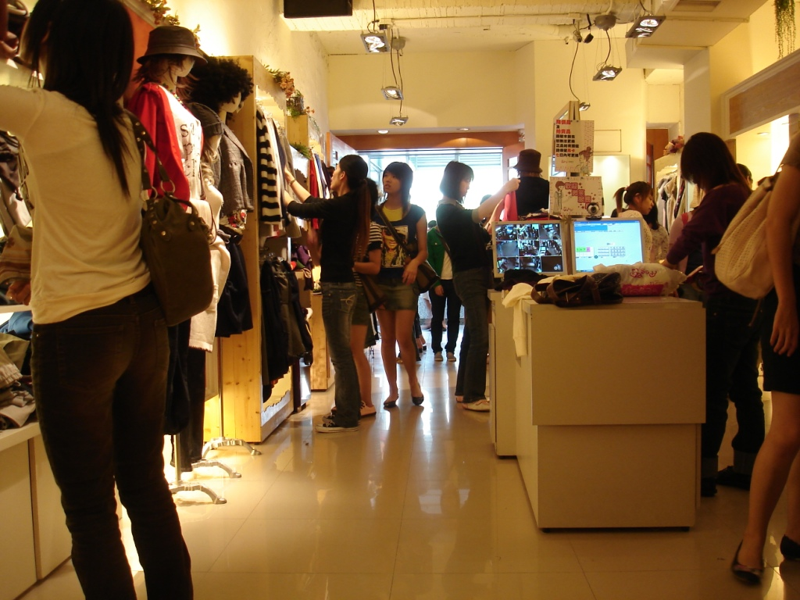

I must take a few moments to note that the GRE was completed successfully, one more step in the PhD application process. Interestingly, as I walk along the streets, I am routinely asked: "so, what does @!*% mean?" "Heck, I don't know!" While I would consider my vocabulary broader than that of the average English speaker, she still asked me some rather random words.

As a reward, I agreed to go shopping with her. So, today I woke up at 6:00am, she took her GRE, and by 11:30 I was off to lunch and several shops. Those of you who know me can sympathize with the pain I was in, as you know I don't really like shopping. At one point she was browsing some shoes, and I sat down on the couch. Looking out over the store I recognized not a single male, and couldn't help but laugh inside. Luckily, we finished lunch and found her a pair of shoes by 2:30 p.m., after which I headed home.

To finish the reward I came across the Mister Donut mascot, and I somehow ended up taking a picture with it. Indeed, as with any mascot I encounter, I had a strong desire to tackle him, but restrained myself. Doesn't everybody occasionally have that urge? Overall, it was a good day.
