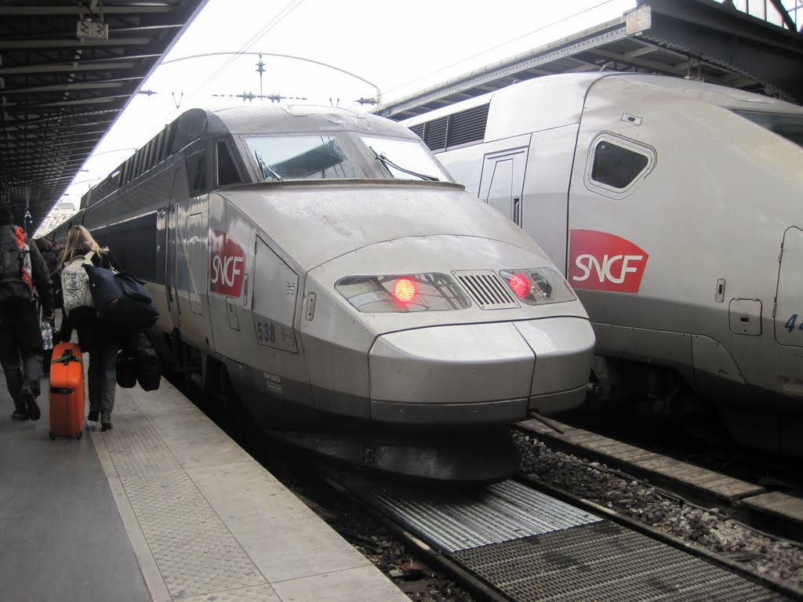
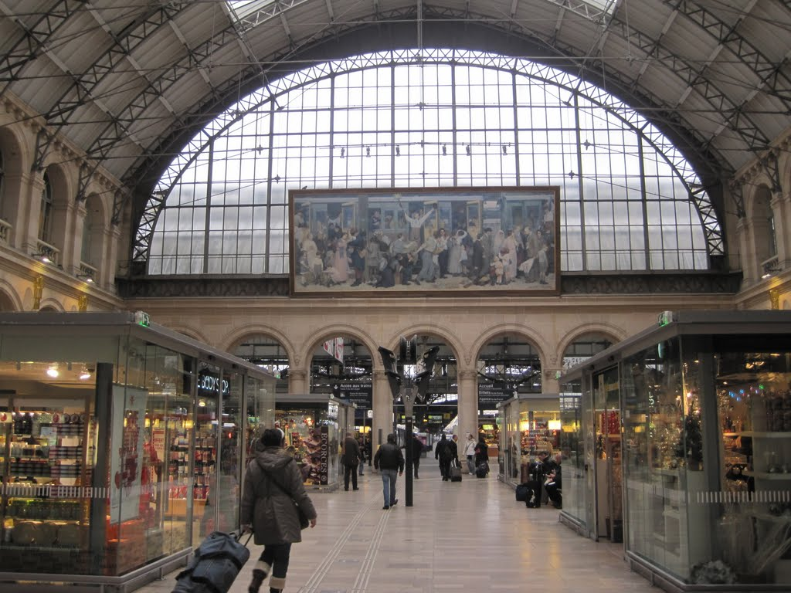
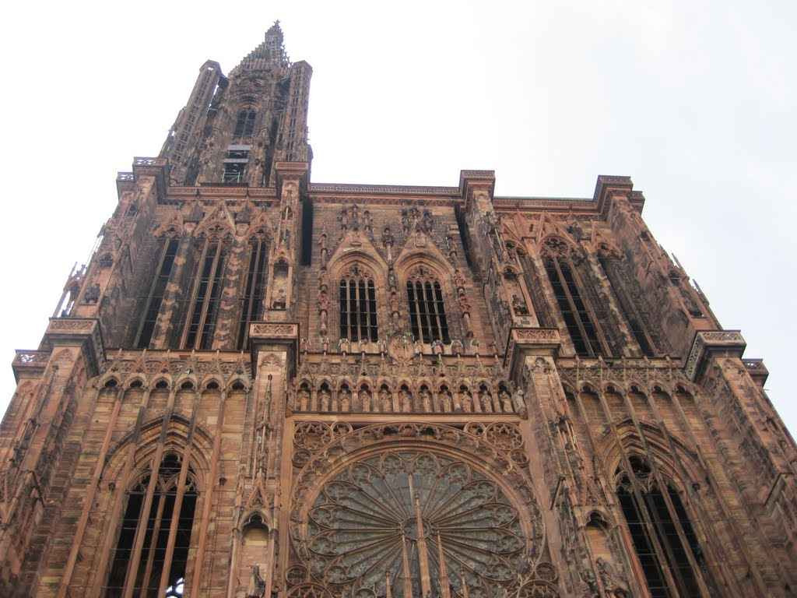
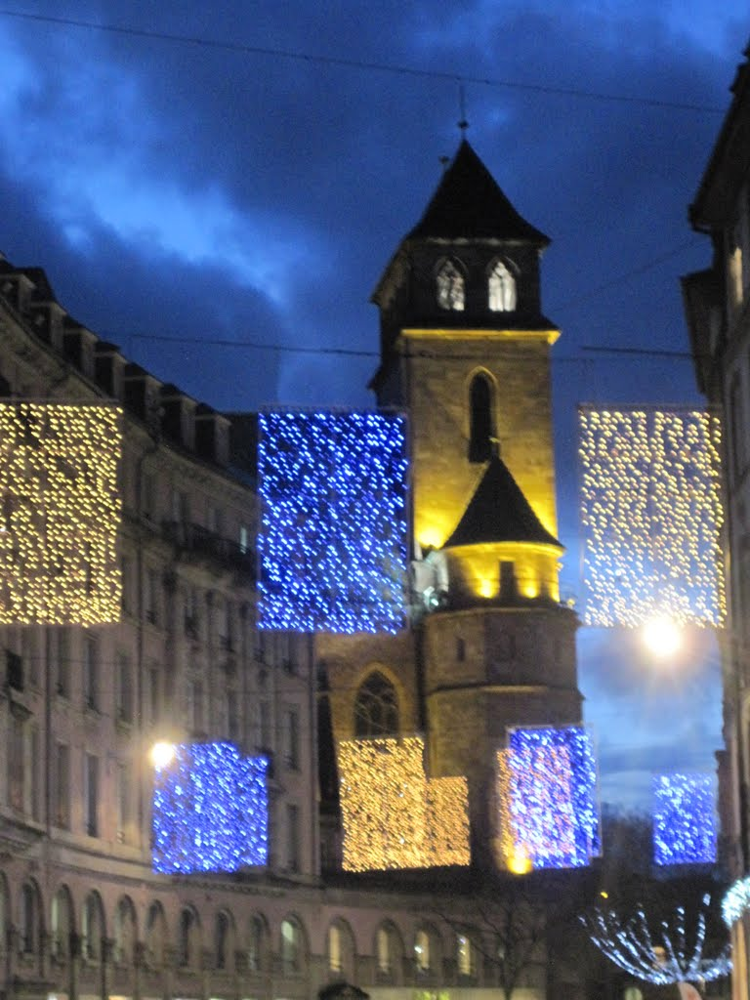

Today was not the best of travel days.

I woke after my large dinner needing to pack, shower, and reach Gare de l'Est before 10am. Luckily, my bags were light and easy to pack, with few things that did not have a regular place. M gave me a ride to the Metro after my obligatory coffee and croissant, and I rode Line 7 to catch the TGV.

Although I arrived at the station a few hours early, I was able to check my email, buy a small meal for the trip, and easily determine which platform the train would use. Boarding was scheduled for 11:05, and sure enough, the platform number appeared precisely on time.

Although I had travelled on the ICE, Shinkansen, and S2000, I had never been on the TGV. The train departed Paris on time and quickly built up speed as the city disappeared behind me, replaced by rolling green hills and tall, bare trees. Parts of the ride were bumpier than expected, but I suppose any deviation feels like a bump at such high speed. I arrived in Strasbourg six minutes late, at 13:48.

Strasbourg was going to be a daytime-only stop on my intense journey across Europe. To maximise the time I could spend walking around, I checked my bags after passing through substantial, if laid-back, security. Another benefit of packing light is that I can usually fit both packs into a medium, or even small, locker. I left the station and started exploring.

I arrived in Strasbourg with certain expectations, or at least images, of what its Christmas market would be like. I had chosen the city because it supposedly has one of the best Christmas markets in Europe. I imagined people singing carols, Santas everywhere, perhaps some snow, and vin chaud. To my disappointment, there were no Santas, carols, or snow. Instead, there were many small stalls, pretty lights, and a little rain. It was not what I had expected, but it was still beautiful to walk around. Strasbourg itself is a beautiful and very walkable city.

While walking along the main streets, I visited a winter clothing store because my shoes were not designed for European winters. The shoes were reasonably priced, but none appealed to me, so I left empty-handed. After several hours of walking, I finally tried vin chaud, which tasted a little like hot sangria, and warmed up in one of the small bars dotted around the central district.

The day ended with a kebab on the way back to the station, a short stop at McDonald's for tea and free Wi-Fi, and then Bus 2 towards Kehl.

Unfortunately, Bus 2 does not go all the way to Kehl, only to the border. The alternative was Tram D followed by Bus 21, but I was uncertain how late that bus operated. When I asked at the train station's information desk, the attendant replied, "This is a train station, not a bus station," probably followed, I imagined, by an equally dismissive aside in both French and German.

I took Bus 2 to the border, with the final three or four stops looking increasingly questionable. The Christmas markets quickly gave way to ordinary city streets, then residential and industrial areas. I thought I saw a few sex workers and began to wonder whether taking the bus to the border had been such a good idea.

I decided to get off at the second-to-last stop, a well-lit area near a major road that I hoped would cross the Rhine and take me into Germany towards my next train. I stayed on the lit path, crossed the river, and entered Germany. In daylight, the crossing would probably have been beautiful; small signs even described points of interest. On a winter night, however, shadows move and ordinary things can look menacing.

I took a quick stroll through Kehl, then waited at the closed station for my train to Offenburg. It was difficult to decide where to wait: on the cold platform or in the concourse with a few people sheltering there. Most passengers chose the concourse, but I opted to stand on the stairs.

The train arrived, and I boarded for Offenburg. It was scheduled to arrive at 10:22. At 10:20, the train slowed and I heard what I thought was the correct station name. Along with many other people, I got off at a station I should have recognised as far too small for my overnight train to Prague.

By the time I realised the station merely sounded like Offenburg, the doors had closed and the train was pulling away. I was stranded at a single-platform station, ten kilometres from my warm overnight train, which was due to leave in ten minutes. I ran outside looking for a taxi, but there were none. I found only one man, who tried to help me in surprisingly good English. We quickly concluded that catching my train would be impossible and that I needed another plan. Only once before, in Shanghai, had I been in a similar situation, but there I had managed to take another train and intercept the original one. I would normally consider this part of the adventure, but sitting alone in 5C weather at 10:45 at night brought back the loneliness and desperation I had felt crossing from Laos into Cambodia.

I weighed my options. Should I continue to Prague, fly, stay in Karlsruhe and take a train the next day, or take two trains and a bus? Every option had financial and practical drawbacks. I delayed the decision until I reached Karlsruhe, where I would have better information. En route, I enabled 3G data on my phone, restricted it to the browser, and investigated flights, accommodation, and other routes. In Karlsruhe, I settled on taking trains to Frankfurt and Nuremberg, followed by a short bus ride to Prague. I would sleep only in stretches of about three hours, but at least I would be warm and would reach Prague only a few hours later than planned.

The train to Frankfurt was pleasant enough, and a proper sleeper allowed me to get a little rest.
