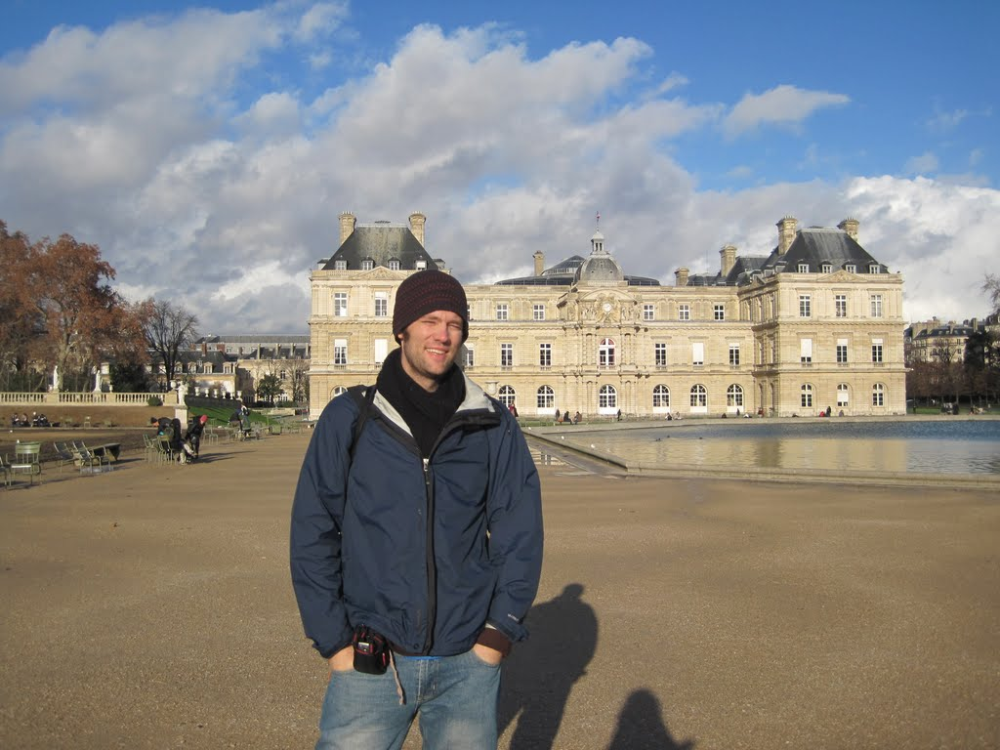
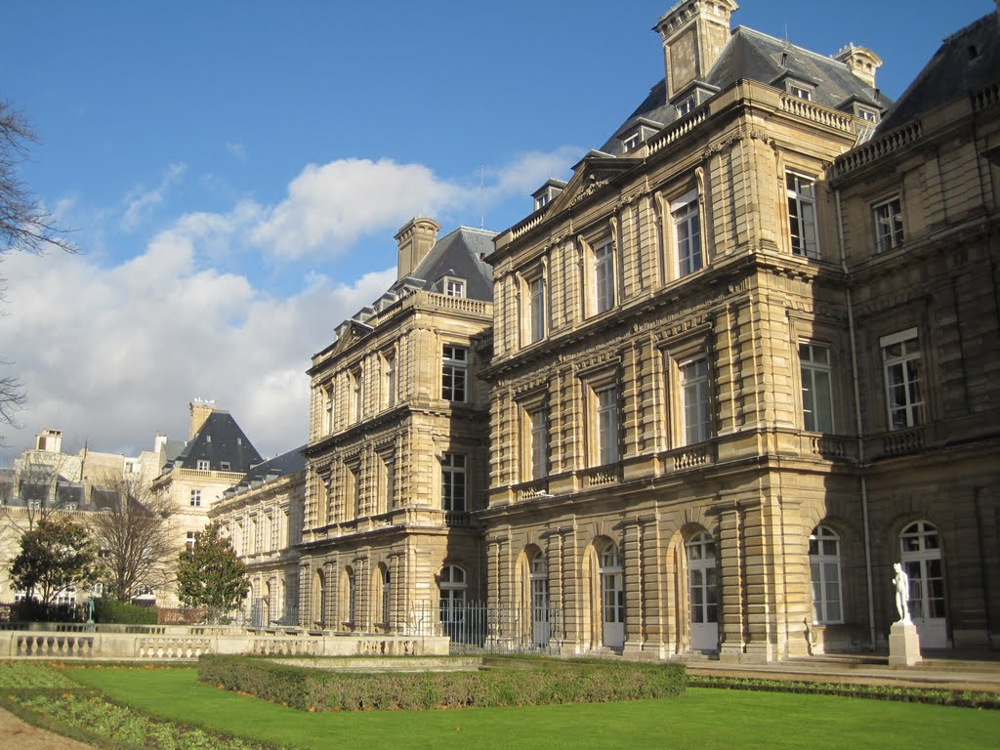

My flight arrived in Paris slightly ahead of schedule. I passed through customs and security without delay, then ordered an expensive but worthwhile "little breakfast" of coffee, orange juice, and a croissant.

Our host for the Paris trip, James, instructed us to take bus 183 to Camille Groult, then walk a few blocks to the house. I called to say that I had arrived on time and was on my way. Moments later, my phone ran out of power; three days of maps and Wi-Fi without an opportunity to recharge had drained the battery.

Fortunately, one of us remembered where the house was after staying there five years earlier. Because our time was limited, we promptly dropped off our bags, borrowed two umbrellas, and set out to see the sights.

Although we had both visited Paris before, this was our first time there together. I had taken almost no photos on my first visit, a mistake I would not repeat.

We visited Notre-Dame Cathedral, whose approach looked slightly different from my memory, and strolled through the Latin Quarter. We had lunch at a small corner pub, most likely an overpriced and mediocre choice, then walked directly to the Pantheon. Next came the Senate, Les Deux Magots, and the Jardin du Luxembourg, where I noticed the distinctive work of Yayoi Kusama, whose museum in Matsumoto I had once helped clear of snow. After walking along the Champs-Elysees, we took the Metro back to our hosts' house, where I showered and prepared for bed.

I had forgotten how walkable Paris was until the previous day, when we visited several sites in only a few hours. Today, we decided to see more while allowing ourselves to get a little lost along the way. We both enjoy wandering through unfamiliar cities and seeing what appears beyond the usual paths.

After coffee and croissants with M and J, we caught a bus, walked farther than planned, and took Metro Line 7 to the Eiffel Tower. I had previously taken the lift to the top, but this time I decided to be adventurous and use the stairs. My excitement grew as we approached. A five-storey poster advertised Australia's picturesque outback, which I would venture most visitors never see.

The base of the tower was less crowded than I remembered, although my previous visit had been in summer, so that made sense. Armed military guards patrolled in triangular formations about three metres apart. The stairs beckoned, and four euros later I was on my way. Two security guards greeted us at the metal detectors with obvious good humour. "Where are you from?" one asked my companion. "Taiwan." Looking at me, he asked, "You're from Taiwan too?" "Um, no." "I know, I joke." I imagined every visitor receiving similar treatment.

I huffed and puffed to the first level alongside several tourists hoping to avoid the lift queues. Every so often, a lift passed us packed to the rafters, making me glad I had taken the stairs. I observed that the Eiffel Tower must offer one of the greatest returns on investment of any structure ever built, which led us to discuss which buildings might attract a better tourist return. "The pyramids, perhaps," I suggested, "but think of all the labour used to build them." We went back and forth over ancient labour, machinery, and modern construction tools.

I circled the first level, taking several photos, and then climbed to the second. The wind picked up, so I checked for loose clothing and electronics before continuing to take pictures. Eventually, the cold became too much, and I walked through the indoor area to warm up before descending.

Almost immediately after leaving the tower, while we were in a jovial mood and looking like two lovebirds amid a forest of black coats, a woman asked me to sign a petition for an organisation supporting deaf people. She was outgoing and generous with air kisses, which perhaps should have been a warning. I then realised it was a donation sheet, with a final column for the amount.

I hesitated, having already written down my name, when I noticed another petitioner approaching my companion. I told the woman I had no money, which was true. When we reconvened, we concluded that the petition was almost certainly a scam. The cardboard clipboards, single donation sheet, apparent focus on foreign visitors, and unusually large amounts all seemed suspicious. Without adding an amount or signature, we decided to walk away. One petitioner wrote "POLICE" on her hand, although her meaning was unclear. She followed us briefly before approaching another tourist. Half a block later, two men appeared to coordinate a group of around 15 petitioners entering the Champ de Mars, reinforcing our suspicion that the operation was organised. Although the encounter had dampened my mood, I recovered by taking a few final photos of the Eiffel Tower.

At the end of the Champ de Mars, I photographed the Ecole Militaire and then wandered through back streets towards the Champs-Elysees. We bought biscuits at a slightly hidden Carrefour, and I bought trousers at the large H&M store. We took Metro Line 7 and then a bus back to J and M's house, arriving with plenty of time before dinner.

J was feeling slightly unwell, but we still went to a fine French restaurant he liked and naturally recommended. The meal was a delight, returning me to cooking styles I rarely tasted. Although I no longer remember the names of the dishes, I had delicious pork and duck. There were no jarring flavours; everything complemented everything else. Our waiter kept earning "gold coins," as J would say, by being attentive without becoming intrusive. We concluded the dinner and wine with coffee at a nearby cafe and, after about four hours of culinary pleasure, slowly made our way back to the Metro.

After all the day's adventures, one might think it was time for bed, but J and I had unfinished business: one last chess game. Unlike our previous matches, J did not control this one expertly. It ended with promises of future battles, and I quickly fell asleep in the basement beneath the spiral staircase.
