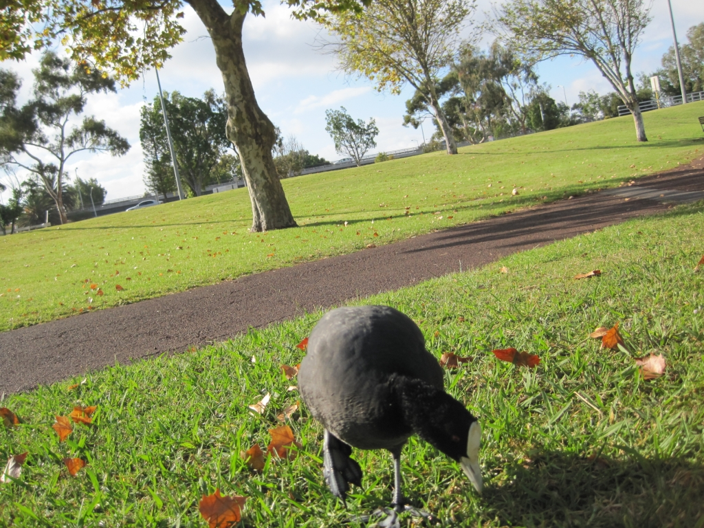
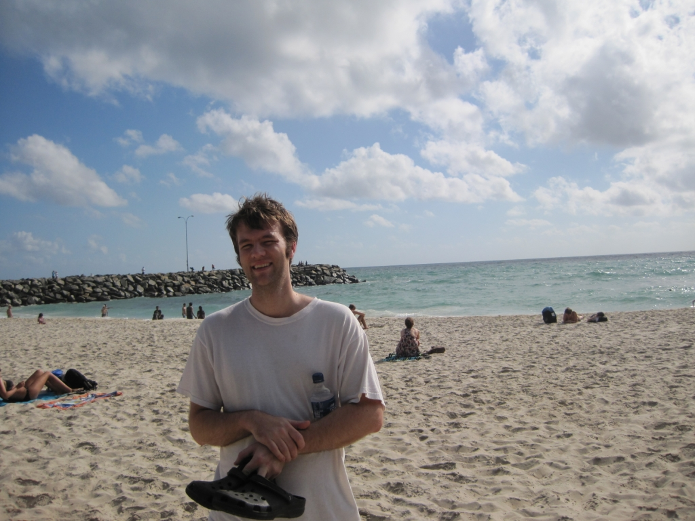
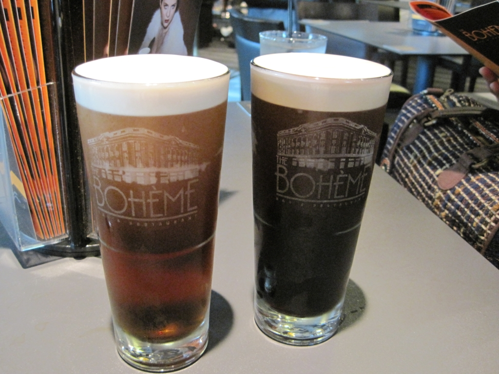
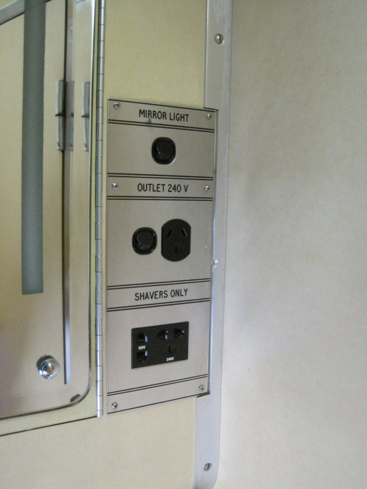
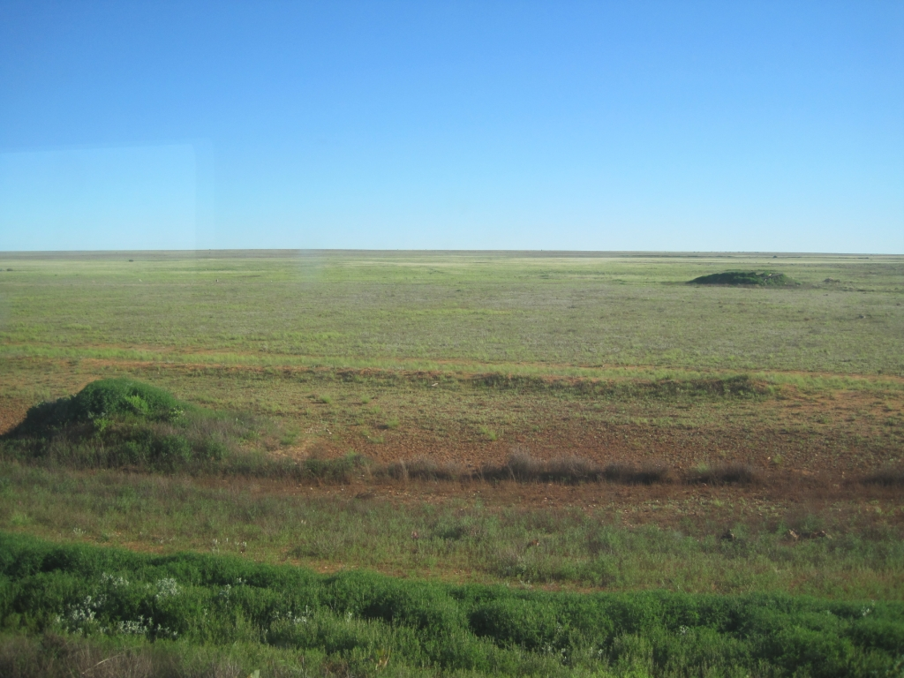

I decided it was time to take a vacation. There was a problem, however: I was under a lot of pressure to finish school-related work. Is it possible to take a vacation without taking a vacation? I came up with the idea of flying to Perth over the Easter long weekend and then catching the Indian Pacific back to Sydney.

On April 22, I caught an early-evening Qantas flight to Perth and took a taxi to my guesthouse. Although tired from the flight, or perhaps from the two beers I had with dinner, I decided to explore the CBD. The lights were blazing and, despite it being the start of Easter weekend, plenty of people were out. Perth appeared more diverse than I had anticipated, with a strong Asian influence. Many stores had Chinese characters alongside their English names. After a quick bite at Nando's, I was ready to head back and get some sleep.

Bright and early the next morning, I started visiting the sights. On my walk to the CBD, I stopped at a little co-op-style store. It was my ideal food store. Maybe I am mountain folk after all?

I will admit that my planning wasn't perfect, partly because the previous two weeks had been extremely busy. Thanks to my Android phone, however, I quickly found the top sights and started walking. After crossing the CBD, I entered Kings Park and Botanic Garden, which offers splendid views of the city. I caught a bus back to the city, enjoyed some retail therapy, and decided to visit Cottesloe Beach.

After boarding the train and then transferring to a bus because of trackwork, I eventually reached the beach. It was nice. After walking the length of the beach and sharing a gelato, I boarded the 103 without knowing where it would take me. Luckily, "all buses lead to Perth," and before long I was back in the CBD.

By this point, I was starting to tire, and there is no better way to revive tired feet than a nice cold one.

I checked in at the guesthouse, made sure my laptops were still in my room, and then went searching for food. One of the advantages of a diverse city is that someone usually has something open. Over Easter or Christmas, many Asian restaurants and stores may be open; over Chinese New Year, many Western ones may be open. I went to a pho restaurant that was packed to the rafters and enjoyed a good meal. The food was pretty good, and I could understand why so many people were there (or perhaps all the other restaurants were simply closed).

I packed and prepared for the non-vacation I was about to take.

The next morning, Sunday the 24th, also known as Easter, I walked to Perth station and tried to find something to eat. Nothing was open. Luckily, Subway was available, and after ordering an egg-and-bacon sandwich, I boarded the train to East Perth. The Indian Pacific was sitting near the platform like a horse ready to bolt from the gates, so I ordered a coffee and prepared to join the race.

A little after 11:00 a.m., I boarded the train and greeted my cabin, an ingeniously planned little room for two. It had two beds, two chairs, a small sink, and a 240 V power supply! I had thought there might be power, but I had also read a recommendation to bring a surge protector, which I did.

The train departed at 11:55 a.m.

The rest of the trip, so to speak, is history. The first stop was Kalgoorlie, a small mining city with a big mine. Next was Cook, in South Australia, which was my only stop on the 25th. Although the vastness was beautiful, I was surprised by how green everything was. The train drivers said they had rarely seen such a green outback. I spent a few hours in Adelaide, had breakfast, and then went north to Broken Hill. Eventually, I entered the Blue Mountains and realised I was nearing home and the trip was coming to an end.

