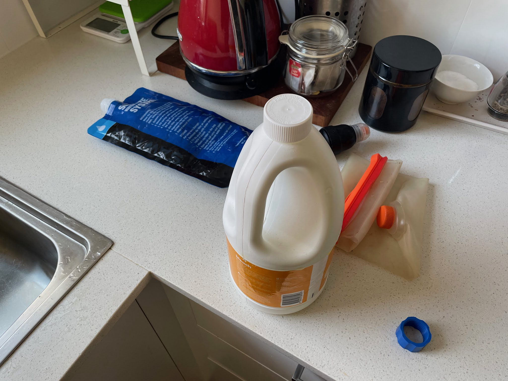
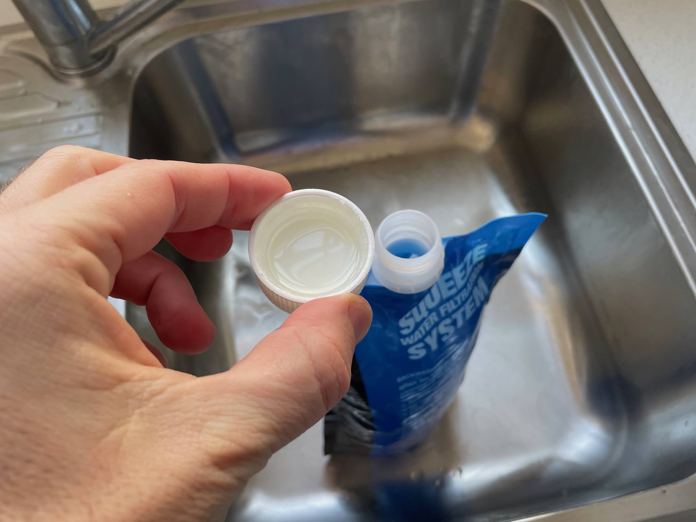
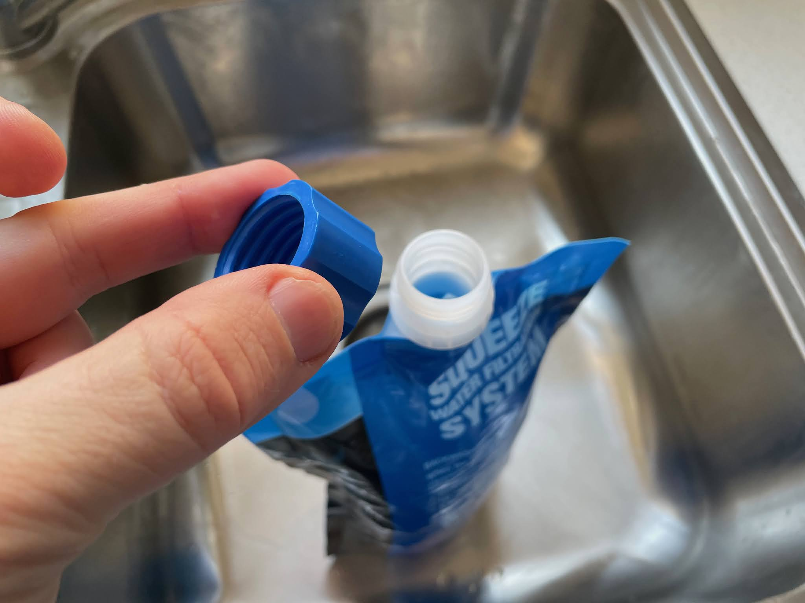
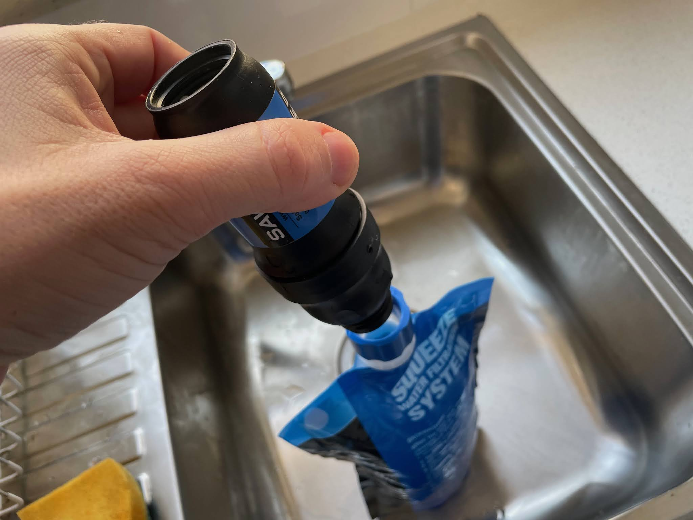
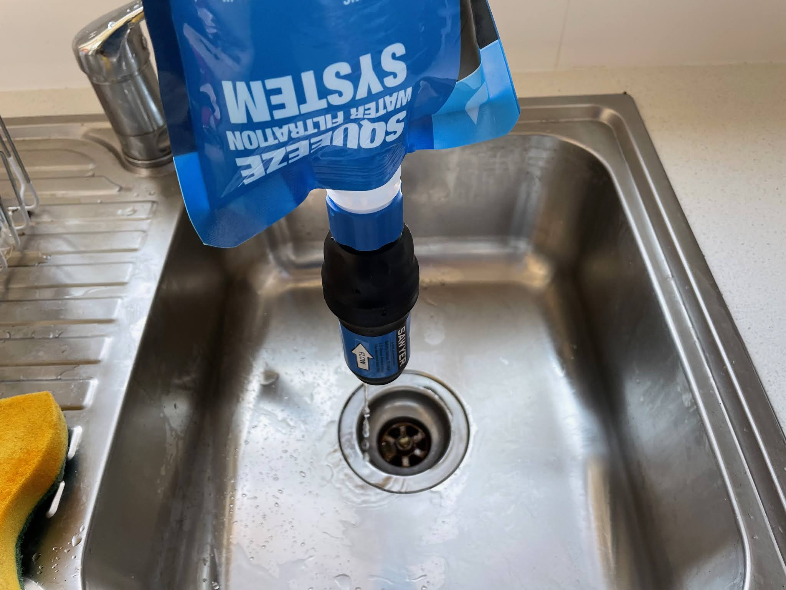
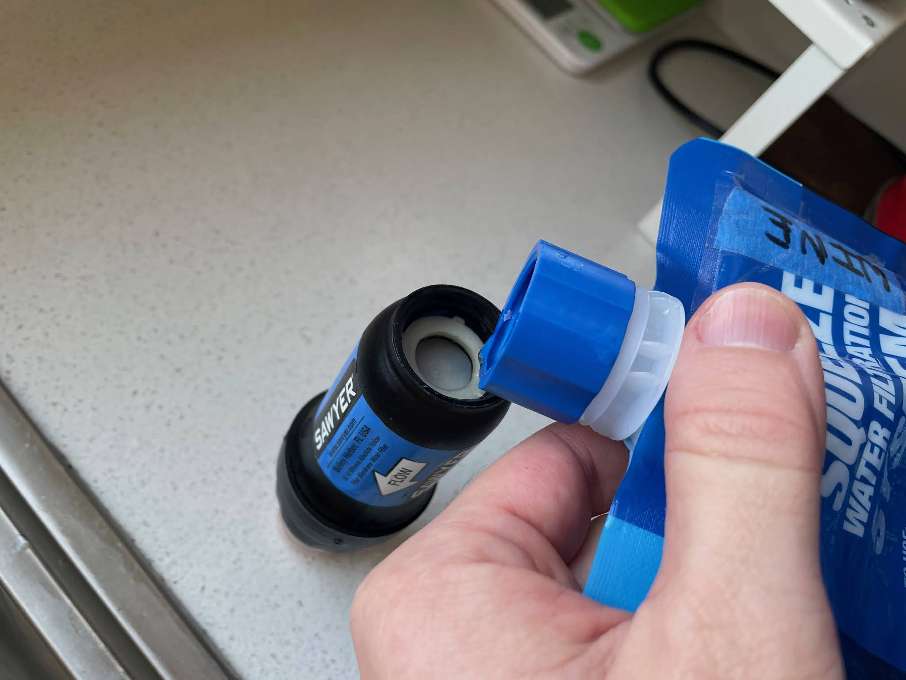
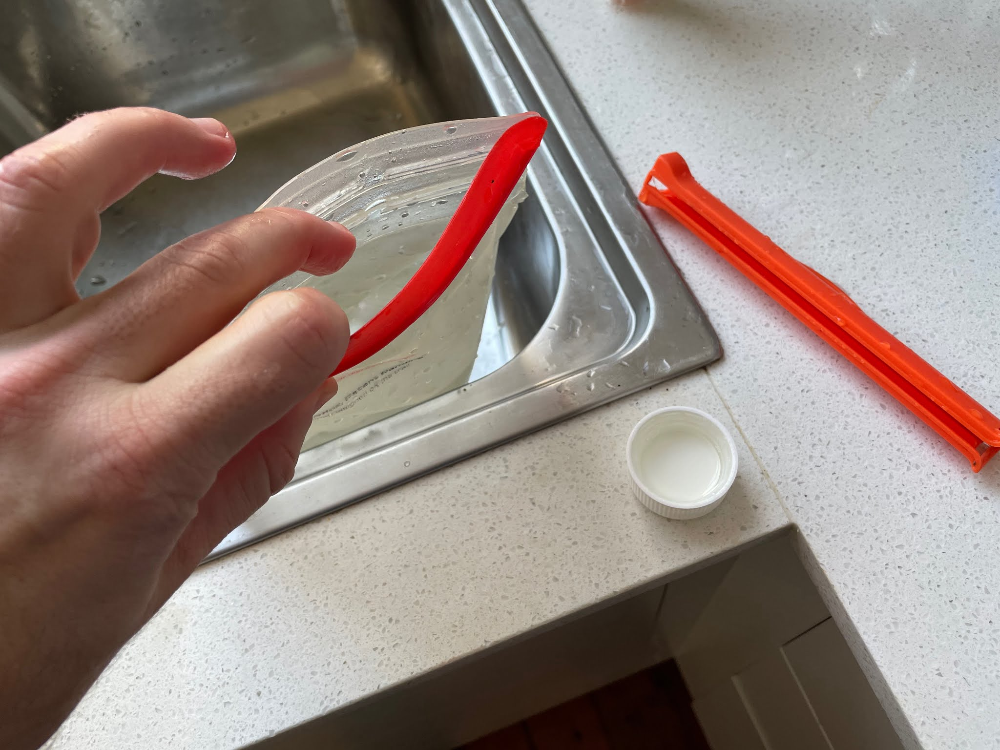
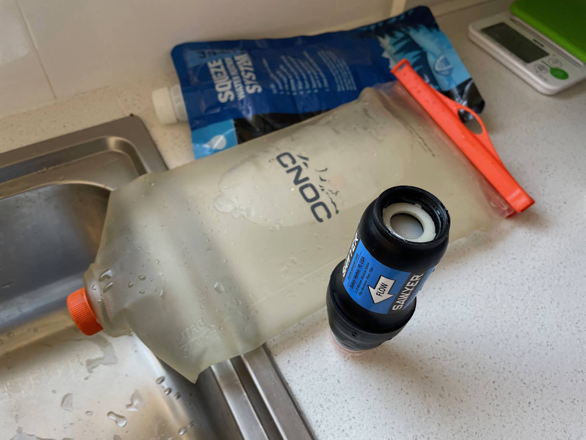
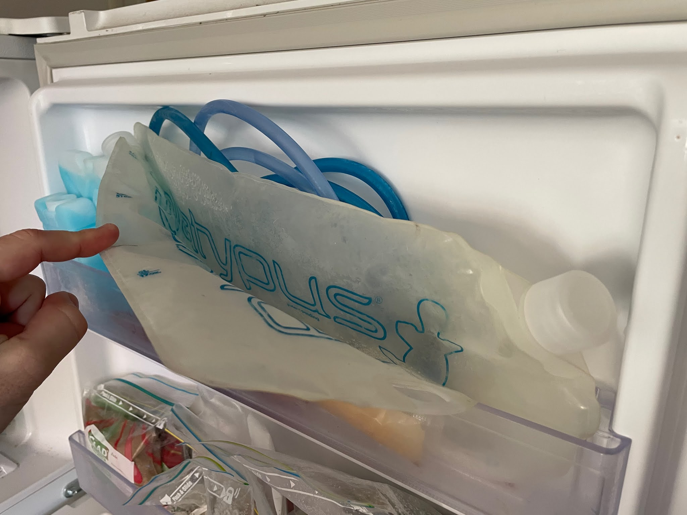
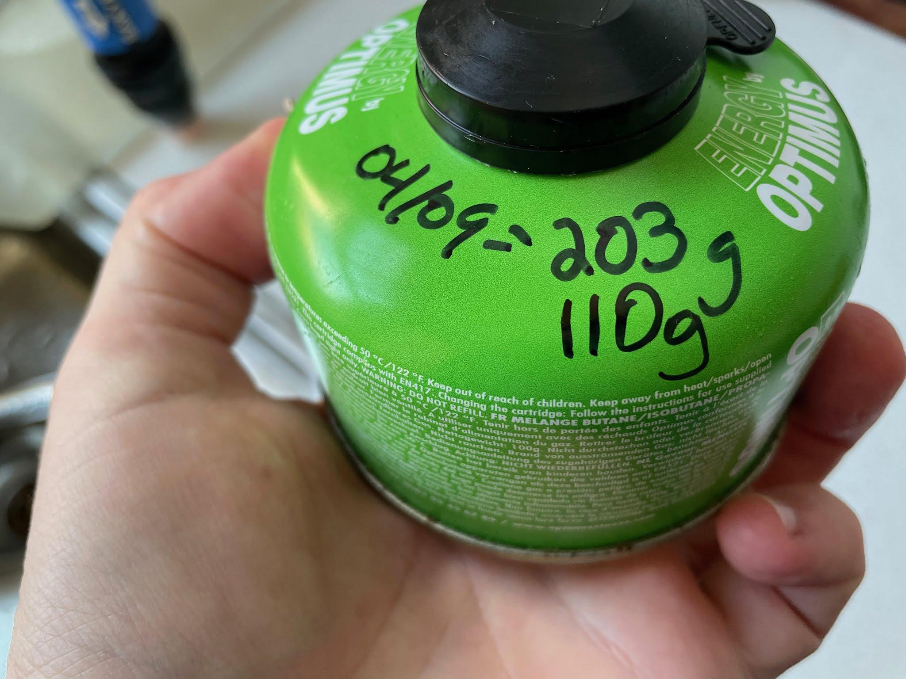

I have the privilege of being able to afford all those random little backpacking items, and while I don't baby my gear, I do try to take care of it. Especially things that keep me safe. Here's what I do after every trip with a few of the items.

  

I have what are probably the two most popular water filters on the market: the [Katadyn BeFree](https://www.katadyn.com/us/us/14946-8019639-katadyn-befree-0.6L_usa) and [Sawyer Squeeze](https://sawyer.com/products/sawyer-squeeze-filter/). The point of this article isn't about comparing filters, but I recommend both: I use the BeFree for solo day hikes / fastpacking or if water is plentiful, and the Squeeze in pretty much every other situation (e.g. if I need to filter for other people). If buying now then I would be super keen to try out the [Platypus QuickDraw](https://www.platy.com/ie/filtration/quickdraw-microfilter/11458.html).

  

This previous weekend I came back from a quick overnight with some people and kids, so decided to take photos of the clean-up process.

#### Sawyer Squeeze

I prefer doing a backflush with the coupling unit vs. the syringe.

  

Get supplies ready. Bleach, spare Sawyer bag, and blue coupling thing.

  

Fill bag with water, add one cupful of bleach.

  

Put on blue coupling thing, but only about 1/2 way

  

Put Squeeze on and now make it tight.

  

Backflush. I don't do it like this, and use two hands instead, but had to take a photo.

  
  

Put cap back on and pour a little of the water in the filter. Let sit for a few hours.

  
  

#### CNOC Bladder

I use this as a dirty bag if needing to filter a lot of water (e.g. group trip).

  

Fill bladder with water and a capful of bleach.

  

Put on counter and let sit for a few hours. I then put a small cup in the opening and let stand dry.

  

20 year old Platypus bladders stay in the freezer. Mainly used for running if I don't take my BeFree.

  
  

#### Gas Canister

I use my kitchen scale to weigh and then write down how much gas is left. This one started at 203g, and after a few overnights is 110g. Commonly these canisters weight 95g - 100g when empty, so I know I've got 1-2 burns remaining.

  

  

Weight on the side (~200g gross weight, 95-100g empty weight)

####   

That's it. When done these all go in my "every trip" basket (to be fair, I don't take a stove quite often), and now I know I don't get caught out with a clogged filter or run out of fuel and drink cold coffee.