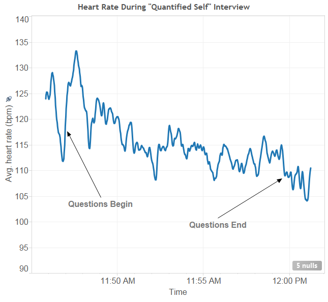

YS and I were recently interviewed about self-tracking and Quantified Self by one of the major news channels in Australia. I will reflect on the experience after the show has aired, but it was an overall great experience. We have a new respect for filming what may ultimately be just a two minute segment. Depending on how the editing is done it will either provoke the hosts to contemplate the value of a data-centric macroscopic view of the world, or give them lots of fodder.  
  
That said, as you would expect, I had to track my heart rate during the interview - see below. My interpretation is that my heart rate jumped at the start of every questions, and went down as I answered the question. It also dropped when the interview finished. I wish I had a more expensive heart rate monitor (e.g. Zephyr BioHarness or Scanadu) that tracked skin temperature and breathing. My hands felt cold by the end.  

.