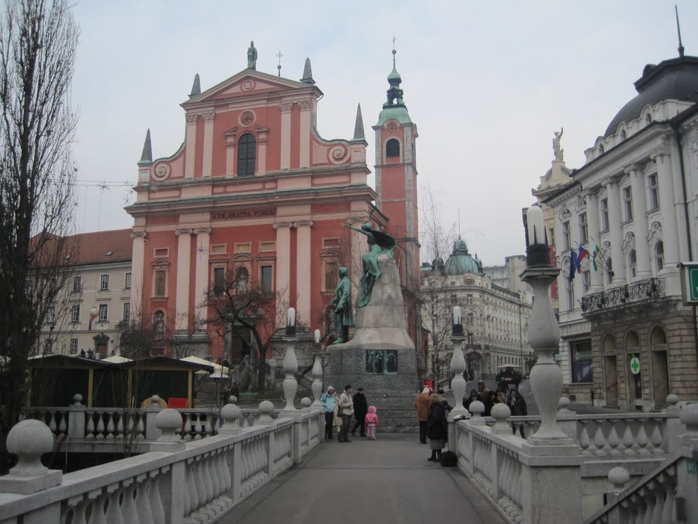

My ultimate goal was Budapest, but with a few spare days, I opted to visit Ljubljana, Slovenia's capital, and then spend the night in Zagreb. Because every Slovenian border can be reached within three hours of Ljubljana, the travel time was not unreasonable. I caught a bus from Bled to Ljubljana to begin the journey.

Ljubljana appeared to be a clean, compact city that was easy to explore on foot, with many interesting sights close together. My layover was only a few hours, so I wanted to make the most of it. I would not claim that anyone can see a city in an afternoon, but walking around still seemed better than sitting in the train station.

I headed south with my bags and went directly to the Three Bridges, one of Ljubljana's distinctive architectural features. The bridges were lovely and duly photographed, after which I continued through the old walkways towards the park.

I noticed a few teenagers looking up a small alleyway and, feeling adventurous, walked down it. The alley grew steadily steeper, at which point I realised I was not walking through the park but up to the castle. Since I still had time to explore, I continued, soon out of breath from the steep path and the weight of my bags, until I reached a wooden walkway marking the beginning of the castle grounds.

The castle was pleasant and free, which encouraged me to explore the interior. The area above the information centre offered an excellent view over the city. Mindful of the time needed to walk back to the station, I left by a different path and soon found myself in another Christmas market. Many vendors appeared to be celebrating Christmas with their families, so several stalls were closed. I crossed the Three Bridges again, found a cafe near McDonald's, and ordered two cappuccinos.

The coffees were perhaps the best I had tasted since arriving in Europe. I had expected great coffee everywhere, but many places used automated espresso machines that produced foam more like dish soap than the microfoam I had hoped for. That makes me sound like a coffee snob, and I am no aficionado.

Can't resist when I see a cannon @ Ljubljana Castle

Just as I was about to leave the cafe, the manager came out and asked whether I wanted a croissant. I had been trying to maintain my habit of avoiding saying no, so I hesitated. He said, "We're closing shortly. Have a free one for the road." "OK!"

A few blocks later, I was back at the station, reading emails in McDonald's while waiting for my train to Zagreb.

Shortly after the train started moving, I was sound asleep. Moving vehicles have always had that effect on me. Three hours later, after nightfall, I arrived in Zagreb, ready to find my accommodation, change money, and organise the next day's sightseeing.
