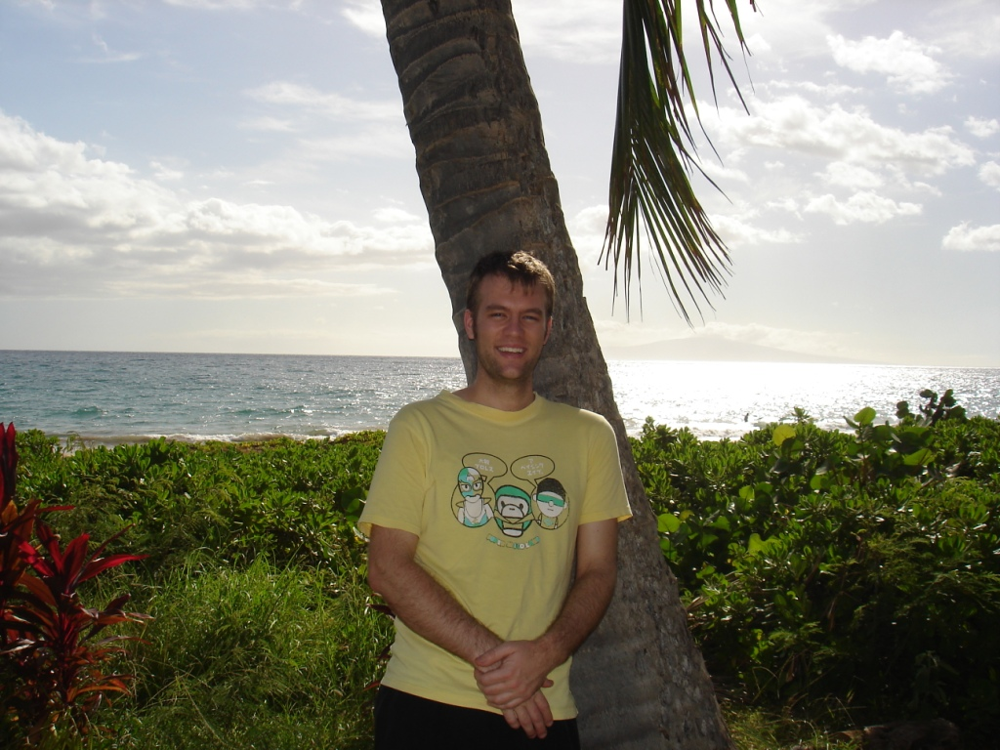

I closed my eyes, imagined being 16 again, focused on driving on the right-hand side of the road, and set off.

I had just returned from Hawaii for Ian's wedding, and what a fun, fast-paced trip it was. I left work a few minutes early on Thursday and went straight to the airport, where I boarded my 6:00pm flight to Honolulu. The flight was slightly bumpy, and I tried to sleep. My airline of choice was Jetstar, which was mediocre as always (imagine flying EasyJet for ten hours), but I knew to plan ahead.

After arriving in Honolulu, I quickly boarded the shuttle to the other terminal and then a second plane to Maui. A short island hop later, I landed in Kahului. Outside the airport, I caught the Thrifty shuttle to the rental-car depot. As we arrived, I saw a tow truck carrying a totalled car, a sombre reminder to purchase the highest level of insurance available. I arranged an early Friday pickup and took the shuttle back to the airport. After waiting 30 minutes for the next bus, I headed into central Kahului.

A short bus ride later, the shopping centre I wanted was only about four kilometres from the airport, and I checked into the Maui Seaside Hotel. The staff were friendly, and the hotel was about what I expected. I rested briefly, then caught a bus down the Piilani Highway. It meandered along the coast, and when most of the local passengers got off, I followed. I was craving "American food," and Denny's was the best option I could think of. Afterwards, I spent some time on the beach and waited for a bus in the other direction. A few hours later, I was back at the hotel and in bed by 11:30pm.

Friday began what had become a regular routine: waking early. The alarm sounded at 6:15, and by 7:00am I was on the Dollar shuttle to Thrifty. I had booked a "mystery car" and was delighted to discover a clean Dodge Charger waiting for me. It was clean on the outside, at least; the interior smelled of smoke, which, combined with the winding roads, made me carsick. I closed my eyes, imagined being 16 again, focused on driving on the right-hand side of the road, and set off. I adjusted quickly, and thankfully Hawaiian drivers were quite relaxed. Compared with Sydney's more aggressive traffic, it was a pleasure.

The main reason for waking so early was to visit Haleakala National Park before Ian's wedding. Continuing the "American food" theme, I ate breakfast at IHOP and drank six cups of coffee. I should have known better, much as a parent should when a child begins devouring sweets. After a short drive, at least by Sydney standards, I reached the volcano's rim, surrounded by tour groups.

Although the Thrifty representative had advised me to stay on the highways, I soon turned onto side roads to see more of the countryside. The beautiful scenery often reminded me of driving around New Zealand's South Island. Rounding one otherwise uneventful bend, I came across a small town and naturally stopped for coffee. Soon, I was back on the road and, after a few wrong turns, reached the Hana Highway.

Ian had warned me about driving the Hana Highway, which was the main reason I had spent as much on insurance as on the rental itself. The first section was tame, but the road quickly became winding. Two and a half hours later, I successfully emerged in Hana and pulled into Ian's guesthouse.

Ian and Xiaowen were not there when I arrived, so I sat and talked with Xiaowen's parents. Ian soon returned, and I helped entertain the steady stream of guests. As people began leaving or retiring for the night, I helped clean up, curled up on the couches, and fell asleep.

Bright and early, sunlight filled the room and woke me. I finished checking my email and left for the wedding.

The ceremony was lovely. Ian and Xiaowen were fortunate to share such a special moment in a beautiful location, surrounded by close friends and family. Afterwards, I had lunch at the resort and returned to the guesthouse. Ian and Xiaowen finally looked relaxed, and I said goodbye.

I should explain why I could stay for less than 48 hours. The entire trip needed to be brief because I had just started a great new position and felt it would be irresponsible to take much leave. My return flight to Sydney departed very early on Monday, so early that I needed to spend Sunday night in Honolulu. That, in turn, meant staying Saturday night near the Maui airport.

After saying my goodbyes, I drove back to the hotel feeling sleepy but content. I still had the car and was not quite ready for bed, so I drove into the hills. Looking over the lights of Kahului reminded me of parking at the top of Park Street in Ashland, only with an ocean. My craving for "American food" returned, and I ate Taco Bell.

My craving for "American food" returned, and I ate Taco Bell.

On Sunday, I woke early again and drove to the airport. Soon I was back on a plane and landing in Honolulu. My itinerary there was sparse; the only item on my list was Pearl Harbor. I boarded a bus from the airport and arrived within an hour. One benefit of travelling light was being able to jump easily on and off public transport. Visiting Pearl Harbor felt like visiting other historic sites I had read about extensively: being there gave me a more personal sense of what the attack might have been like. The memorial area was exceptionally well organised. Before visiting the USS Arizona Memorial, I listened to a veteran share his experience of the attack. I am still moved when I hear veterans of the Second World War speak.

After the memorial, I checked into my hotel. The room was small but clean enough. I left my bags and wandered around Waikiki Beach, where I found an evening market and had some reasonable sushi. Soon, I began to feel tired and returned to the hotel, worked for a while, and fell asleep.

At 5:30am, I woke and left for the airport; by 7:40am, the plane was departing Hawaii. I have taken many flights, but this was among the worst. Because I was flying Jetstar, there were no individual screens unless I paid $30 for one. The passenger in front repeatedly reclined and shifted his seat, leaving too little room to use my laptop or tray table. A restless child in the next row called repeatedly for his parents for most of the first five hours. I consider myself patient, but even I was becoming frustrated, and the surrounding passengers looked equally tired. He eventually fell asleep, but resumed for much of the remaining three hours.

Leaving that flight was a wonderful feeling. I was home by 5:30pm and awake early the next morning for work.

My final impression of Hawaii was that it combined elements of several other places I had visited: hills like Taiwan, vegetation like Laos or Thailand, beaches like Sydney, and a relaxed attitude reminiscent of Ashland. It was certainly beautiful, and I imagine living on Maui would be about as relaxing as anywhere, but I was still relieved to return to Sydney.
