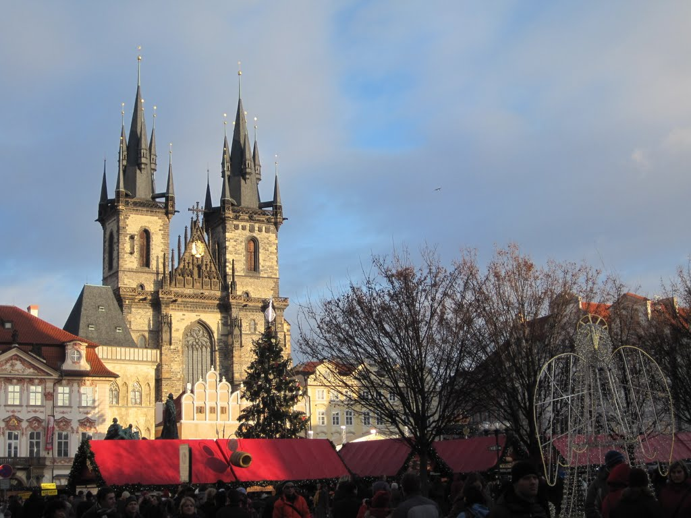
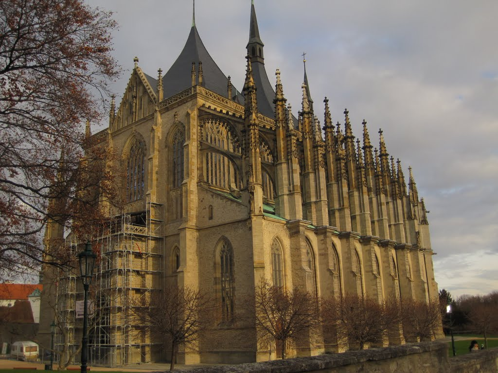

Prague was, fortunately, a refreshing stop. Although I had generally enjoyed my travels from Paris, missing an essential train connection had dealt a blow to my energy levels.

One of Prague's rejuvenating experiences came shortly after I arrived and went looking for food. I wanted pizza and a beer on tap. My hotel was on the other side of the main square, so I walked up and down the square and along several side streets until I found a small pizza shop in a basement. I ordered a simple, slightly salty cheese pizza and tried two different beers. By the end of the meal, I felt refreshed and ready to continue the day.

My hotel was only a few blocks away. I checked in, showered, and prepared to explore. Over the next few days, I bought two pairs of shoes, attended a performance at the Prague Opera House, ate plenty of sugary pastry rings around the city, visited Prague Castle, and enjoyed some good food. Although my time was short, I felt refreshed after the long journey to Prague. On my final day, with my bags in storage, I decided to visit Kutna Hora, about 70 kilometres east of Prague and a popular destination for Czech tourists.

The main goal of the outing was the Bone Church, decorated with thousands of bones from the plague, but it was closed for lunch, so I first visited the majestic Gothic Church of St. Barbara. I then made my way through the city to the Cathedral of Our Lady before continuing to the Bone Church. I had expected the church to make me feel uneasy or sad, but it did not provoke any unusual emotion. This was in direct contrast to the bone museum at the Killing Fields in Cambodia, where I experienced a constant mix of emotions.

The Bone Church was popular with tourists, many of whom were taking photos. Crowds ebbed and flowed as tour buses dropped off groups, allowing me to take better photos during the quieter periods. I imagine it is much busier in summer.

I walked back to the station and boarded a train to Kolin, where I ate a few pastries before continuing to Prague. After waiting a few hours at Prague's main station, I boarded my overnight train to Krakow.

