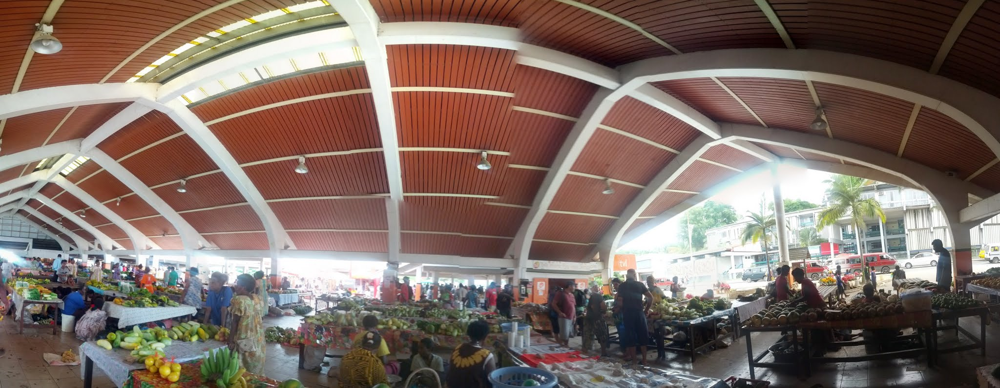
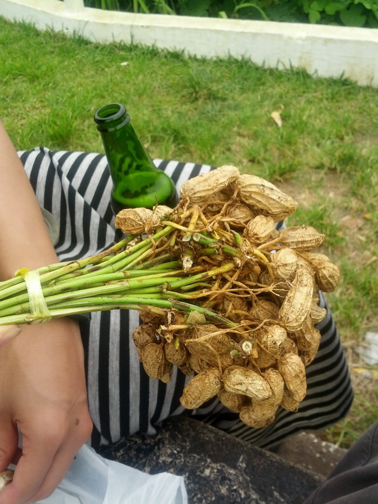

 I first considered a trip to Vanuatu a few months ago, and it did not take long to realise there might be some great workarounds possible.

The first workaround came through IHG, the InterContinental Hotels Group. I was able to use my Hilton Gold membership, alongside my Virgin Gold status, to "trade up" to IHG Platinum. This allowed me to stay more cheaply and collect more points than usual. After staying at IHG hotels in Taiwan and Sydney, I had enough points for four free nights at the Holiday Inn Resort in Vanuatu, normally a $400-per-night hotel.

I also had enough points to claim discounted return flights to Vanuatu. The entire five-day trip would cost less than $1,000 for two people. Without these generous loyalty bonuses, it would have cost at least $5,000.

Day 1
I woke bright and early to catch my flight, leaving my apartment well before 6:00. I called the folks to say hello, as I usually do before boarding. I spent an hour in the Virgin lounge, then flew to Brisbane. Brisbane Airport was a little frustrating because the two terminals were far apart and connected by an infrequent train. I waited almost 30 minutes for it to depart; I could not remember ever waiting more than 10 minutes for the train between Sydney Airport and the CBD.

My Virgin flight departed without incident. Virgin had recently introduced an in-flight entertainment system that allowed passengers to connect their own devices and stream movies and other content. It worked reasonably well and was probably much cheaper than installing new screens throughout the aircraft.

As I was landing in Port Vila, it was remarkable how similar the climate and lush greenery were to Hawaii. I found it beautiful.

I made it through customs without incident and saw my name on a board. The lady was kind and gave me some shell necklaces, which I knew I probably could not bring back to Australia, but she could not find my reservation information. Nor was there a "Holiday Inn bus" to take me to the resort. I wandered to the domestic terminal next door to look for a vehicle marked with a "B" for bus, but the only one I found was covered in vomit and had no driver. I walked back to the international terminal and caught a taxi directly to the hotel for $20.

The lobby of the Holiday Inn Resort was fantastic - it was easily the most beautiful part of the hotel. It had high arching ceilings with lots of fans. The rest of the resort looked a bit like a normal hotel had simply been dumped on the island, which was disappointing, but I suppose it was to be expected. I dropped off my bags and walked to the town centre.

It was quite a considerable walk to the town centre, and I walked a slightly longer route than intended. Foreigners zipped around in their big trucks right next to me. There were no other foreigners walking.

Before arriving in Vanuatu, I was uncertain what to expect and, to be honest, my better half had done all the research. I had imagined the locals would resemble larger Pacific Islanders, but many were darker-skinned and shorter than I expected. Almost everyone I met offered a bright smile, even if they had initially seemed annoyed, and people went out of their way to say "Merry Christmas" from the roadside, moving cars, and their homes.

The town was deserted, and I mean completely deserted, probably because it was Christmas Day. I managed to find one shop that was open, enough to buy some noodles, bread, and peanut butter. I remarked how much I liked the bread - it had a denseness to it that I do not normally get back in Sydney. I meandered by the police station and up the hill, past the Reserve Bank, and then on to my hotel.

By this point I was starting to tire, so I took a nap in my hotel room. I awoke, ate some noodles, and then headed to the beach for one final event: a fire dance. It was a wonderful experience, and it kept going and going.

 Day 2
A solid 10 hours later, I awoke and slowly made my way outside. The sun was fierce, but not unpleasant. I started the day with some sea kayaking, which I had never tried before, and paddled into the small gulf beside the resort.

Eventually I started to feel the sun, so I paddled back to the resort and lounged for the rest of the day. I read a fair amount of Big Pharma and routinely beat her at ping pong. That evening I had a shrimp pizza and two beers, then quickly fell asleep.

 Day 3
A solid 12 hours later, I awoke and began my day with food, ping pong, more pizza, and then a taxi into the city. "How much to the city?" I asked. "VT$1,000," the driver replied. "So, it isn't $500?" I asked. "Okay, sounds good." People in Vanuatu were relaxed to deal with. Prices were generally fixed, as on a menu, while some things appeared negotiable, though locals did not bargain aggressively. They also used a very soft sell, unlike my experiences in Cambodia or Vietnam.

The city had a small tourist market selling manufactured goods, probably from China, and a large vegetable market. Apparently, vendors came from the surrounding islands with their wares and returned home once everything had sold. I wandered around and bought a bundle of raw peanuts still on the stalk.

I wandered along the shore, examining the deteriorating concrete walkway, and watched Big Sista load passengers for the ferry to the surrounding islands. I noticed a sign for a larger supermarket and went inside, where the selection was much better than the day before. I bought four loaves of bread and two beers.

On my walk home I stopped by one of the local restaurants and ordered two quiches. The road traffic was both noisy and polluted - it reminded me to a certain degree of being in small cities in Bali. After finishing my food I walked back up to the Reserve Bank, cracked open my two beers with my wallet, and drank beer while eating raw peanuts, all with the city sprawled out below me.

I tossed my rubbish into one of the "bins," which appeared to be simply an elevated area for waste, perhaps to keep cats out. Speaking of cats, I could not remember seeing a single stray cat or dog, although I had expected to see many.

I walked past the Reserve Bank and down to my hotel. The  rest of the afternoon was spent eating pizza, playing ping pong, and taking a nap. At about 16:00 I started to develop a really bad headache, which was probably from too much sun, so I tried to stay in the cool hotel room until the headache went away. With my legs rather sunburnt, I was sore literally from head to toe, which reminded me why I like mountains over beaches.

 Day 4
My sunburn hurt less, although it looked purple, and my headache had dissipated. Having played too many games of ping pong, I decided to be more adventurous. Looking across the water, I noticed two groups trying to sail. Neither crew seemed particularly skilled, and one boat appeared to be travelling backwards. I approached the boat area with trepidation, just in time to hear a woman announce, "My husband is stuck on the other side. Can you tow him back?" It was a windy day.

The day before, I had watched a couple try to set out, only for the man to fall into the water while pushing off. I could hear the woman crying from the ping-pong table. I asked, "Are you sure you want to do this?" "Yes!" "Okay, let's go."

The "Calipso 4" was essentially a sailboat with training wheels. I remarked, "How hard could it be? The sail only goes two ways, as does the rudder. There aren't that many combinations to try!"

Having watched the activities staff sail without difficulty, I noted that the zigzag motion was critical. I had a PhD and a master's degree, cue the Big Bang Theory jokes, so how hard could it be? I moved the boat into the water, marvelling at how strongly it was already pulling away. I had planned to walk around the side and hop aboard, but, recalling the previous day's incident, decided to jump on as quickly as possible. The moment I did, the boat took off. 

I grabbed the rudder and told my shipmate to take the sail. I began a slow zigzag, making steady progress. Another boat passed and reminded me to keep zigzagging, so I did.

After about 50 minutes, I turned around, handed my shipmate the rudder, and we sailed back to the private beach. We had been out for a little more than an hour, during which I managed to learn how to sail, dodge swimmers and boats, and have a great time. The sunscreen on my legs held up, and my sunburn did not worsen.

I returned, played more ping pong, read for a while, and then tried a giant Jenga set. I built the tower four blocks by four and started playing. About 30 minutes later, I had reached the end: the tower was now two blocks by two throughout. Where could I go from there? On my turn, I slyly moved a single block from the middle and placed it on top. I repeated the move with the level above, leaving parts of the tower balanced in one-block crosses. I tried to remove another block from the middle without cheating too much, but the weight was too great. The tower fell in what I coined the Great Collapse, a term surely to be reused the next time weak regulation lets society's systems run out of control.

I played a little more ping pong, which I won, and I took a video of it.

Happy hour at the bar had started, so I wandered down and ordered another pizza and two beers. And then another two beers. Vanuatu had a local beer, Thaska, produced at a brewery near the airport. It tasted similar to other beers from tropical regions, such as Chang, Singha, Beerlao, or even XXXX. I preferred darker beer, but understood why it was less popular in beach destinations, another sign that I am a mountain person.

After my final beer, I returned to my room and began packing. As on my New Zealand trip, I had travelled very lightly, carrying only a small backpack that probably weighed less than three kilograms. With my bag packed, I went to the main hall to spend the rest of my cash on one final Thaska, although I had a coconut instead. There was a live performer in the background, but, to be honest, I initially thought it was someone doing karaoke.

I spent the rest of the night drinking tea and watching television, mainly the National Geographic channel, which I needed to find a way to receive at home. One particularly interesting program covered tsunamis and earthquakes, although its science was probably overly optimistic. I went to bed by 10:30 in anticipation of my 4:30 alarm.

Day 5
My final day was a short, uneventful one. I awoke to my alarm at 4:30 and 4:31, put some clothing on, ate breakfast (bread with peanut butter - I finished an entire container), and checked out from my hotel. The taxi I had arranged the night before was waiting patiently for me, right on time, and friendly as everybody else. The staff seemed rather cheerful, despite it  being 5:00 in the morning.

The taxi set off along the main road and soon dropped me at the international terminal. I collected my tickets, passed through some rather relaxed security, and waited for my plane. I dropped the rest of my change into the large yellow Rotary donation bin, each coin making a pronounced "ding" that seemed to say, "I've donated; have you?"
