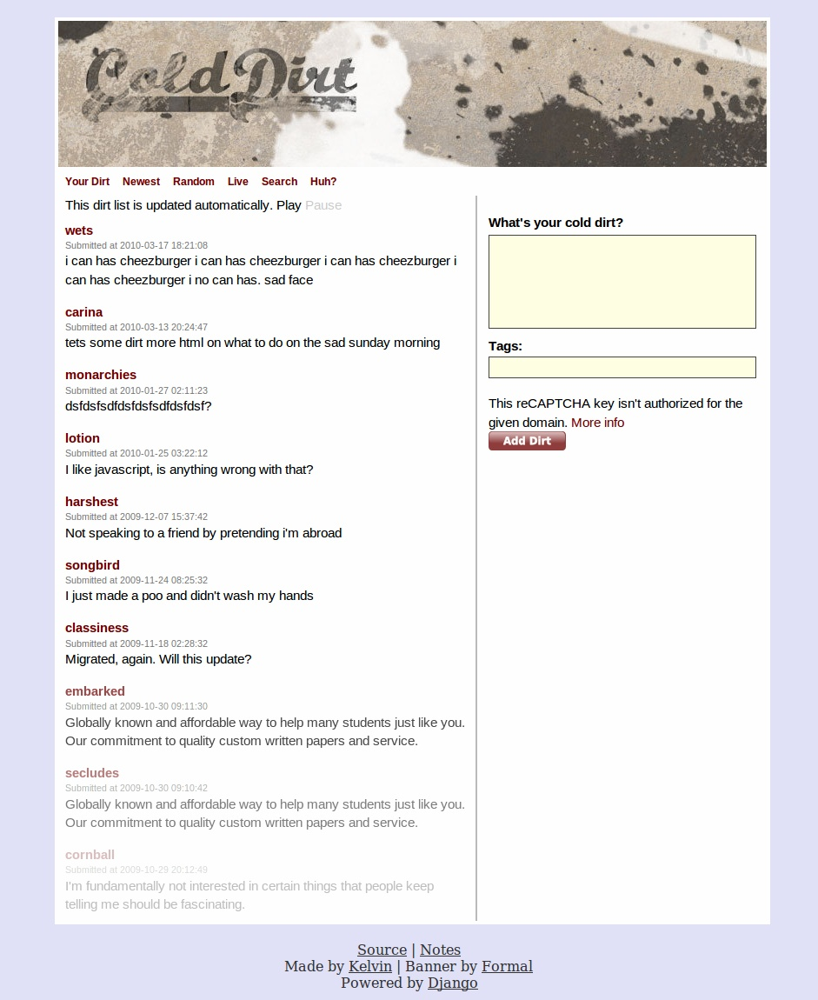
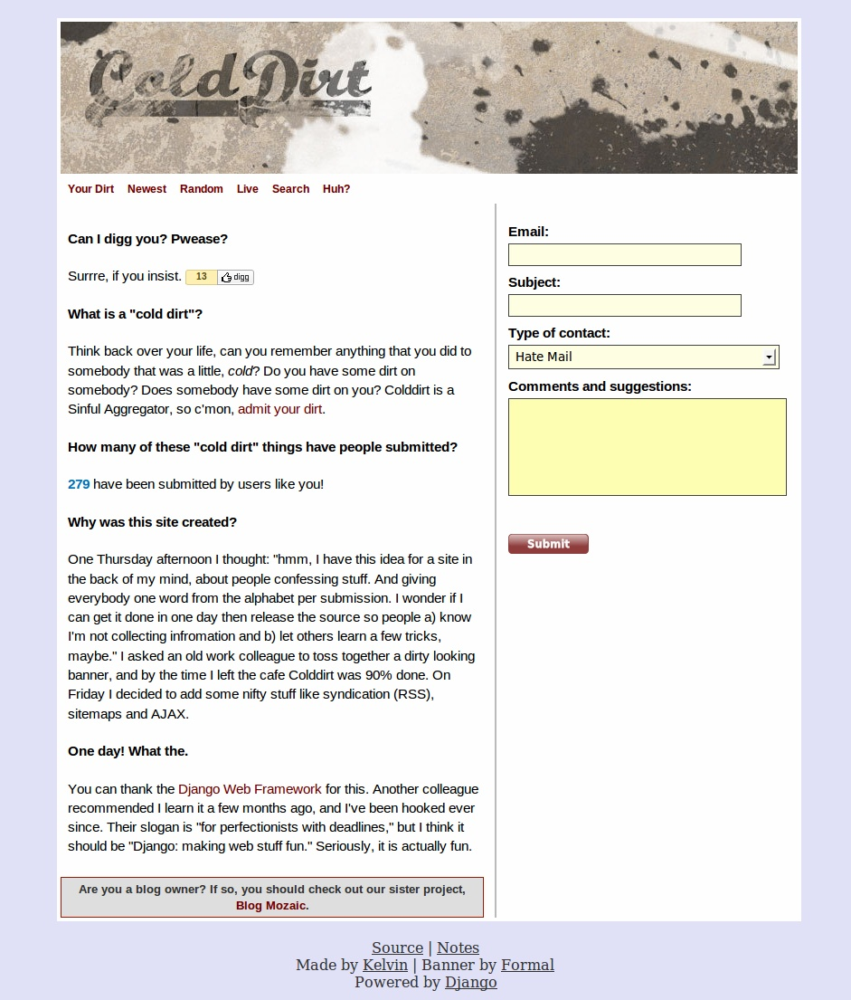

After much consideration, I've decided to retire yet another website: Colddirt. This site was created as an example of how to use the different parts of Django, mostly in just one afternoon. I've decided it is time to just take a few screenshots and retire the site - the domain is expiring, and honestly, I don't want to spend $10 to renew the domain. So, here are the screenshots.

  
  
