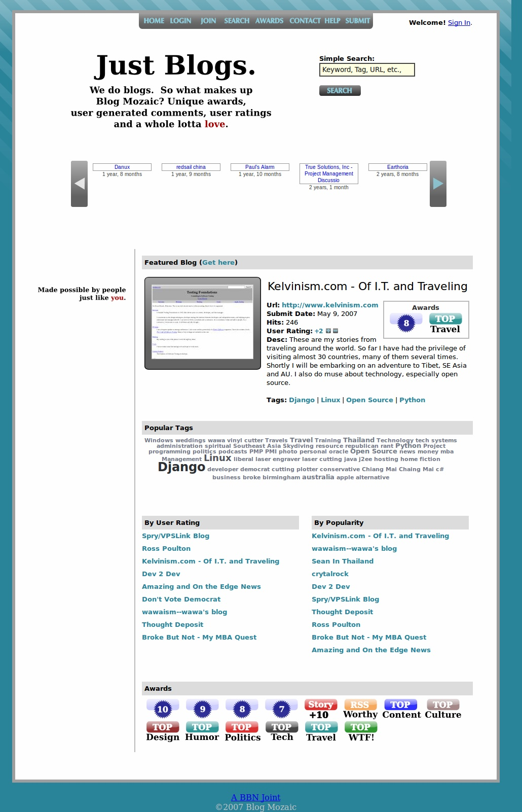
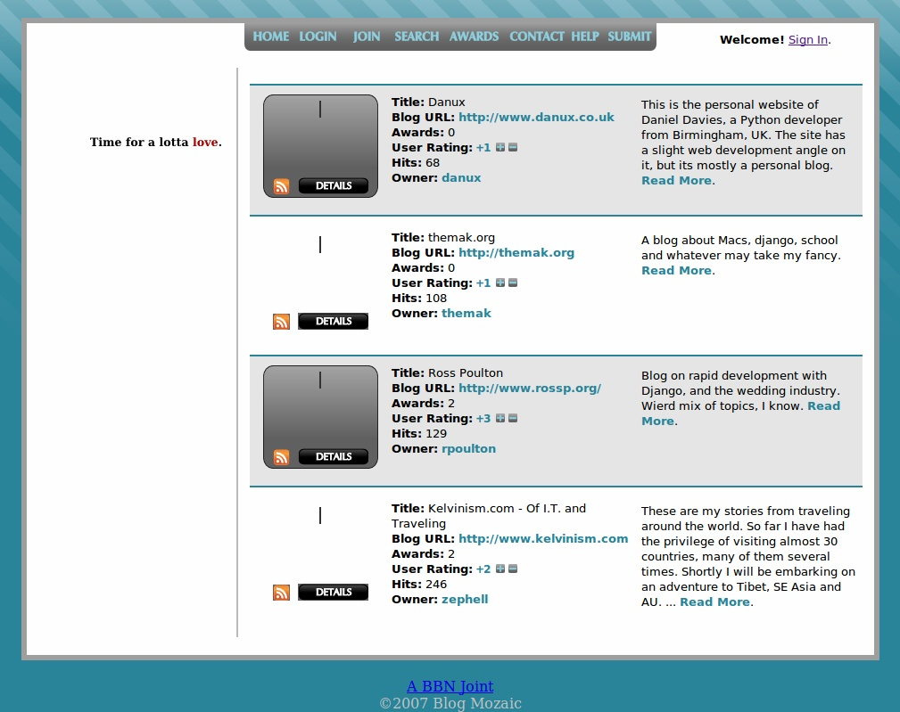
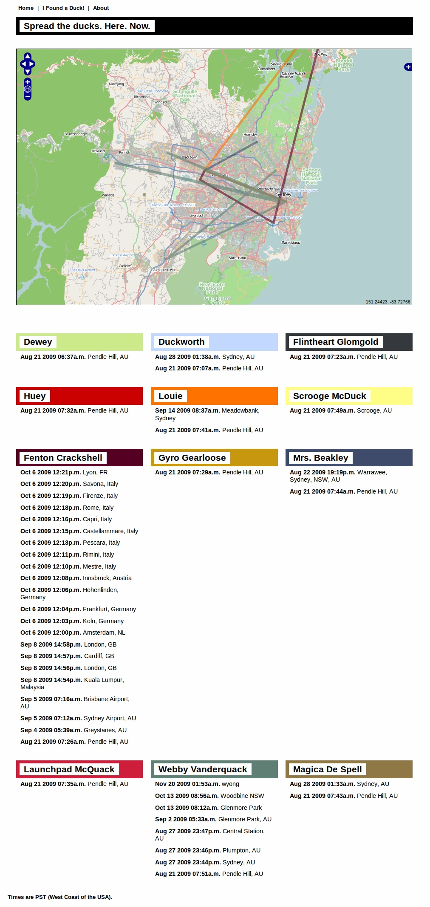
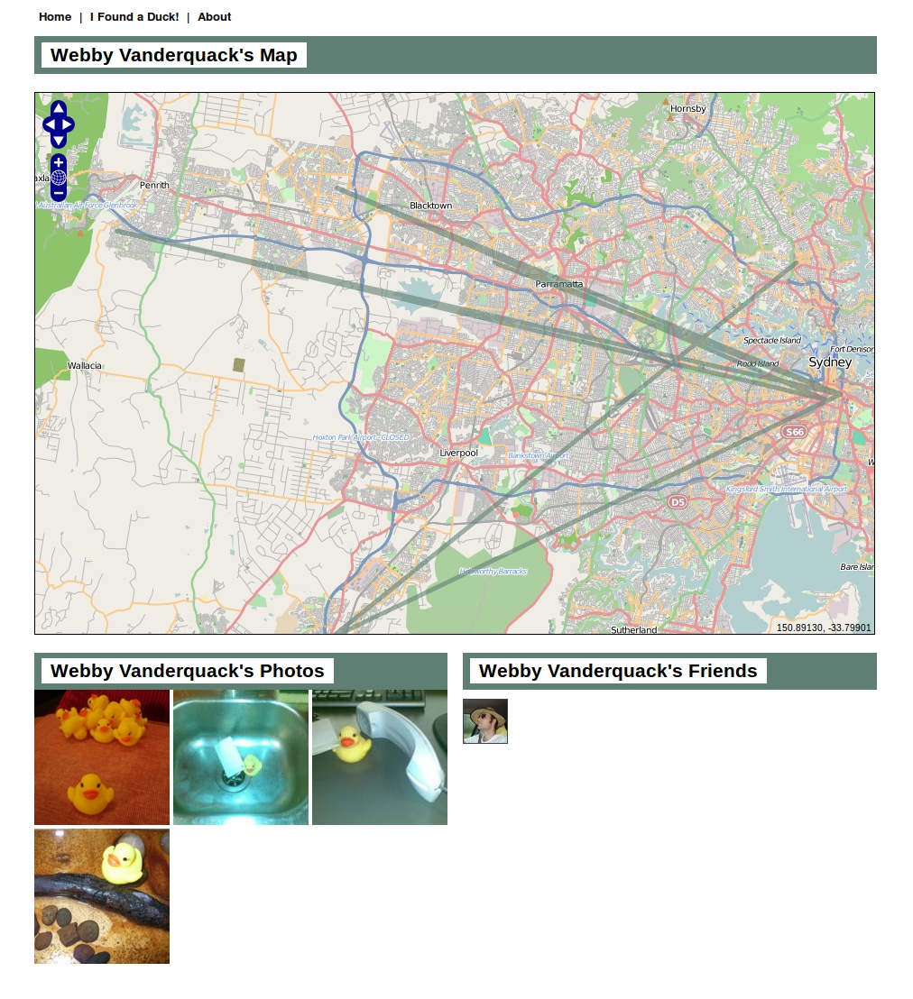

Over the years I've created several websites, some with the hope of becoming big and popular. Naturally, I'm still waiting to create a site that becomes big and popular. In the meantime, it seems appropriate to retire some of the older sites and ideas. The truth is, I'm moving all my little sites from MySQL on a mediocre VPS to Postgresql on EC2.

Because I put some sweat and blood into these sites, I thought it would be only appropriate to record how the sites looked for future sentimental value. I downloaded a small plug-in for Firefox to take full-length pictures, and I thus post them here.

Back in Taiwan I created a site to demo blogs. The idea certainly wasn't revolutionary, but I thought that somebody would find it useful. Nope.

The second idea was to send a bunch of little ducks around the world and track their progress. My friend Jamie took one to Europe, but besides that, I don't think most people really understood that they were supposed to hand the duck off to somebody else. I'll re-brand and launch it again if I can find a little twitter logo to send around, because hopefully people on twitter will understand to pass the duck onwards.

So photos for nostalgic sake.

  
  
  
  
  
  
  
  
  
  
  
  
  
  

  
  

It is always a bit rough retiring old sites, but looking back I learned a little, had some hope, and that's all I can ask for.