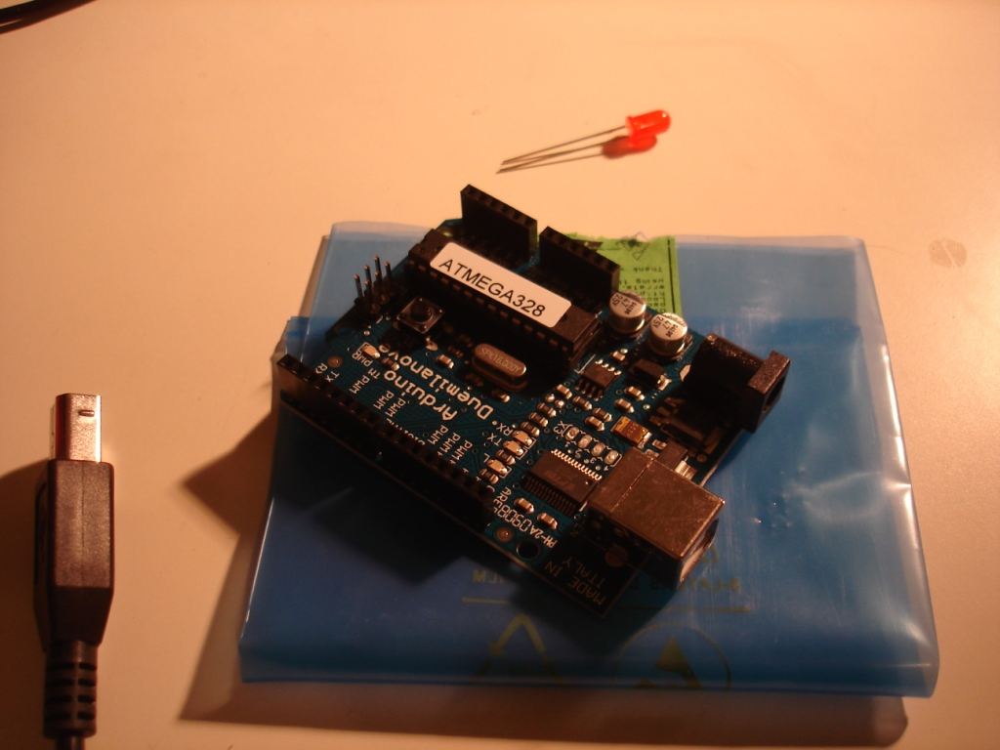
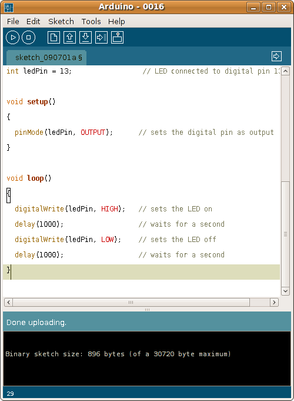

For this you'll need: an Arduino, an LED, a USB cable, and the Arduino software.  
  
  
  
  

  
  
1. Get the LED, and plug it in to your Arduino. Plug in the long end to pin 13, plug the short end to the GND.  
2. Plug in the Arduino into your laptop. Go to Tools->Serial Port. Choose the USB port that appears.  
3. Take the code from the [BlinkingLED tutorial](http://www.arduino.cc/en/Tutorial/BlinkingLED) and paste it in to the arduino like so:  
  
  
  
  
  
4. Hit File->Upload to I/O Board.  
5. Hit (physically) the little reset button. Voila! a blinking LED!