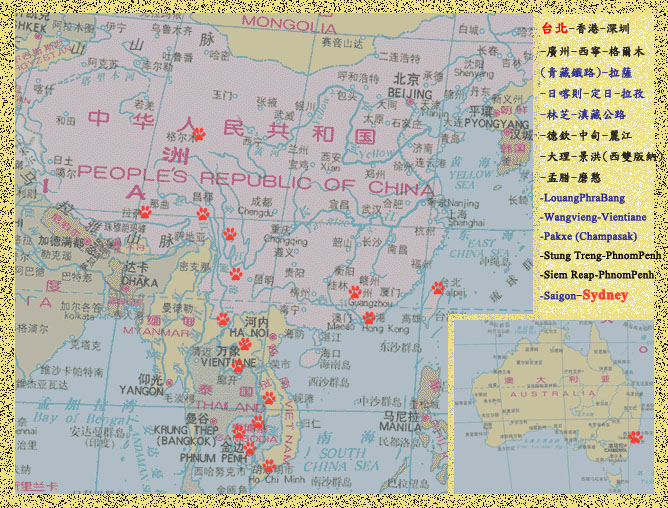

For the last 16 months I had been living in Taiwan (if it wasn't obvious). Within the next month, that chapter will come to an end. Over the next few weeks I will continue studying for the GMAT and hopefully finishing my MCSE; any words of encouragement will be warmly welcomed. Meanwhile, I will try to avoid distractions, which seem to be coming in the form of [Python](http://www.python.org). [Django](http://www.djangoproject.com) has been one of the most fun things I've ever played with. Recently I wrote and contributed some code to access both [Alexa Web Search](http://developer.amazonwebservices.com/connect/entry.jspa?externalID=817&categoryID=97) and [Alexa Site Thumbnails](http://developer.amazonwebservices.com/connect/entry.jspa?externalID=818&categoryID=80) via Python. What I am particularly excited about is returning to C (I learned C++ at university, but have subsequently forgotten it), and contributing to the [OpenMoko](http://www.openmoko.org) project. For me, the OpenMoko phone will be close to my ideal phone. The second I can get one with WiFi (and maybe with GPS), count me in. Here's my money. Enough tech talk, sorry, I just get really excited about Python, Django, and an open-source phone.

What I meant to write is that I am leaving Taiwan. Oh! General admission to Computex is tomorrow, and while I've already seen some photos, I can't wait. Okay, so I am leaving Taiwan. Where next? Eventually I will end up in Australia, so I plotted the route and created a little map.

That's a long trip, and I'm looking forward to every moment of it. I'll be gone June 30th to August 16th, and most likely largely out of contact. I have heard that my site may be blocked in China (I do mention Taiwan quite a bit), but will still be able to access my email. Well, onward and upward...
