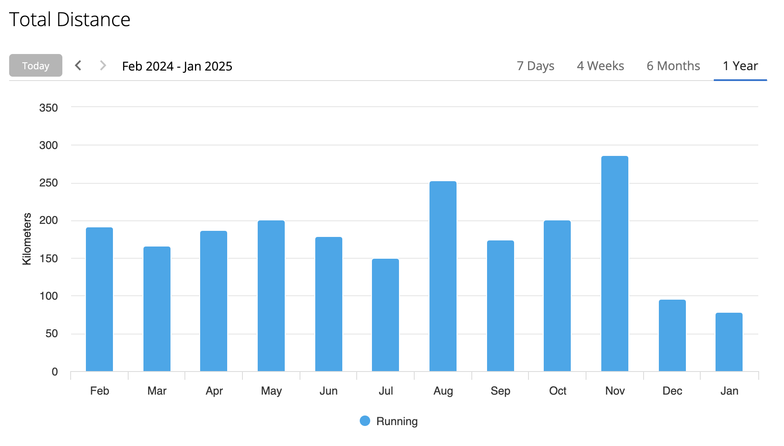
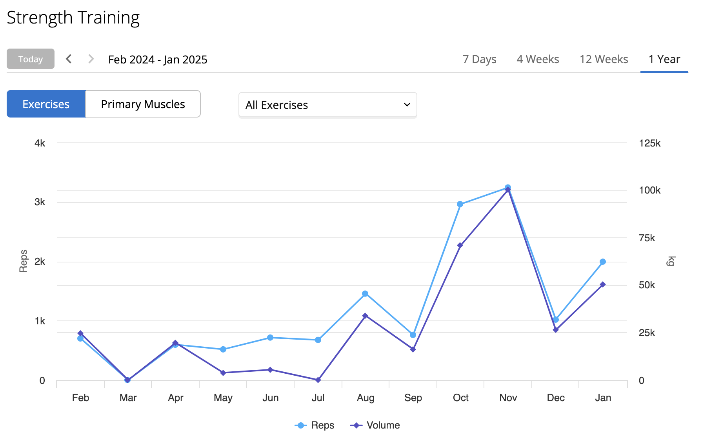
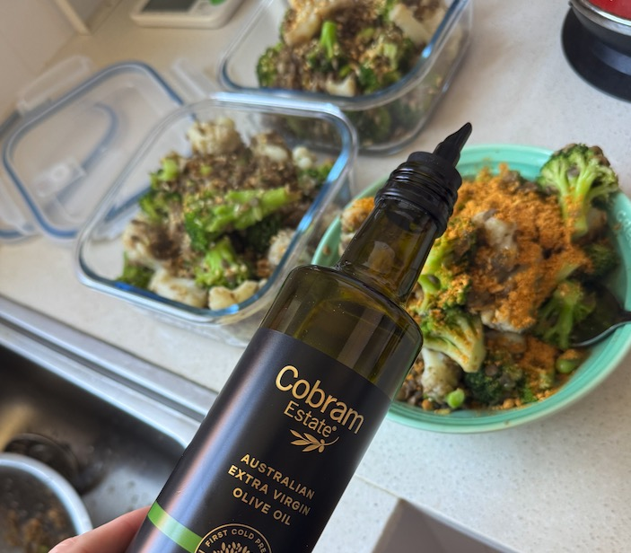
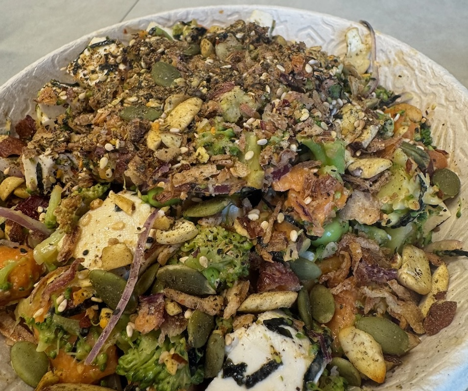
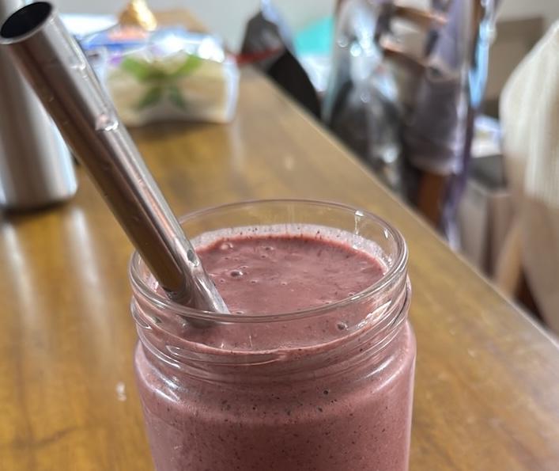
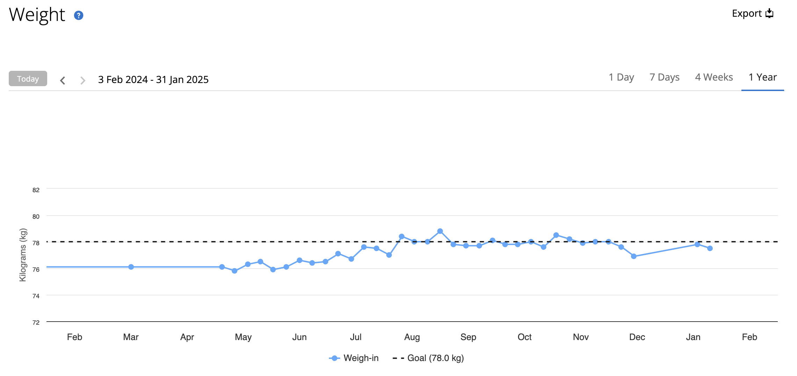
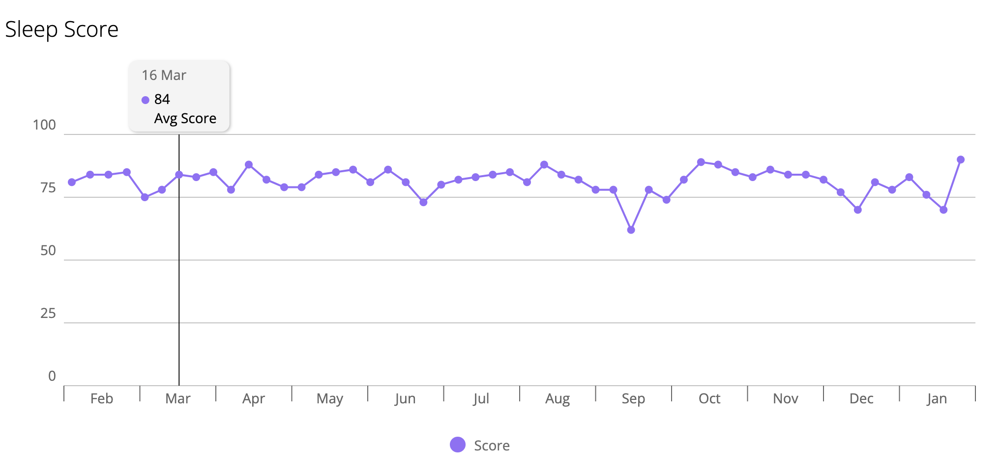
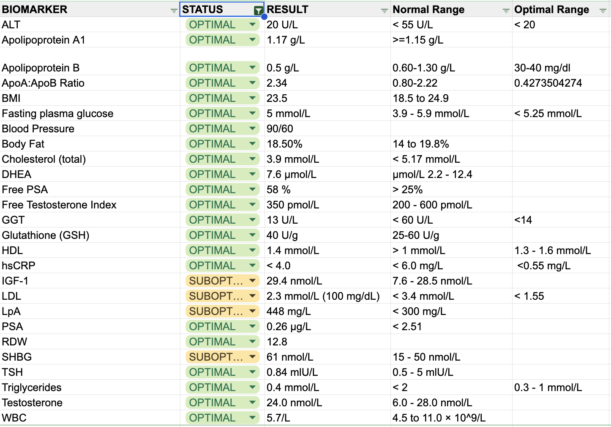
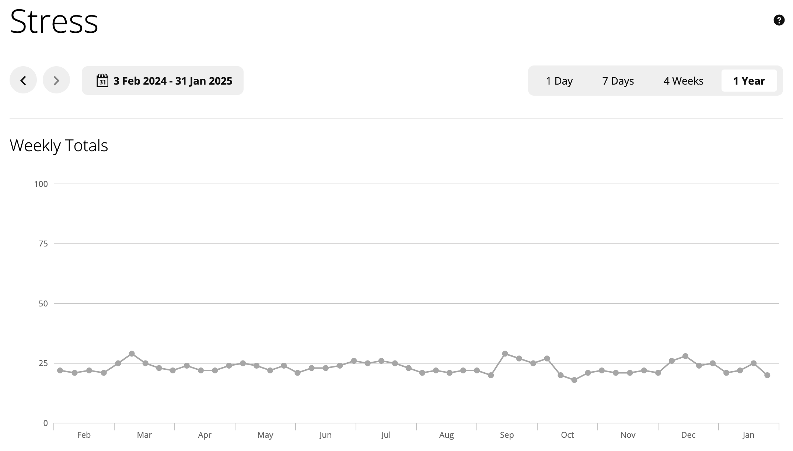
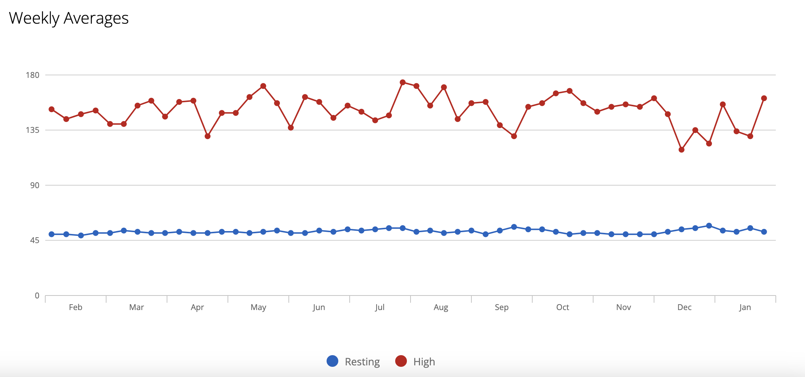

### Background

A few years ago, probably in late 2022, I was doing some self-reflection and was pondering what the next constraint was for improving my health. Depending on whom you ask, there are generally several areas of focus when it comes to health:

1.  Exercise
2.  Nutrition
3.  Metabolic health
4.  Sleep
5.  Testing or screenings
6.  Supplementation or pharmacological interventions

The conclusion I reached after some reflection was that nutrition was the next area for me to focus on. My approach has typically been to deep dive on reading books, and since then I've read the following books related to nutrition and longevity:

*   Longevity Diet
*   Outlive
*   How Not To Age
*   Eat, Drink, and Be Healthy
*   The Art of Lifting
*   The Science of Lifting
*   And I'm currently reading the Longevity Leap.

In addition to books I also found a few channels on YouTube that I generally thought were evidence based and produced well, with [Plant Chompers / Viva Longevity!](https://www.youtube.com/@Viva-Longevity) and [Physionic](https://www.youtube.com/@Physionic) being some of my favourite.

  

Fast forward to this morning, when I was outside eating breakfast (sunshine exposure!) and I thought it might be worthwhile to do a yearly reflection of each year. Perhaps this is just me being influenced by reading [No More Gold Stars](https://www.amazon.com.au/More-Gold-Stars-Regenerating-Ourselves/dp/0989301389)!

  

Without further delay, let's get going on my inaugural State of Health series!

### Exercise

My main form of cardio is running, so let's start there. You can clearly see when I went on holiday (December), as it was really challenging to be able to find time / fresh air to run.

  

  

  

  

My total distance for 2024 was 2759km over 417 hours, which is about 8 hours of cardio on average per week. This seems to be under the threshold limit of the "cardio [j-curve of CVD](https://pmc.ncbi.nlm.nih.gov/articles/PMC7431070/)" that I read about a number of years ago.

  

I did less hiking in 2024 than in 2023, which I hope to rectify in 2025.

  

In addition to cardio I've been trying to increase the amount of time I spend resistance training, so that became more of a focus after both my first DEXA scan as well as reading the Science of Lifting.

  

  

I think I will continue with adopting an approach of progressive overload and focussing on total volume, with a mixture of intensities focussing on both hypertrophy and strength.

### Nutrition

My diet continues to be whole foods plant based, but with exceptions when travelling; if needed I'll have some chicken, fish, or eggs.

  

Super Veggie

  

Fishbowl (when I need to eat out)

  

Nutty Pudding

  

How do we track how well nutrition is working? For now, let's just look at my weight.

  

  

I was previously using a Withings scale, and apparently it didn't sync correctly, but the new Garmin one does. From what I can tell my weight has been fairly consistent for the H2 of the year, but with a drop in December due to travel. My typical meal looks like this:

  

Breakfast (about 6am): thins with ABC nut butter and banana and cinnamon

Snack (about 8am): Nutty Pudding, but with mustard seeds and turmeric.

Lunch: Super Veggie, w/Kimchee

Dinner: Something from [The How Not To Die Cookbook](https://nutritionfacts.org/book/how-not-to-die-cookbook/)

  

The DEXA scan I did in the beginning of 2024 had me at **18.5%** body fat, so it will be interesting to see what I'm at in my next scan. 

### Sleep

Sleep became much more of a focus in 2024 after reading [Why We Sleep](https://www.amazon.com.au/Why-We-Sleep-Science-Dreams/dp/0141983760?crid=3GFYDA14PZV7N&dib=eyJ2IjoiMSJ9.HqZgX72gI9PBGMtU0GUwo2axDi0vyYeL6Yd7dhsk4E2pPhgyHrRI31dO90lEk4F95_tc96Tkk79xc-IwOtptJXOU7QiqzGM2lhmaEuX3lkl-dXe3_NDe_FZhx2oH-HSKvEzbR5K3DSj1uXyYdq7THueUsEssq8hmWSdOrOVs0o-AazMhKBfStt6fqO1U7rYTijEKxnpK_B-ak9M6kYco0nvbCSAG9rboEB_HOLuSRG0JUdQ19UgOBf80mGBTm5SLgnEXsOP-PjTlWsPKatSygcha9Nz0MS7hxpjsfjqdBi3uEZIayaX5wyWSbVqGHlPw2lWZkIEkxp-I2lrpv1VVmkW0qGNUZsC2XikSYdaRzAbWEhRBH37vVur12MwGTkKSue-h0GgWJF1g45onQcHitnGzwyythj4YJCUueYvanZBZOY4QblR5epnbxkaPZwuC.1guDuFcWGuR3dOAPpkdkJihh6IdvmDFsKLz2GRZlOvs&dib_tag=se&keywords=why+we+sleep&qid=1738274327&sprefix=why+we+sleep%2Caps%2C351&sr=8-1) in Sep 2023.

  

However, my sleep in in 2024 was less consistent than in 2023, unfortunately. My average "[Sleep Score](https://www.garmin.com/en-US/blog/health/garmin-sleep-score-and-sleep-insights/)" was an 82 in both 2023 and 2024, yet 2023 saw a Standard Deviation of 3.0 while 2024 saw 5.2. This is quite ironic, as I was much more aware of my sleep in 2024, but I believe due almost entirely due to work related stress.

  

  

  

In 2023 my average duration was 7hr 33m, and in 2024 it was 7hr 28m.  However, my average bed time decreased from 10:25PM to 10:10PM.

  

I continue to wear ear plugs when I sleep, and try to sleep in a separate bed from anyone whenever possible. For 2025 this will be a focus, and it would be ideal if I could routinely get in the 90+ sleep score space.

  

### Supplementation

While many people are comfortable taking 100s of supplements, I have been trying to stick to what is on the ITP website for [supported interventions](https://www.nia.nih.gov/research/dab/interventions-testing-program-itp/supported-interventions). For most of 2024 I took the following supplements:

*   Collagen 15g 
*   Trimethylglycine (TMG) 500mg
*   Niacin 50mg
*   Vitamin K2 MK-7 90µg
*   Zinc 8.25mg
*   Creatine 5g
*   Omega 3

I also tried taking Boron to lower my SHBP levels, but I believe it negatively impacts my sleep.

### Results

Here is a snapshot of my biomarkers.

  

  

I also track my biomarkers in [Carrot Care](https://carrotcare.health/), and the main areas of focus for 2025 will be:

*   Continuing to lower my LDL
*   Keeping my ApoB low
*   Re-testing IGF-1
*   Re-testing my progesterone levels (potentially low due to stress at time of previous test)
*   Exploring if I should lower my SHBG

Unfortunately I don't think there's much I can do about Lp(a).

  

Let's look at Stress.

  

  

  

2024 was certainly more stressful than 2023, which was itself generally more stressful than 2022 - all due to changing roles at work. My stress levels in June/July were elevated due to work, in September due to running a marathon and then immediately catching Covid, and finally in December due to several overnight flights and some work deadlines that required significant overtime.

  

I would like to aim to get routinely under 25 if possible.

  

My resting heart rate hovered around 50-51 for the year, and ultimately I would like to try and get this below 50.

  

  

  
  

### Experiments

*   Convert garmin's intensity minutes to MET, so can compare to papers
*   TBC