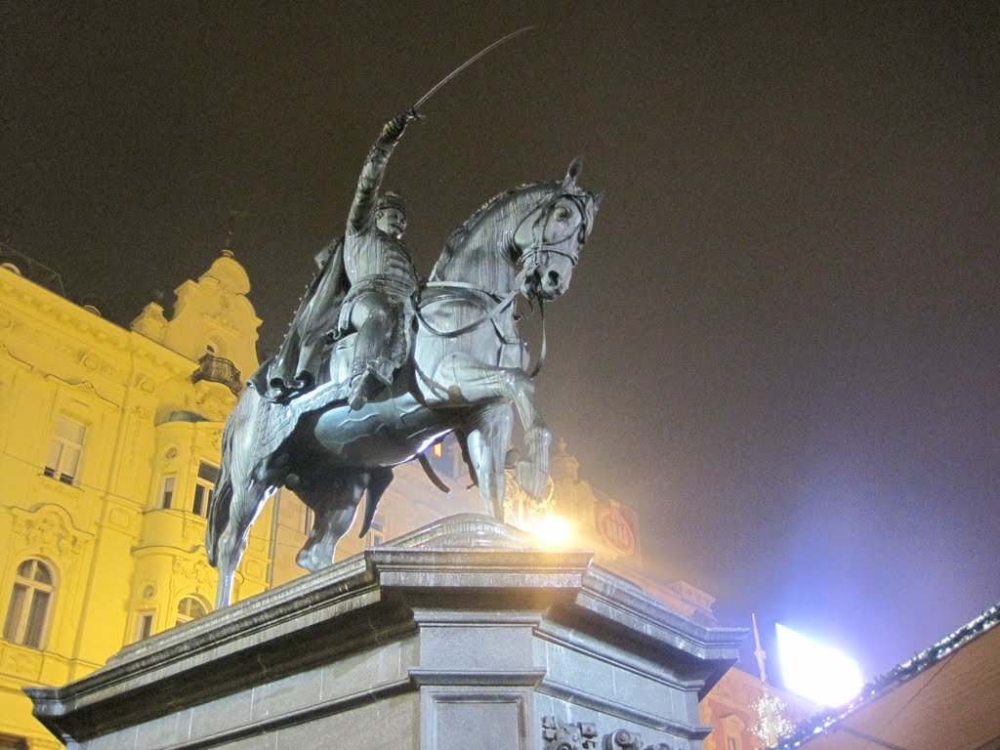
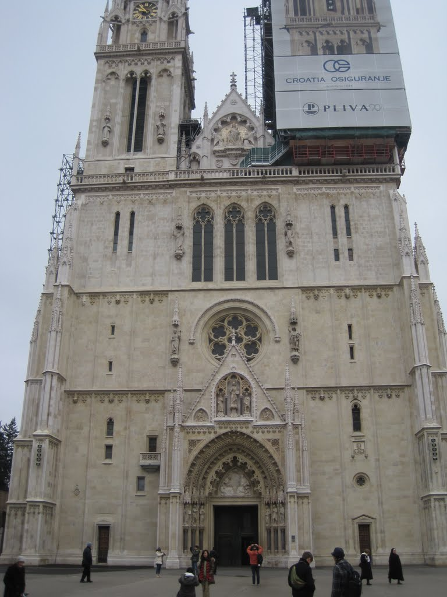
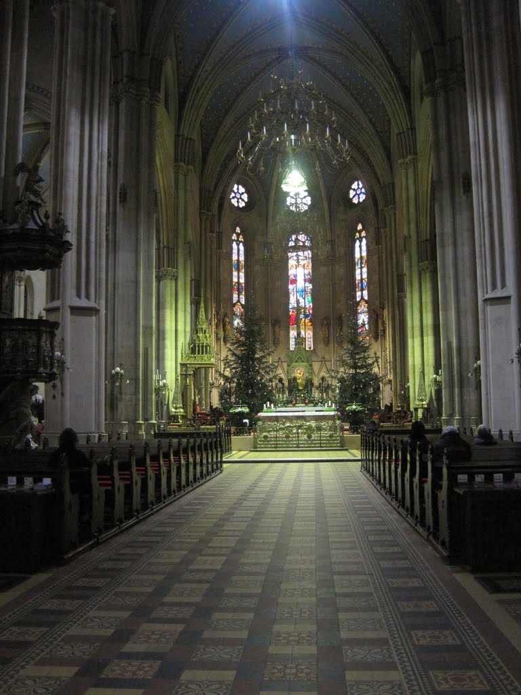
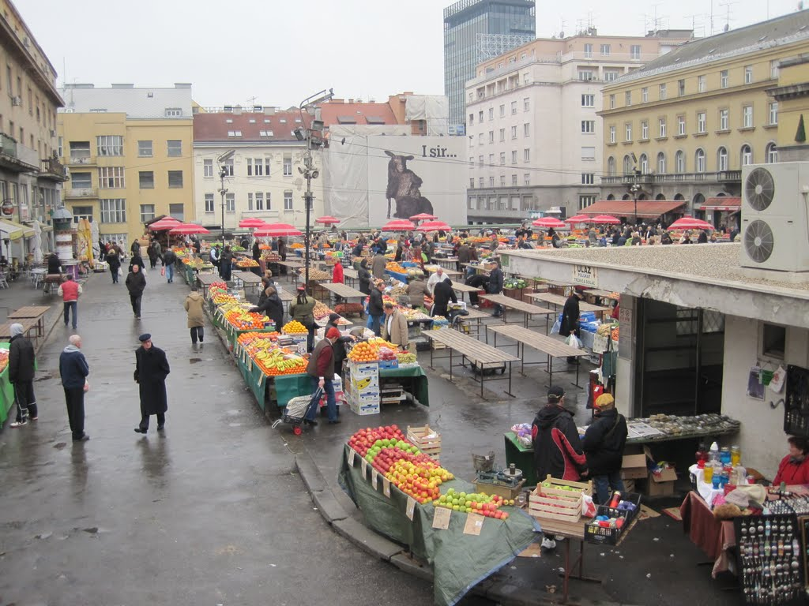
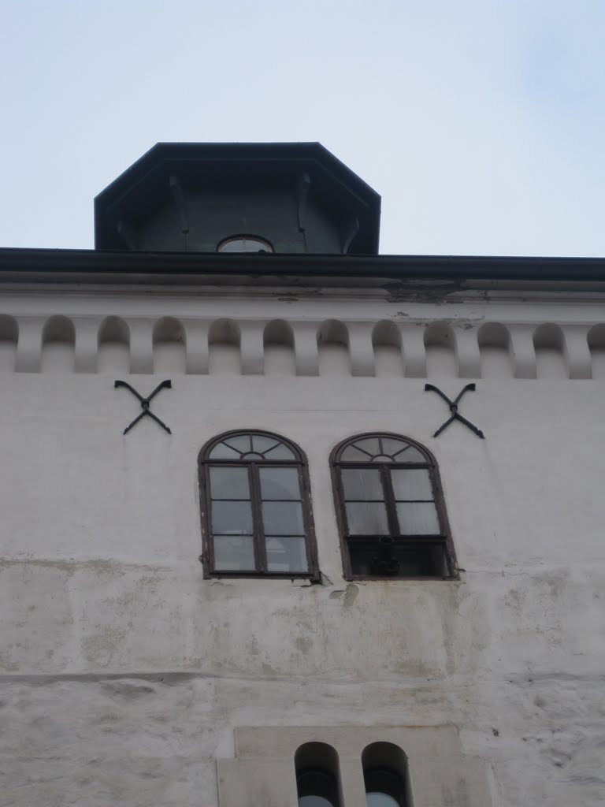
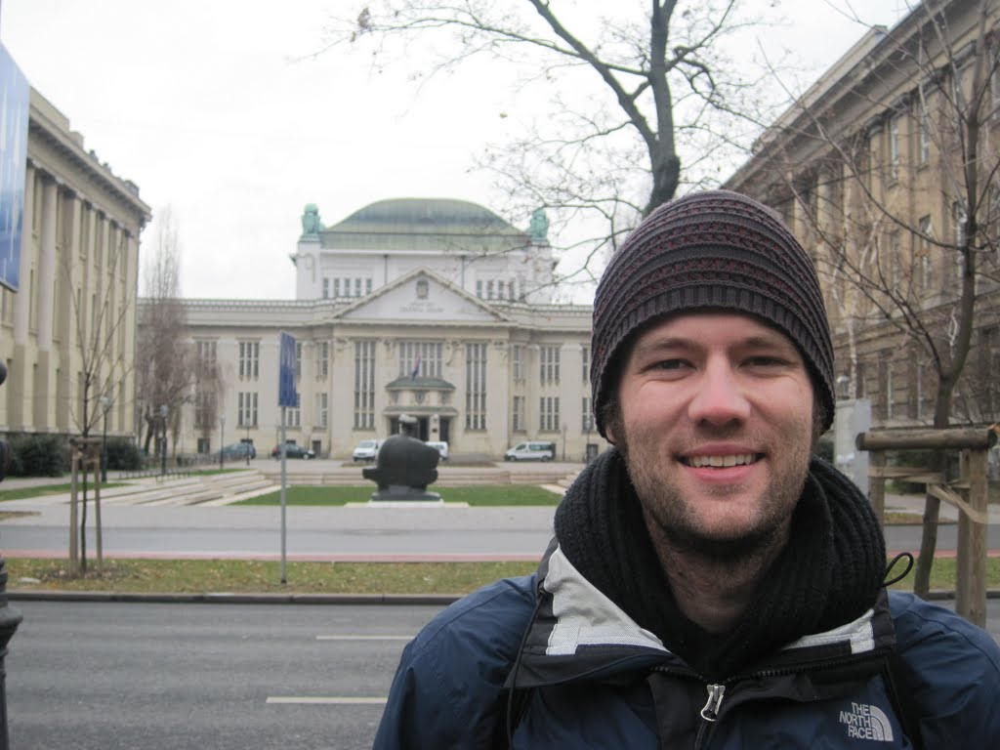
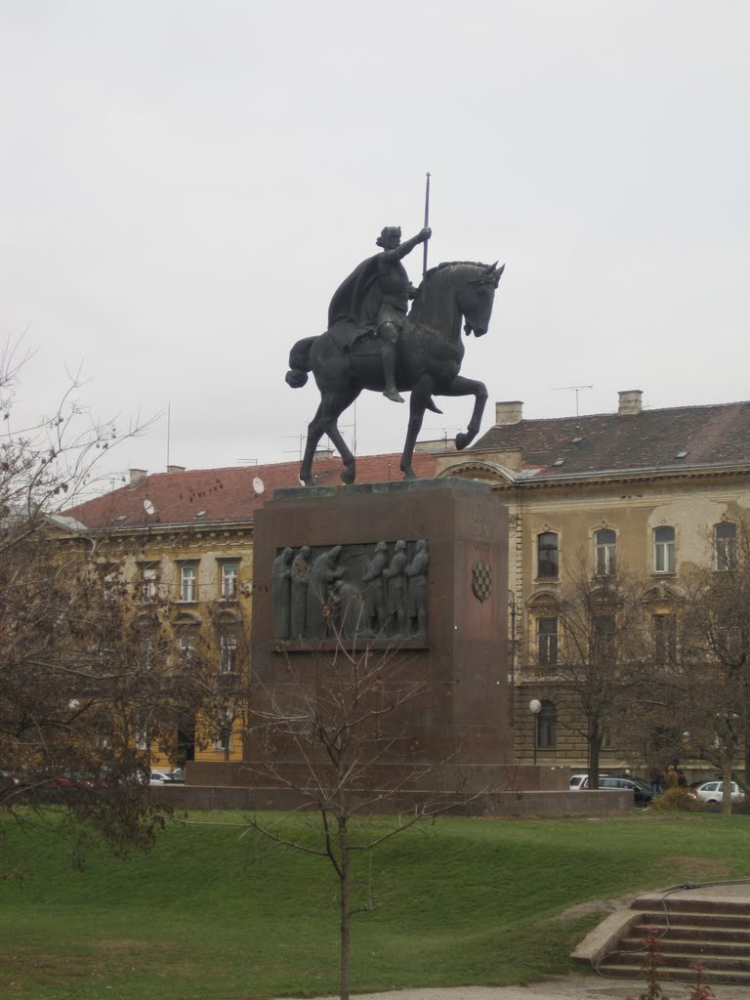

I booked a two-bed room in a Zagreb hostel based on its reviews, price, and especially its location. Zagreb, at least near the main train station, is laid out in simple, straight blocks, so I found my hostel without delay. After entering through a tall, solid double door, I found the stairwell pitch-black and completely silent. It was not exactly what I had expected.

I climbed the first floor, but no hostel.

I climbed the second floor, but no hostel.

I climbed the third floor, and off to the side illuminated by moonlight through a courtyard window I saw a small sign with an arrow going up, and I knocked on the door. The outside light flashed on, the door opened, and I was greeted by the grin of a puppy running across the floor to new smells.

Old Zagreb Hostel turned out to be a clean, tidy, and generally quiet place to stay. The flourishes of Japanese decoration (cherry trees, tatami mats, Japanese newspapers, and comics) reflected the owner's Japanese background. I liked this. The hostel had three sleeping rooms: an eight-bed dormitory, a small room with a bunk bed, and a large room with a double bed. I had selected the bunk-bed room. The other residents were from either Japan or South Korea.

I put my belongings in the room and went out exploring, on a mission to see the main square and get dinner nearby.

In the main square was a giant tent with two food stalls serving wine and sausages. Because I was going to be in Zagreb for such a short time, I opted not to exchange any money and instead bought groceries and dinner by card.

I continued further into Upper Town and went into the Pivnica Mali Medo restaurant, recommended for good drinks and food. My timing was exceptional, as happy hour had just started. First on the menu was a local beer, followed quickly by dinner: a pasta dish and some goulash. The food certainly hit the spot, and it was difficult to decide whether the meal or the drink was better. Photos were immediately uploaded using the bar's free WiFi.

After eating I tried one more local beer, paid with EFTPOS, and walked back to the hostel.

Almost back at the hostel, I crossed Nikola Šubić Zrinski Square, a park that reminded me of the Park Blocks in Portland. A small group was playing jazz-like music on four different string instruments. I was enamoured, quietly enjoying Zagreb far more than expected, and stood listening until the group finished.

Upon arriving back at the hostel, two of the guests, both Japanese, asked whether I wanted some wine and would join their table. I said I was ready for a quiet night, but still sat up for a short while chatting about what had brought them to Croatia. One had visited Zagreb three or four times and said he really enjoyed the city.

The next morning I started sightseeing as early as possible. I made my way to Zagreb Cathedral, through an open-air market and the Kamenita Vrata tunnel, which was being used for a vigil, then past the old City Hall and on to Lotrščak Tower. I walked down the steps beside the funicular, which were ironically neither long nor steep, and stopped for coffee at The Cup near Bogovićeva Street, in what I understood to be the coffee district. The coffee was great.

My next stop was the train station to buy tickets to Budapest, after which I continued seeing the rest of the sights downtown. A tour guide would have helped explain what everything was, but instead I was left taking photos and reading WikiTravel.

I collected my bags from the hostel with several hours to spare, so revisited the coffee district for a second coffee, this time from Bonita. My cup from The Cup was better.

After a quick walk again through the Zagreb Park I arrived at the train station, ready to board the six-hour train to Budapest.
