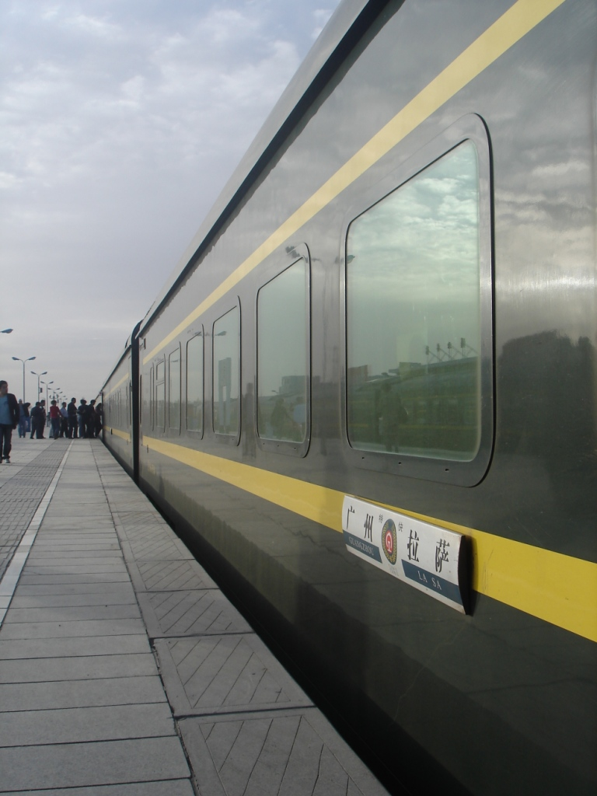
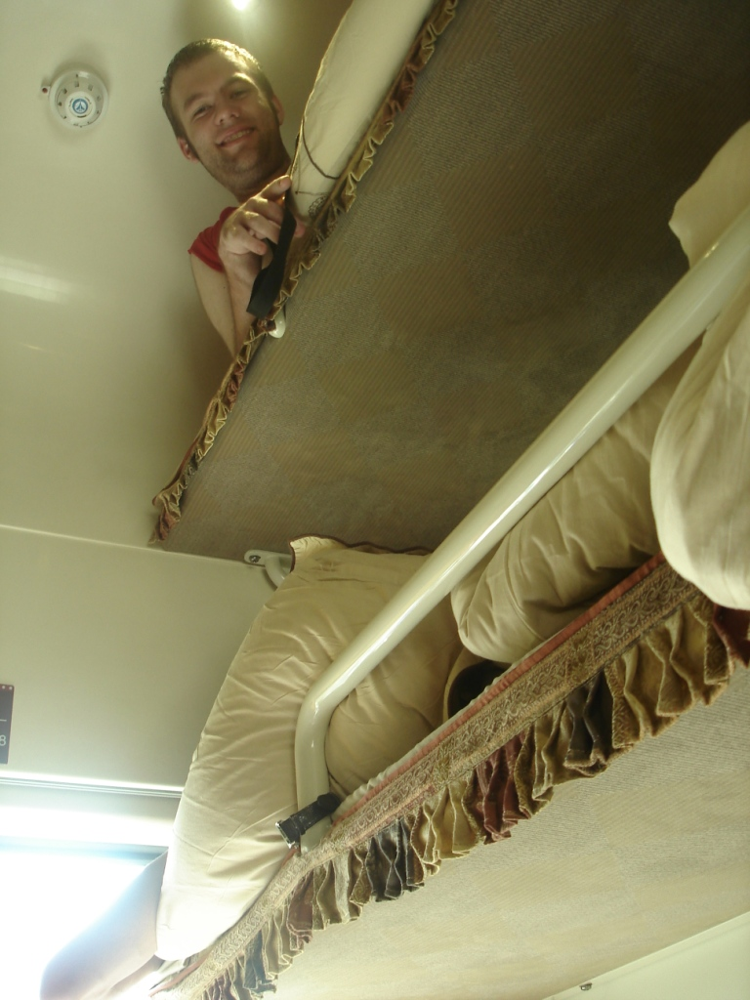
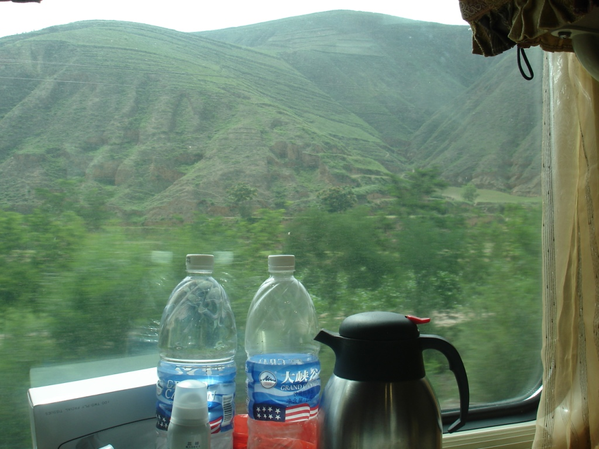

Early in the morning, at 6:00am, we arrived in Guangzhou. Can you guess what we did? We ate rice balls, of course. Perhaps I should explain: although Taiwan prepares rice balls differently, those in Guangzhou usually come in a dark sesame paste or soup and are filled with peanut butter. Yum.

After eating, we checked our email, since it was inexpensive, and wandered around the nearby mall. We needed to buy about three days' worth of food because the train ride would take more than 60 hours. At 13:00, we boarded and met our bunkmates: two women from Hong Kong, May and Kwin, and a man from Malaysia. We started chatting and soon began playing cards. They taught me German Bridge, which became the card game of the trip.

For the rest of the afternoon, we played bridge, read, and chatted. Night soon arrived, so we ate instant noodles for dinner and fell asleep.

The next few days were consumed by bridge and reading. Our Malaysian bunkmate left the train in Xining, and we made friends with a local Tibetan woman. I can now count to three in Tibetan and know how to say hello, thank you, and, even more importantly, beer.

Expect updates about Lhasa soon.
