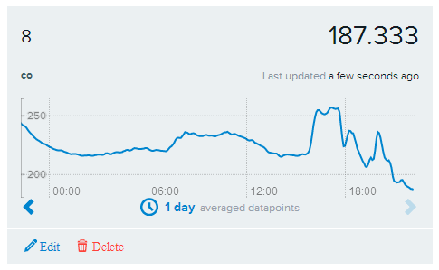

Today was an unfortunate day that I should get on the record.

Let me start at the beginning.

At about 17:15, just as I was leaving work, I received a frantic call: "The sprinklers went off and flooded your apartment." I jumped on the train home and asked the caller to record the names of anyone present and take photos. My air-quality sensors did not detect a rise in particulate matter, but the CO level clearly rose at 15:50 and fell again around 17:00.

When I returned home, I ran into my neighbour, who is was the president of the body corporate, and he explained some of what had happened. One resident had apparently smoked in the service room and discarded a cigarette butt in a recycling bin. The bin caught fire, filling the hallways with smoke, triggering the sprinklers, and forcing the entire building to evacuate.

Unfortunately, the sprinkler outside my apartment also activated, sending water inside. When I opened the door, I found about two metres of damp carpet.

I found the caller in the next-door neighbour's home and learned that the fire department had forced entry into the flooded apartment.

The episode was a stark reminder that one careless act can affect an entire building.
