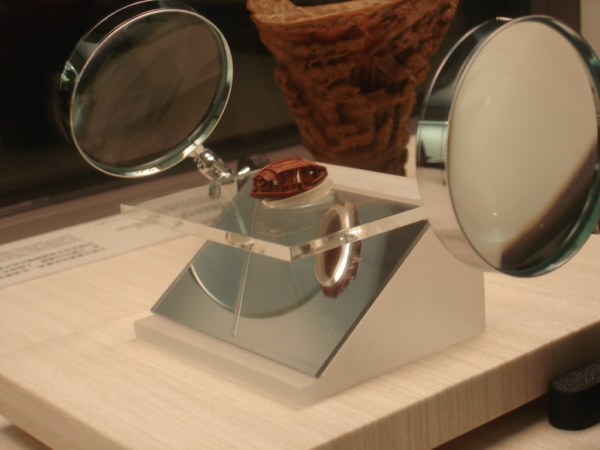

The Palace Museum, ranked as one of the world's five best museums, had just completed a renovation. Since I lived in Taipei, I had no excuse not to see the exhibition.

From start to finish, the experience inspired a sense of awe. The Palace Museum building alone was splendid enough to make the bus ride worthwhile, but the true treasures were inside.

For those unfamiliar with the history, I will offer a short summary. As the Communist Party took power in China, the Kuomintang, or KMT, withdrew to Taiwan. The history still seemed shrouded in propaganda to me, with both sides offering different accounts of who fought and defeated the Japanese and who overthrew the final dynasty. Chiang Kai-shek brought his army to Taiwan, along with many valuable objects. The Palace Museum's collection includes those objects and spans some 5,000 years of Chinese history.

What do the exhibits look like? Good question, and I will show you. I initially took a few photos without noticing the signs, though never with a flash. This continued until I noticed staff carrying signs that said, "NO PHOTOS." I stopped immediately and have left those photographs out of this post.
