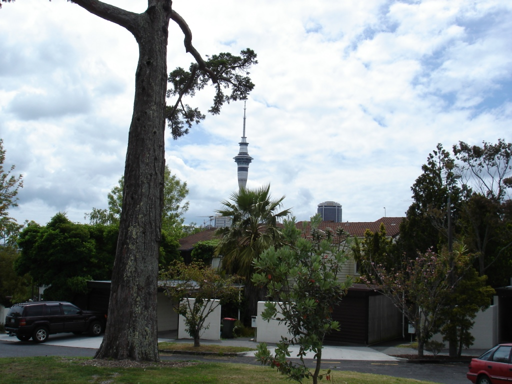
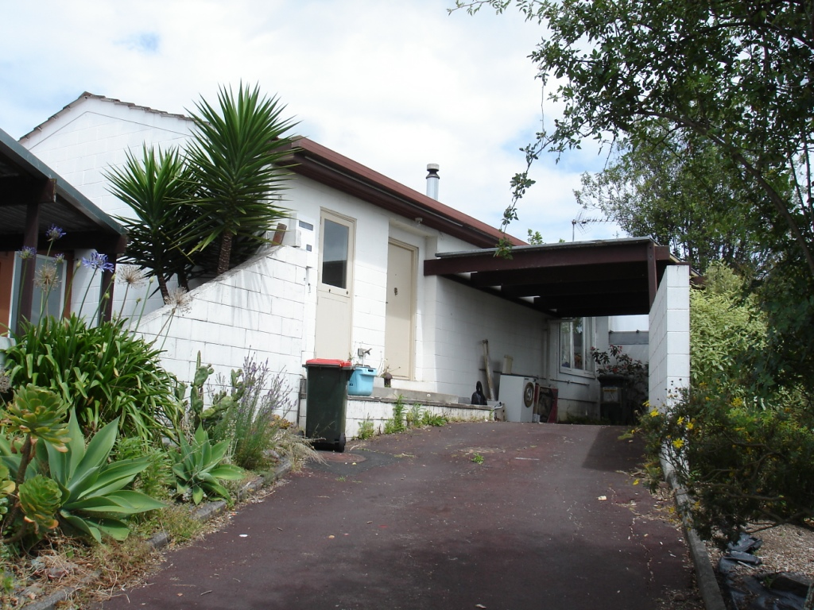
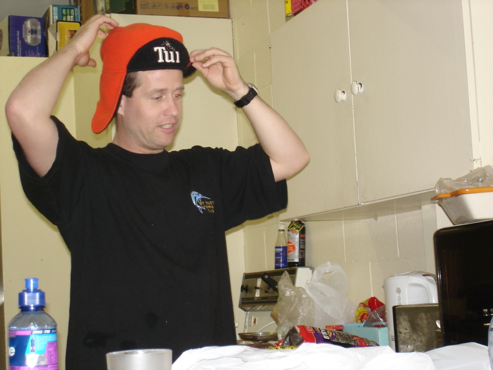
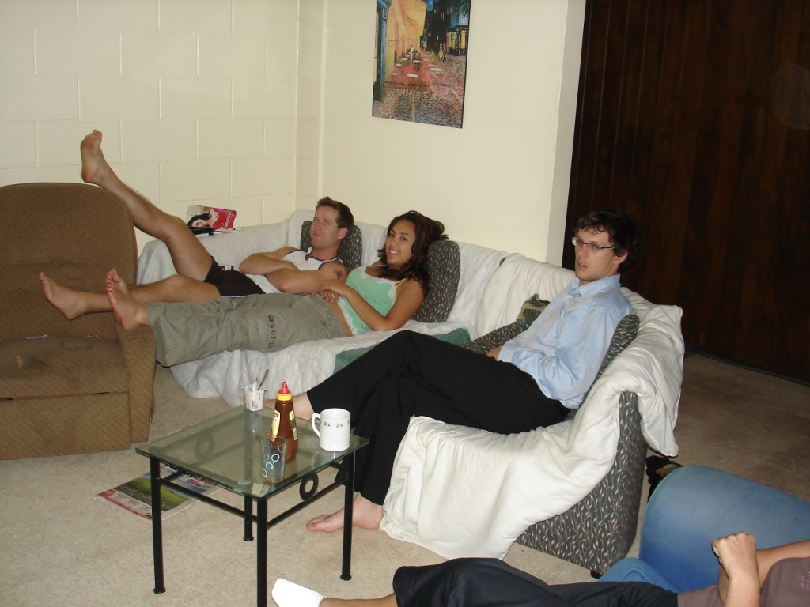

My night is winding down at 2:30 a.m., and sleep seems like a good idea. Looking at my arm, the relentless mosquitoes must have read yesterday's post; they have practically drained the life from my left arm.

What I really meant to say is that my time in this flat is finally nearing its end. Today I listed the networking equipment I used to work away from the office on Trade Me (http://www.trademe.co.nz/Computers/Networking-modems/ADSL-modems/auction-46922291.htm). Wish me luck!

I could not have been more fortunate with the group of flatmates I ended up living with. I genuinely intend to visit Hayden and Tanya in Melbourne and travel with Kate and Owen to Moscow via the Trans-Siberian Railway. I hope to see Dylan again too, although I have no idea where. He is one of the most amusing people I have ever met; I can listen to his ramblings all night without becoming bored. He can be outrageous, but he is a genuinely great person.

Tonight I helped the woman moving into my room learn Excel. It was an odd feeling to help the person replacing me. She is staying here until I move out. Not long now, and then the adventure begins!

