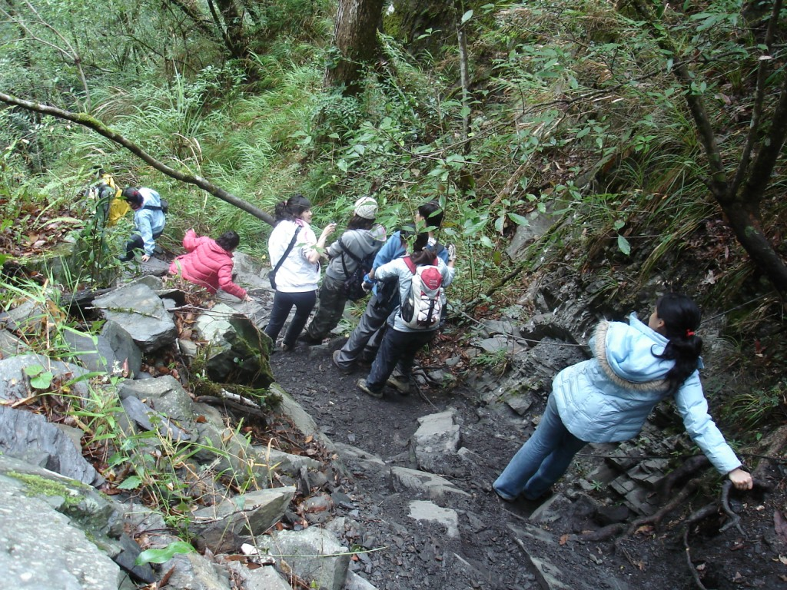

After a mediocre breakfast, we were on our way. Just a five-minute drive up the road, we reached the entrance to the hot spring, but a slow drive and a long hike (or climb!) still lay ahead. We parked and started getting ready. I was wearing sandals when it suddenly hit me: my hiking shoes were back at the hostel!

Not wanting to hold up the group, and with no other choice, I borrowed a pair of shoes two sizes too small and started hiking. Or rather, climbing. For much of the trek, we used ropes or climbed on all fours. After an hour or so, our group reached the bottom of the ravine, where a shallow river greeted us. We changed into our swimming gear, forded the river, swung around a large rock, forded the river again, and finally reached the natural hot spring. At one point, one of the women in the group slipped off the rock and into the river, and I jumped in to help. A large group was already at the springs but left just as we arrived. The water was indeed very warm, sometimes too warm, and the twenty of us settled in.

We had noodles for lunch, sat in the springs a little longer, and walked back to the bottom of the trail. I was eager to take off the borrowed shoes, since hiking in shoes that are too small is not exactly pleasant, although I was happy to be where I was.

Forty-five minutes later, we reached the parking lot and took our victory photos. We jumped into the cars, picked up my shoes, and continued for a few hours to our next destination.

In one of the few small towns, we had dinner at an Aboriginal restaurant next to a packed 7-Eleven. The food was the best we had eaten so far, in my opinion, and I was able to try wild boar, which was delicious.

After another hour, we reached a hostel where we knew the owner. We pulled out our wet gear and took turns showering. As you can imagine, it took quite some time for everyone to shower (twenty people at ten minutes each). Meanwhile, we sat on the large patio drinking victory beers and cocktails. The final event planned for the trip was lighting a lantern carrying all our wishes. We took turns writing our wishes, placed the paper under the lantern, lit it, and watched it take off. I do not think anyone was as amazed as I was. I had not expected it to go so high, but off it sailed. It was a great close to a great day.
