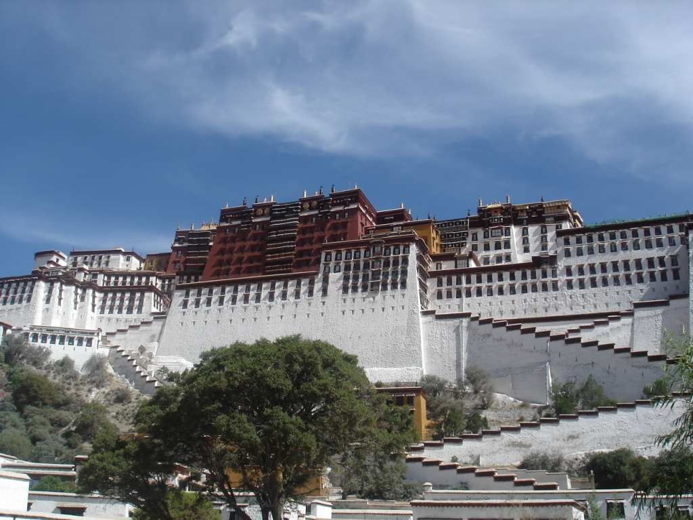

After waking up and eating breakfast, we checked out of the hotel but left our bags in the lobby. We wandered down the street to the post office, bought some postcards, and entered the Potala Palace. If you intend to visit the palace, make sure to leave enough time to walk up the stairs. Around 30 minutes should do it.

The palace is quite remarkable. On our trip, we had seen more magnificent places, places with more gold, and places with more history. But the Potala Palace gives the visitor an amazing feeling. The spirituality of the pilgrims is fascinating, and the contrast between their humility and the grandeur of the palace cannot be fully expressed in words. One of the rooms reportedly contains the second-largest diamond in the world, yet only one modest guard stood nearby. He looked sleepy.

After leaving the palace, we grabbed our bags and headed to the bus station. Our bus to Shigatse was intense. I was travelling with uncertain paperwork, and the bus was packed with local people. On each bus trip, I marvelled at how close to danger we seemed to come. As we cruised along winding mountain roads, this ride became the pinnacle of those experiences. About five hours later, we reached Shigatse, one of the largest cities in Tibet. We did not have clear directions to our guesthouse or a map. Consequently, we wandered through the city for a while and noticed how different it felt from Lhasa. Either way, we found our guesthouse and checked in.

As the day drew to a close and hunger set in, we sought out dinner. Unfortunately, almost every place appeared to be closed. We finally found a place with a group of locals inside but no indication that it might actually be a restaurant. We asked if they had food, and they assured us they did. Interestingly, not many people spoke Mandarin. The food was superb and very inexpensive. One of the things we kept realising on our trip was that the people who had the least often gave the most, and this place was no exception. They kindly gave us free soup and were eager to chat about where we came from. I do not think many Westerners came in there, if any. We spoke with the group for quite some time and eventually took a photo together.
