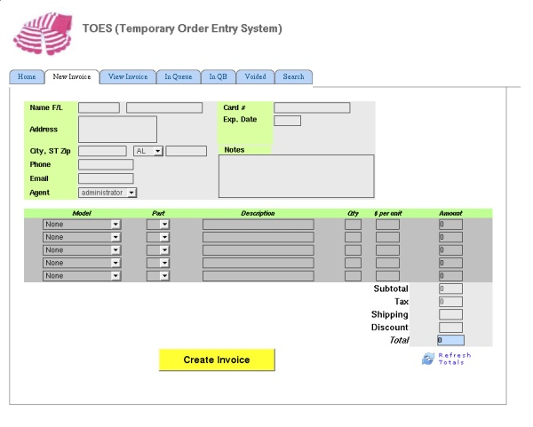
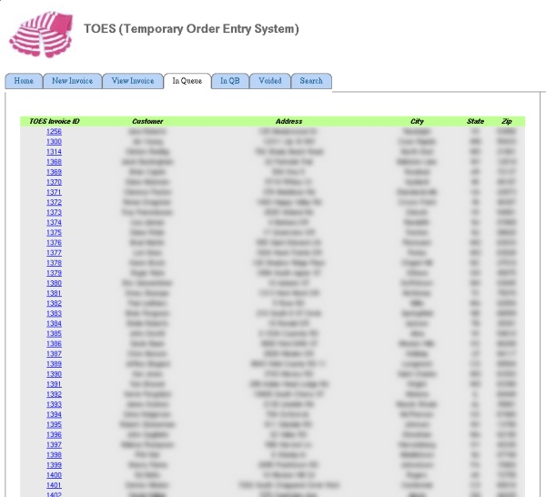
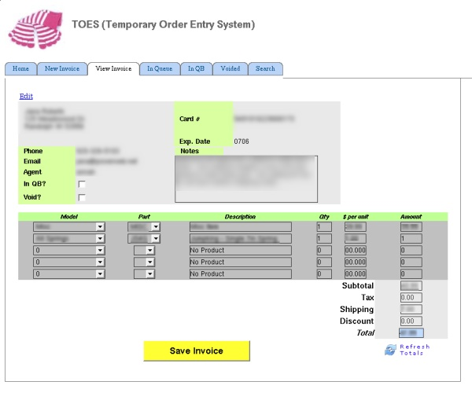
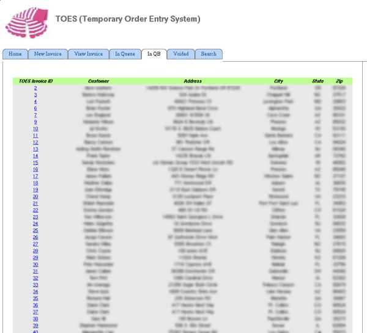

Status:  ✅ 
  

Toes, aka the Temporary Order Entry System, is a, get this, a temporary ordering system to buy some more time while the full ERP is designed and implemented. Because we grew so quickly, orders needed to be put in a temporary zone, then moved somewhere else (apologies for being vague, you can understand why). Myself and a co-worker hacked up a temporary holding zone for the orders. It allows New Invoices, to View Invoices, whatever is In Queue, Voided and Search. The order entry page is auto-loads prices and things from the database, so totals are pulled out of the database and added up automatically. We ultimately entered well over 1500 invoices into TOES before the ERP was implemented, and besides a few odd hiccups, it was pretty stable. The UI doesn't look all web2.0-like, but for an intranet project, it didn't need to.

  
  

**Adding a new invoice**

**Auto-fill out feature**

  
  

**Order in-queue, ready to be transferred**

**Viewing an invoice**  

  
  
  

**Orders Taken (already moved)**

  

**Must have search**