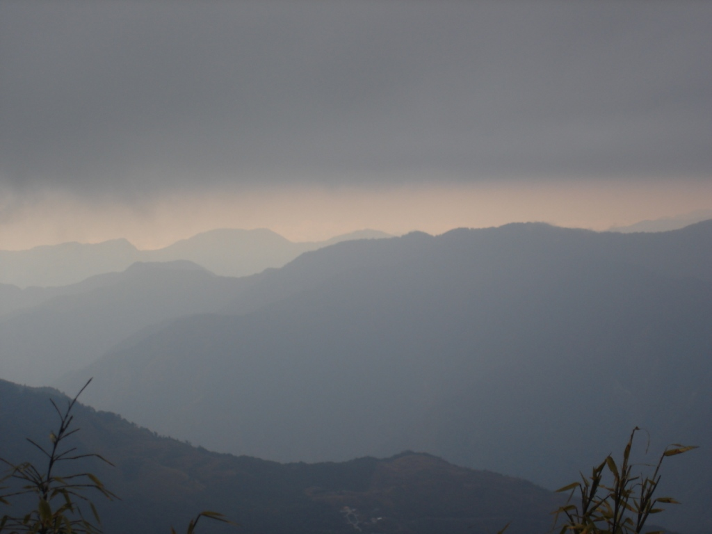

Waking up rather early, I walked back to the restaurant and ordered breakfast, another five-course meal. Soon I was packed, in the car, and on the road. Since we were driving through Jade Mountain National Park, there was almost no development. What a relief.

We drove and drove, finally reaching the base of the mountain I was about to climb. I was under the impression that the mountain would not be cold, so I had brought only a sweater and a pair of shorts. Even at the base, I was cold, so I put on my trousers and hoped I would stay warm enough. Everybody else was wearing double-layered waterproof jackets, warm trousers, and large backpacks. Indeed, the two of us looked a bit out of place. Even though I got almost no daily exercise, I apparently had a heart of iron and trekked up the mountain without delay.

I should mention that the mountain was not "hiking," as I had been told, but more like climbing. I reached the top after a few hours and started eating some more food. I was a little worried about being blown away, yet even more worried about freezing to death.

Somebody yelled, "No shirts!" or something like that. All the men subsequently took off their shirts and stood at the top, which was blisteringly cold; it had been hailing moments before. After a few photos, I hiked back down the mountain. Thoroughly tired, I jumped into the car and continued to our next destination.

My intention was to stay at a small campsite near the hot spring we were visiting, but poor weather led the group to choose a hostel instead. That was where the trouble started. The hostel advertised a particular rate, both publicly and on its premises. When I started to check in, however, the owner quoted a price for each room that was double the advertised rate. I did not understand the discussion, but I paid what they asked and went to our rooms. The owners did not know that two people in our group were reporters for an organisation in southern Taiwan, so the matter was already being followed up. In any case, the sudden price change left a poor impression.

The rooms were quite basic, the bathrooms even more so, and dinner was mediocre at best.

Still, I had climbed a remarkable mountain, so the accommodation could not distract from an otherwise great day.
