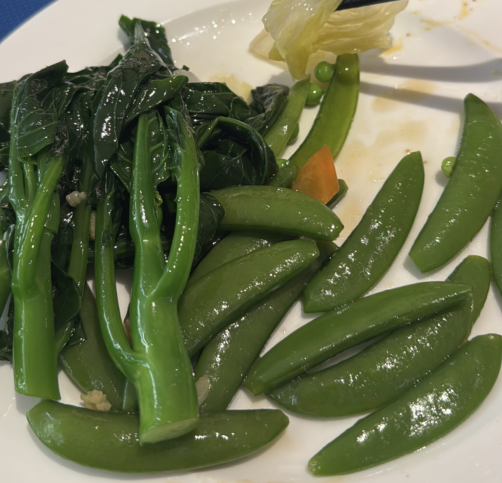

### Background

I remember reading somewhere that what a country deems as important changes as it becomes more affluent: people want a scooter, and then a car, and then move on to intangibles like clean air. It feels like longevity is the pinnacle of affluence, so it is worthwhile reminding myself that some of what I experiment with comes from a complete position of privilege.

This post comes from that position of privilege.

There are several key components when it comes to longevity: food, sleep, and exercise. Unfortunately, travel makes all of these more challenging.

Although I do not need to do significant business travel, I do usually travel 1-2 weeks per quarter, and then likely 1-2 larger trips for holiday per year. The purpose of this post is to document, for myself or others, what I have found to reduce the impact of travel on my longevity hobby.

### Experiments

#### Nutrition

The first area I focussed was on nutrition, but you might be critical with what I've done. One of the challenges with travelling for business is that you have less control over your nutrition and timing of meals. There is a trade-off here, of course, as part of travel is enjoying local cuisine.

* Breakfast: I bring sufficient material (steel cut oats, sunflower seeds, goji berries, nuts, and spices) for breakfast each morning.
* Lunch: I normally get taken out to lunch, so eat locally.
* Dinner: I'm a bit cheeky here. My preference is to eat dinner rather early, but usually there is a business dinner for me to attend. What I do is bring a meal designed for backpacking, e.g. Radix Nutrition, and eat that around 4PM. Then for dinner I focus only on vegetables, which often have fewer calories.

Luckily I operate under more of a 'flexitarian' model when it comes to nutrition, so while I am almost entirely plant based while home, I will still have chicken and eggs while travelling. However, I will still aim to avoid foods high in saturated fats (in particular coconut oils and full cream dairy), or heavily processed foods (e.g. baked goods, or certain meats like sausage or bacon). This does change how I participate in shared meals, and does mean missing out on some absolutely fantastic food!

Sometimes I can get in a situation where I need to try something, but only after trying it realise that finishing the item is incompatible with my longevity goals. For example, the below drink came out on a recent trip and I thought it was going to be a rose-flavoured tea, but it was more like juice. Given it was 8PM, after having a single sip I opted to skip the rest. While extremely tasty, I am experimenting with avoiding carbs in the afternoon and especially evening. Previously I might have felt it would be rude to not finish everything, but now I'm OK skipping items.

Here is what my supplies look like for 8 days (ignore the TimTams and Vegemite - they're a gift!). That is 1KG of oats.

If my hotel offers a free breakfast, then I might get some additional food, but limit it to veggies and fruit. The below photo was from 5:30AM.

I'm currently bringing my regular supplement stack, but ideally I would like to take a single multivitamin that covers most of the stack and reduces the amount of items I need to bring.

One experiment that failed before it even got any traction was to bring a portal blender, and make smoothies. Unfortunately, I realised the morning before I left that the blender had a giant battery in it, and then blades that wouldn't detach. In hindsight I should have thought this through, so the blender will go to work.

### Sleep

Sleep remains an area where I think I can still grow significantly. The biggest change I am trying to adopt is avoiding overnight flights, as I've found these take a significantly long time to recover. My trip to China involved one leg and overnight in Guangzhou, which cost the same as a direct overnight flight. Sure, I lose essentially an extra day, but I justify this as a day I would lose due to being fatigued anyways.

Because of that first night in Xian I'm going to be asking to be far aware from elevators wherever possible.

I bring bluetac and a little cardboard to cover up any lights in the hotel room, as sometimes they are super bright. I also bring my blue light blocking glasses.

Finally, I maintain my glycine intake, which is especially important if my methionine intake increases due to more meat consumption.

### Exercise

After a previous trip to India I realised that staying in a hotel with a fitness centre is crucial, so unless visiting somewhere where I can run outside, such an amenity is now non-negotiable. I will usually travel wearing a pair of trainers, and will pack my HRM as well as a headband; the headband is essential if using a treadmill!

It would be easy to bring too much clothing, but what I've found is that I can get away with 2x running shorts, 1x lightweight tank, and 3x running socks. I wash every evening in the hotel sink, and bring a Sea-To-Summit clothing line to let it try.

Some places are easier (Melbourne, or NZ) than others (large cities or places with sub-standard air quality).

If taking an overnight flight I would prefer a window, but with only daytime flights I would prefer an aisle seat, as this allows me to get up and stretch my legs without interrupting anyone. Yes, I'm that weird person to do lots of calf raises or squats in the back of the plane. There have been some flights where I spent 75% of the flight standing up reading.

I'm still looking at better optimisations in this space.

### Others

Basic hygiene remains important, so washing hands or using lots of hand sanitiser, and bringing masks for high risk areas. While I don't wear a mask in the office, I do while in airports or public transport, and generally while flying. Masks are also useful to have in your pocket just in case someone is super sick and coughing, or even if needing to be somewhere that has extremely poor air quality.

