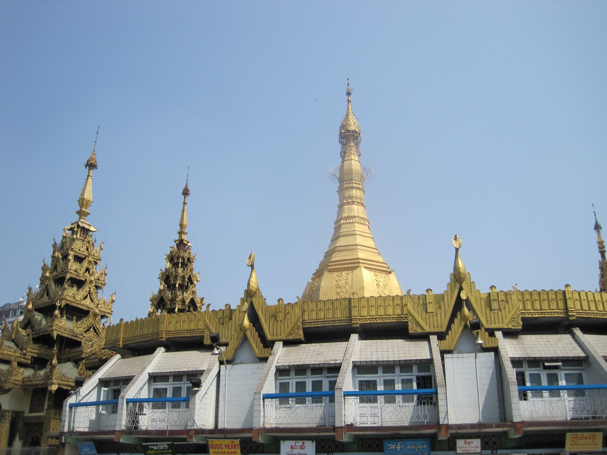
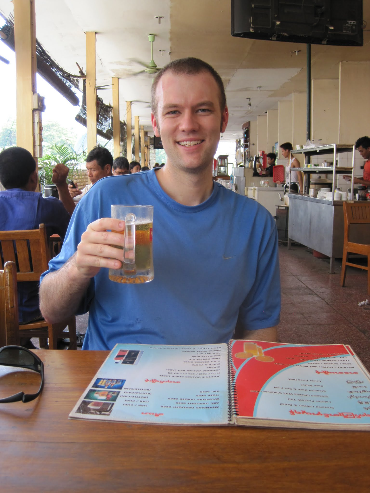
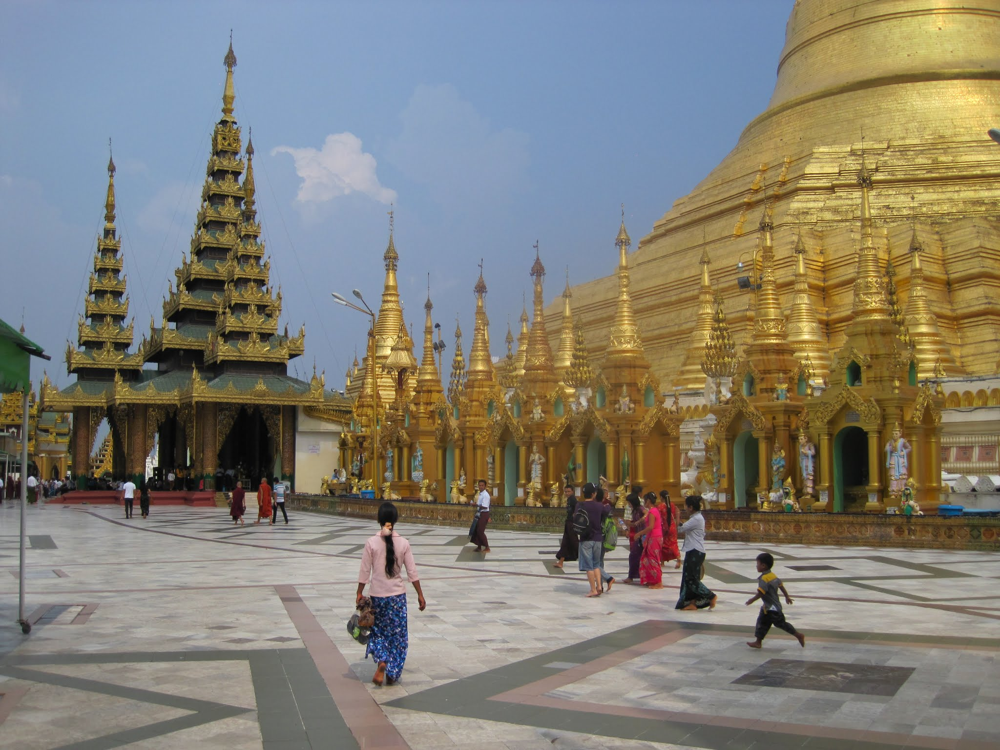
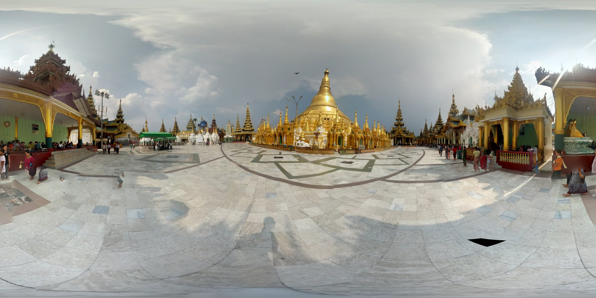
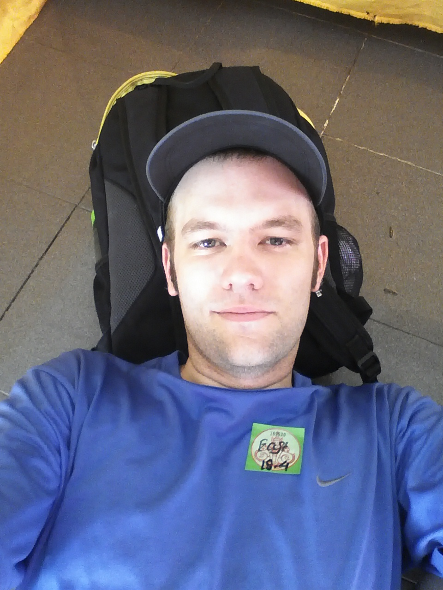
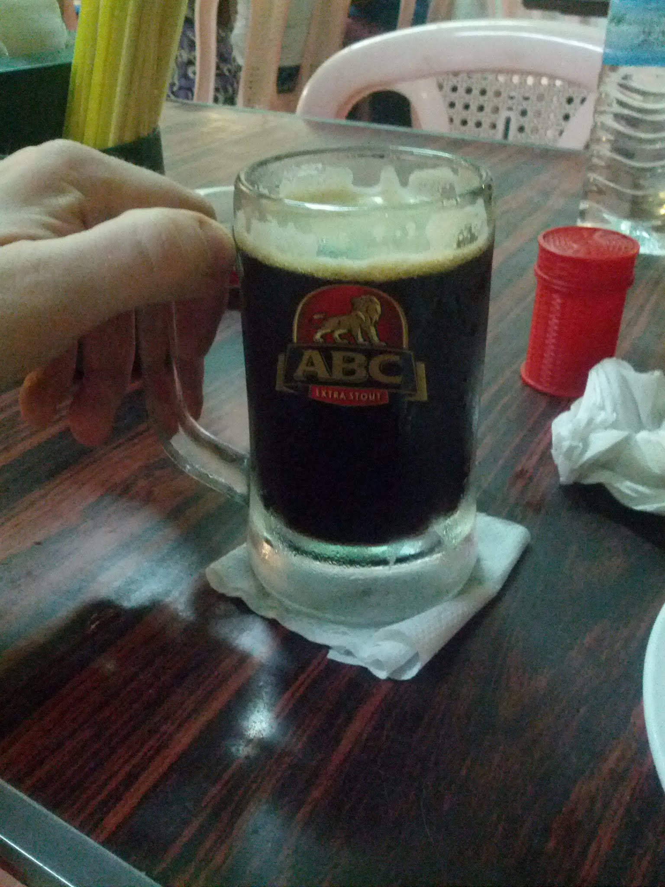

I arrived at Yangon International Airport quite early in the morning. My first impression was that the airport seemed new, with smartly presented staff throughout. I passed through customs without any problems. My first stop was the currency exchange; the airport rate was apparently reasonable, and I would need cash quickly. I handed over $200 in freshly minted US currency. Do you know how hard it is to find fresh US dollars in Sydney? The staff began preparing my money. The people before me had bags and bags of cash, and I thought they must have exchanged $10,000 or more. My luggage soon arrived, and I left the exchange with a stack of 200 bills. I counted them, passed through customs, and was greeted with warm smiles and my name on a placard.

The car set off at a slow pace towards the city. About halfway there, we left the main road and continued to my motel. The drivers seemed quite relaxed, although the local driving style was still unfamiliar to me.

My motel was some distance outside the city, near a main road. The trucks were noisy, beep beep, but the staff welcomed me warmly. My room on the third floor was clean and comfortable. The sheets were perfectly white and pressed, and the mattress was free of bugs. I checked the seams of the mattress. In fact, it looked brand new.

After a quick shower, I prepared my bags and used my one complimentary ride downtown. I was dropped outside Sule Pagoda, beside the large park near the US embassy. I had already cached two maps of the city on my phones, so I knew exactly where I was and set off on foot. It was a sudden reminder that I was again somewhere you had to cross the street calmly as cars moved around you, or, better yet, join a group of locals. I usually positioned myself among them and moved when they did.

Sule Pagoda was impressive, standing unexpectedly in the middle of a roundabout. Of course, the pagoda was built centuries ago, and the roads were planned around it. Several demonstrations had begun there, many of them swiftly stopped.

Downtown Yangon was a flurry of activity, compressed along roads lined with large and small buildings that all seemed about eight storeys tall. Commerce was happening everywhere, and the city certainly felt alive. It was also quite dirty, with rubbish everywhere and the red stains left by betel nut visible in many places. I needed to remember to look both up, for my head, and down, for my feet.

I was starting to feel peckish. My usual travel guide, Triposo, which draws on WikiTravel, had relatively little information about Myanmar and listed only two places to eat. While crossing an overpass on my way to one of them, I noticed a restaurant just off the bridge. It was about half full despite the time being only 10:30am. I went in and was promptly given two menus. I ordered a hot and spicy rice dish, which lived up to its name. It was pleasantly spicy, full of heat and flavour without leaving a burning sensation, and perfect for such a hot day.

After paying about $5 USD for lunch, I crossed the street, walked through one covered market, and eventually reached the larger markets just north of downtown. They were expansive, with small alleyways running in every direction. There was little I could buy and take home, which made browsing easier. Really like that wooden spoon? Not a chance.

One block beyond the markets, I found a small mall selling the cheapest water of the entire trip. I had gone in for the air conditioning, so the inexpensive water was a bonus.

I had been practising numbers, so when I saw Bus 43 approaching, I flagged it down and jumped on. It was rumoured to go to Shwedagon Pagoda, one of Yangon's key attractions. Normally, I would use GPS to decide where to get off, but the golden pagoda is so large that it can be seen from anywhere nearby. After 15 minutes, it came into view. When the bus stopped, I jumped off and walked towards it.

The entrance to Shwedagon Pagoda comes after the obligatory row of shops. Visitors then remove their shoes and climb a dimly lit staircase. Bring a bag, as children try to sell bags for your footwear. I encountered an unusual situation, at least in my experience of Myanmar so far, when a child picked up one of my shoes and tried to place it in a bag for sale. I retrieved it with a smile and continued. I believe there is an entrance from every direction; I entered from the east. After crossing two roads barefoot, I reached the ticket booth and paid the foreign-visitor fee. I might have entered without anyone noticing, but I was a very obvious visitor.

What I had forgotten was how hot it was and that footwear was prohibited, so everybody was hopping around as though walking on embers. Some monks and other local visitors tolerated the heat better. One could attribute this to mind over body, but I suspect they were simply more accustomed to it than I was. I made it about 14% of the way around before retreating to a small hut to cool my feet.

The small hut provided an excellent view of the pagoda. Its different levels were clearly maintained to different standards, with those closer to the bottom in the best condition.

Children looked at me curiously while I sat and gazed at the temples.

After about 30 minutes, I changed tactics and tried walking around the outside. Many locals seemed to be doing the same. Perhaps because of the angle at which the sun hit the tiles, the outer path was noticeably cooler. I completed another 50% of the circuit, taking photos along the way, until I reached what could best be described as the main gathering area. It looked as though half the city had come to the pagoda and found a corner in which to rest. Beginning to feel tired, I found my own corner, put down my small bags, and took a nap.

A few people seemed to be watching when I opened my eyes, probably curious why a foreigner was just hanging out  in the corner. I picked up my bags and began walking, the tiles a bit cooler. Thunderstorms rumbled in the background, a noise that seemed to clear out some of the locals. I made it all the way around the complex, underestimating just how large it was, and walked back down the eastern staircase.

After walking a few blocks back to the main road, I found Bus 43, jumped on, and returned downtown. I called it the "bow-tie bus" because of the way the number 43 appeared.

While downtown I searched for another bus back to my hotel, #102, which looked a bit like "coJ". I saw the bus drive by, ran to the intersection, and jumped on. The bus rides all cost about 20 cents.

Bus 102 began winding its way out of the city, but instead of turning right, it went left. This seemed unusual because I had seen the same route pass my hotel. The bus continued farther in the wrong direction and never turned right. I asked the passenger behind me, who seemed to indicate that it did not go to my suburb. I got off at the next stop, only to watch the bus reach the following intersection and turn right, exactly where I had hoped to go.

After trying to ask people in a local cafe which bus to take, and receiving only confused looks, I returned to the street and flagged down a taxi. Twenty minutes later, I was back at my hotel.

That night, I ate at the small restaurant next door, one of the partially outdoor places so common away from central areas. There were no menus, and nobody spoke English, so I pointed to another customer's meal and held up two fingers. I also ordered a drink, which was easier to communicate.

Dinner was a vermicelli noodle dish, which was delightful. The drink was refreshing, and I tried one of the ABC extra stouts, which was also quite nice.

After dinner I walked over to my hotel, went inside, and fell asleep.

 You can see all my photos from the trip on my [Myanmar album](https://plus.google.com/photos/102101489843655881853/albums/6007323388582033025?authkey=CIWFiI3T_dvXQA) on Google+.
