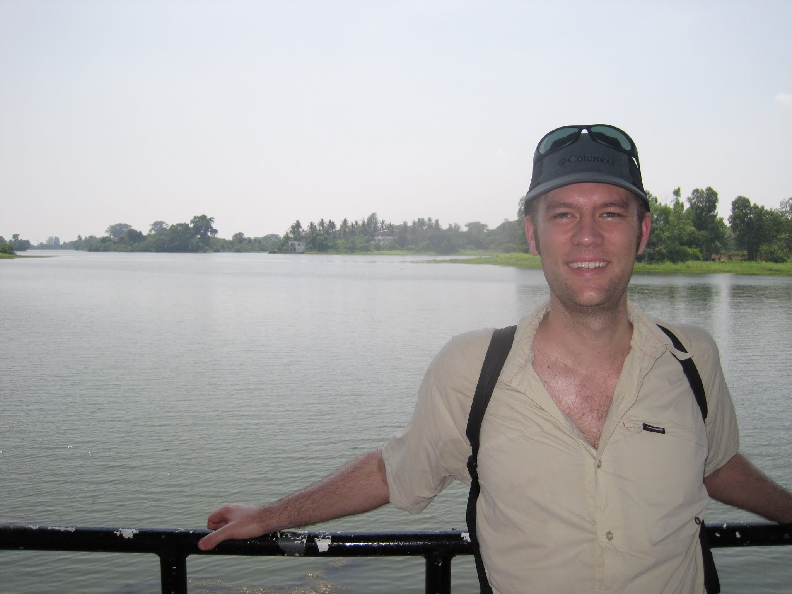
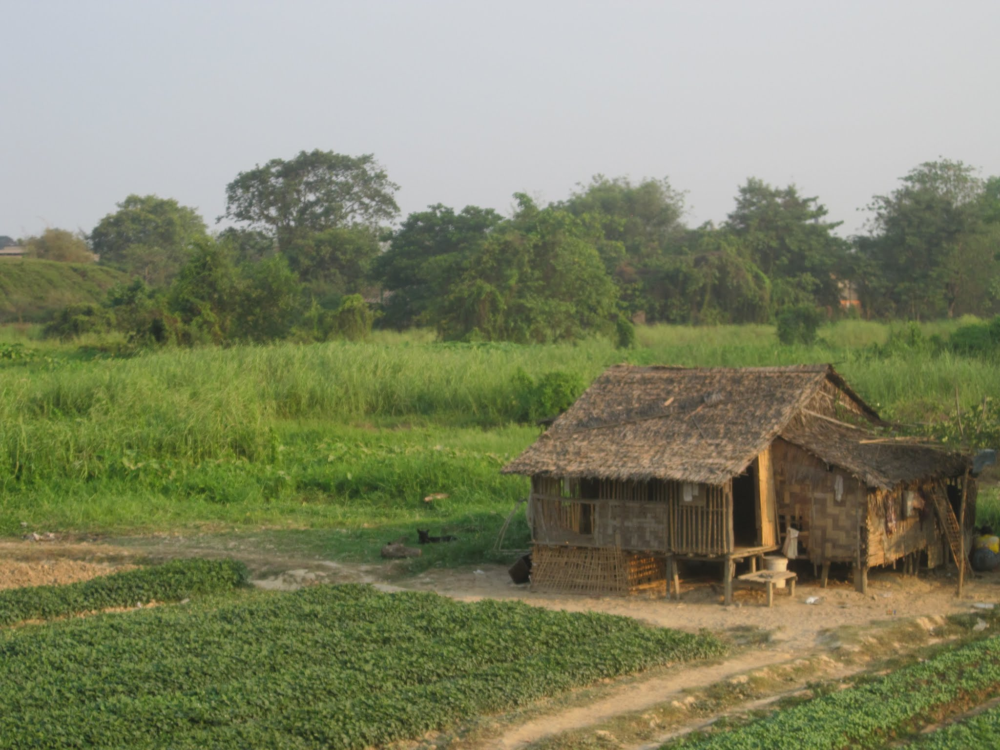
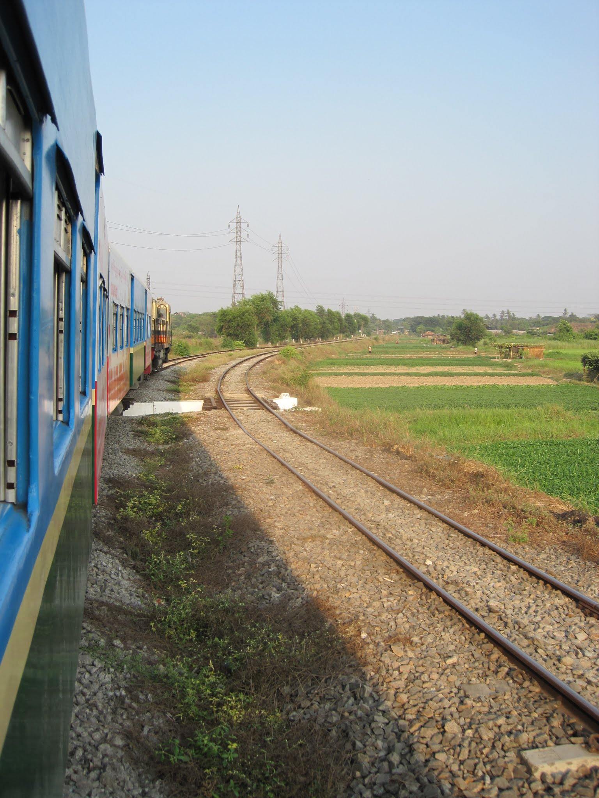

I woke up and went downstairs for a simple breakfast of eggs, toast, and coffee. Another traveller from Australia was there, so we chatted for a little while before I packed my things and walked to the bus stop.

The bus arrived quickly. I jumped on and was soon on my way. Although I had some instructions for using the bus, I needed to transfer. Following my map, I got off and crossed the street to wait for the next bus to Inya Lake. It never came, and a local mimed that I was at the wrong stop. After walking around for a while in search of the bus, I eventually gave up and flagged down a taxi. It looked fine from the outside but was barely functioning. Twenty minutes and $3 later, I was at the lake, although at the Inya Lake Hotel rather than my intended destination. I could have been more explicit, but the hotel sufficed.

I walked by the lake for a little while, took some photos, and headed back towards the main street. The sun was out in full force as I walked through the back streets. Just before reaching the main road, I stumbled and the sole of my shoe flew off. The pavement may have been hot enough to melt the glue holding my shoe together, although the shoe might simply have been too old. I made it to the bus  stop, jumped on the next bus, and was soon downtown. As the bus passed the Shwedagon Pagoda, about half the passengers bowed their heads at the same time and began praying.

My first mission downtown was to find a new pair of sandals. One market stall was filled with what appeared to be Myanmar-made footwear, so I went in to investigate. A few minutes later, I casually walked out with a new $3 pair of flip-flops. These were high-end flip-flops, not the mass-produced foam kind.

I noticed a small place filled with locals eating lunch and realised I was a bit peckish. The food was decent, though not quite as good as what I had eaten at Lion World the day before. I found MMR$1000 on the floor and asked everyone nearby whether it was theirs, but they all said no. I placed it on the table, where nobody took it, and it eventually blew off. Someone walking past found it and put it back on the table. I was impressed by the honesty.

From there, I stopped at a supermarket, encountered a few very pushy shoppers, bought some biscuits for later in the day, and walked across a bridge to the railway station. I bought a ticket at the bottom of Platform 7, which I had researched thoroughly, and waited for a "circular train." It was supposed to cost $2 USD but ended up costing 20 cents. My transport costs were generally lower than the prices reported online.

People were spread throughout the station, many of whom appeared to be living there. Some sold ice or, more accurately, the chance to pour water over their ice to cool it. I took a few panoramic photographs, and at 15:30 the train arrived. It stopped for perhaps 20-30 seconds, with people jumping on and off in all directions: impressive dwell time! The train began its clockwise circuit around the city. Although its dwell time was impressive, the track maintenance left something to be desired. The carriage shook violently as we inched along, never exceeding 25 km/h. Every station had people selling something, and people regularly walked between the tracks.

I inched my way station-by-station until I stopped somewhere north of the  city, at a larger stabling yard, where I paused for almost 45 minutes. There were mothers everywhere with their newborns, both dressed in colourful clothing.

The train whistled and began moving, now entering a more rural part of town. People farmed on both sides of the tracks. I wished I had a camera with a better lens, as this would have been a photographer's dream. The sun  began to set, bathing the houses in intense orange light.

Just as I was beginning to tire of the train, I reached Tamwe Station. I jumped off and started looking for a bus back to the hotel. Several buses passed, but I was not at the designated stop, so they did not stop. I walked a few blocks up the road, found other people waiting, flagged down a bus, and jumped on. It was jam-packed with rush-hour passengers, and I was pushed from side to side as I ducked my head to work out when to get  off. I spotted a familiar building and recognised where I had  boarded that morning, so I jumped off at the next stop and walked back to my hotel.

Back at the hotel, I ordered dinner, showered, finished packing, ate, and said my goodbyes before the hotel staff drove me to the bus terminal.

The guides helped me find the correct departure area, which might have been difficult amid so much chaos. I waited in the  terminal, drawing curious looks from many people who passed, and was soon called to board.

The #2 VIP Express was a reasonably new Skoda bus with spacious, nearly fully reclining seats and large screens. Skoda marketing material was still playing on all of them, but I quickly switched it off and investigated the "Movies" section. The movie files were incomplete, so one suggestion before starting a film is to double-check its duration. I started playing "Safe House.avi," but it stopped at minute 51. I suspect only one of the two discs had been copied.

I tried to finish a few movies but fell asleep almost immediately. The seats were comfortable, though not quite comfortable enough for uninterrupted sleep.

After stopping once for food, I arrived in Mandalay.

 You can see all my photos from the trip on my [Myanmar album](https://plus.google.com/photos/102101489843655881853/albums/6007323388582033025?authkey=CIWFiI3T_dvXQA) on Google+.
