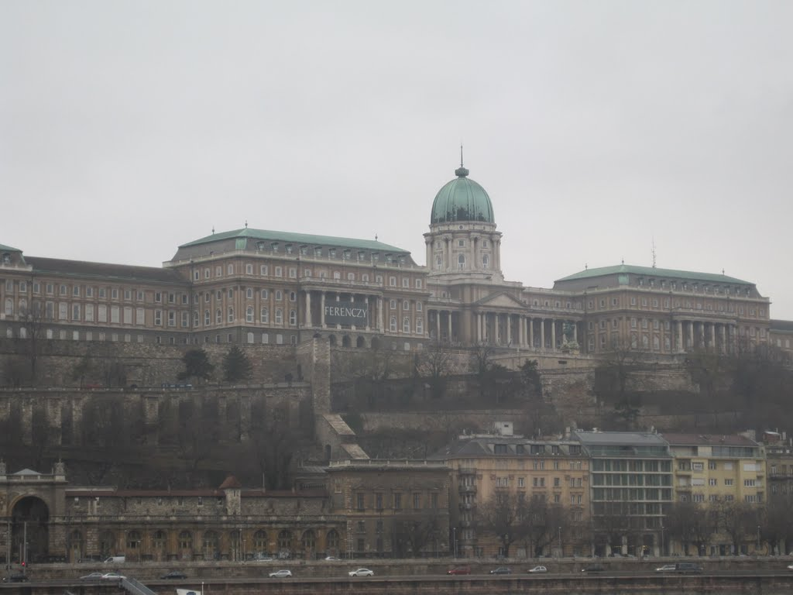
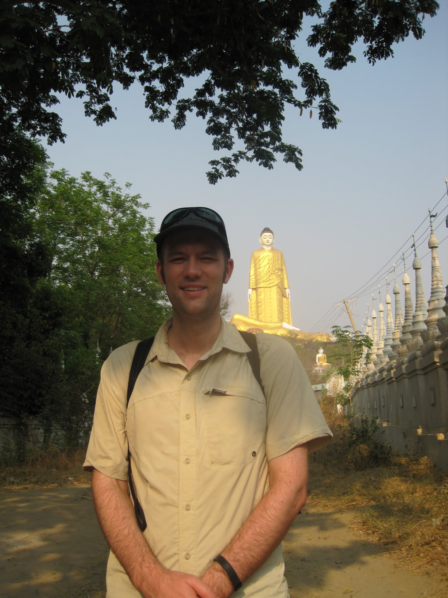

The touts in Mandalay were more persistent than those in Yangon, approaching every passenger on the bus.

One driver asked where I was going. When I said the bus station for Monywa, he offered to take me for 5,000 kyat. I countered with 2,000 because it was only about two kilometres away. He lowered his price to 4,000, then offered two motorbikes for 1,000 each. I declined and started walking.

One of my quirks is that I genuinely do not mind walking, provided it is neither too hot nor too polluted. At 6:30 a.m., the city was still cool and traffic was light. I made my way to the palace, then followed back alleys to the bus station. The road approaching the station was chaotic: vehicles moved in every direction, buses swerved around market stalls, and dirt gathered in every corner.

At the bus station, I found someone selling tickets to Monywa, and they directed me to the bus. The fare was just US$2, and I had only a 20-minute wait.

My seats were in the front row, with a perfect view through the windscreen. This made it easy to photograph the activity around the bus, although the position felt less reassuring whenever traffic became unpredictable.

Four hours later, I arrived in Monywa, having endured some uncomfortable attention from the man behind me during part of the journey. A quick tuk-tuk ride brought me to Hotel Chindwin, where I would spend the night.

The hotel was well maintained, with cleaning staff sweeping every corner. My room was on the third floor at the back, away from the street. It had a small television, the same remote control I used at home, and air conditioning. I immediately showered, washed some clothes, and arranged for a tuk-tuk to take me to nearby sites. While waiting, I had a late lunch and a beer at Tsu's, a restaurant near the hotel that served a traditional buffet-style meal.

My tuk-tuk arrived, and I climbed aboard for the ride through Monywa. After dropping another passenger at the market and stopping for fuel, we continued to Thanboddhay Paya, said to contain 580,000 Buddha statues. I thoroughly enjoyed the temple's interior, although many niches within easy reach were empty.

My next stop was a few kilometres away: the giant Buddha at Bodhi Tahtaung. By this point I was tiring, so I made a quick visit to the giant golden pagoda, took my photos, and returned to the tuk-tuk. The good-natured driver smiled often. About 45 minutes later, I was back at the hotel, tired from the day's travel but happy with what I had seen.

Back at the hotel, I began asking about bus tickets to Bagan, roughly four hours from Monywa. Buses between Mandalay and Monywa could be booked at the station just before departure, but I did not want to take that risk for Bagan. The hotel staff repeatedly called the bus station, but the line remained busy. I had not seen such persistent redialling in years, perhaps since trying to reach a congested radio hotline. When they finally connected, I learned that every bus to Bagan was full the next day, with only a few seats available on an 11:00 departure the day after. I had planned to spend only one night in Monywa and two in Bagan, so this created a problem. I asked them to reserve a ticket.

I bought some street food and water and brought them back with me, knowing that no tickets were available the next day. I ate dinner, cleaned up, watched some television, and soon fell asleep.

 You can see all my photos from the trip on my [Myanmar album](https://plus.google.com/photos/102101489843655881853/albums/6007323388582033025?authkey=CIWFiI3T_dvXQA) on Google+.
