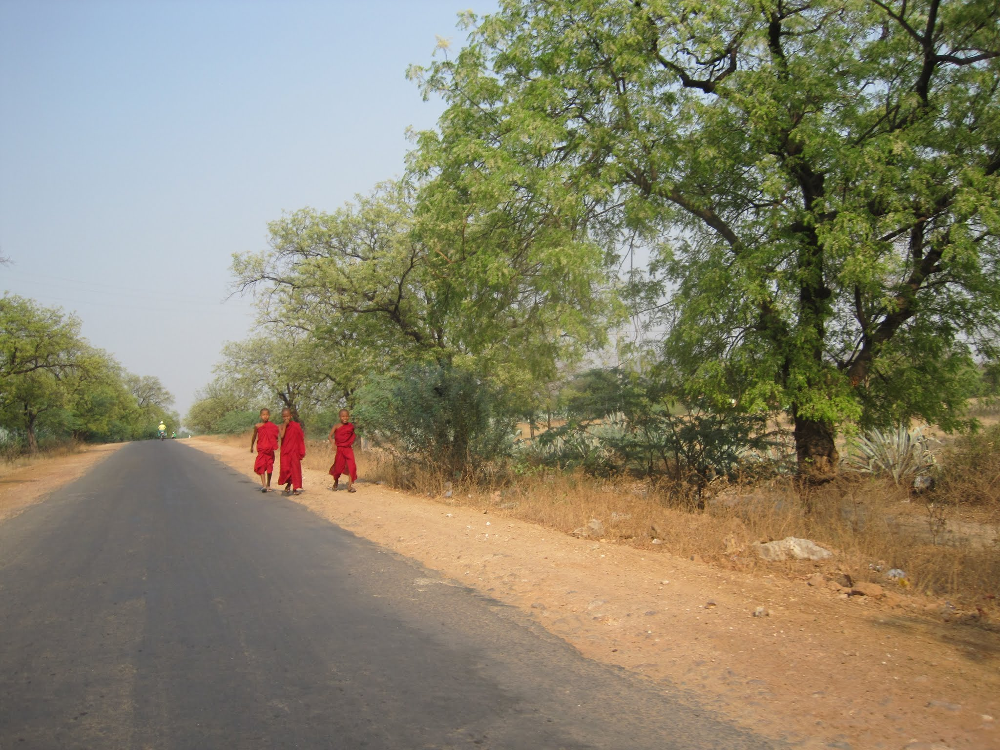
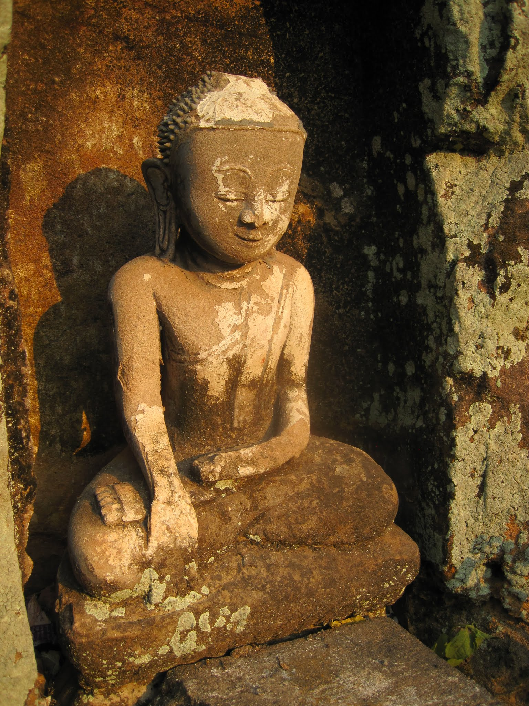

First thing in the morning, I went downstairs and asked whether the staff had been able to organise bus tickets out of Bagan, either during the day or at night. I knew JJ Max was full but held out hope for the two other bus providers. The hotel staff managed to contact both, but they were fully booked for the next week, day and night.

I started to worry about how I would get to Yangon. The staff then checked the buses from Monywa to Yangon: full. The buses from Mandalay to Yangon were also full. I had already encountered bad luck when organising airfare, as the company cancelled my ticket at the last minute due to "technical issues." All the airlines' websites reported that only limited flights would operate over the New Year holiday period and that their call centres would be closed! Now I was getting more worried: how was I going to get home with my flight departing Yangon in four days?

The train was an option, but I questioned the reliability of the service. If I had been alone, I might have contemplated hitchhiking, but I did not think it prudent to do that with my better half. I started exploring my options: go to Bagan and wing it, try to take a train, return to Mandalay and talk directly with the bus operators, or pursue a third option and fly out of the country.

Unfortunately, I resigned myself to the fact that going to Bagan was too risky because there was too much uncertainty about getting out. At almost any other time of year, this would not have been an issue, but the New Year festival had everybody returning to their villages. To be certain that I could get back to Kuala Lumpur, I found a route: fly from Mandalay to Bangkok, then on to Singapore. After one night in Singapore, I would take a bus to KL. Luckily, I could book all of this in advance, giving me much-needed peace of mind.

After two hours of impromptu ticket booking, I had a plan, which meant it was time to explore. The hotel organised a tuk-tuk to take me to the Phowintaung caves, located "quite a bit out of the city." The negotiated fare was $20, and I departed at 14:30.

I somehow boarded what was probably the roughest tuk-tuk in the country, but it mostly worked, and I was on my way. The tuk-tuk reached the edge of Monywa and kept going, then continued for another 90 to 120 minutes. At one point, I looked around and saw nothing but barren land, which reminded me somewhat of driving in Australia. One thing I could not understand was why it was smoky everywhere, not just a little smoky but filled with thick, dense smoke that turned your snot black. It felt as though there were a fire nearby, except the smoke stretched all the way from Mandalay to Monywa. I would like to think it came from a single fire, but it was probably from cooking fires across the region.

The sides of the road were so worn from traffic that it was obvious how much an extra metre or two of width would have helped. I lost track of how many times my tuk-tuk barrelled down the road towards a large truck in the middle, both drivers seemingly playing a game of chicken. Sometimes our driver swerved off the road; sometimes the other driver did. I never figured out the rule. All I could do was keep telling myself, "It will all work out."

My tuk-tuk driver stopped at one point, filled two bottles with water, returned, and cleaned the tyres of his tuk-tuk. I never figured out why he did this; the other drivers did not, and the tyres were dirty again five minutes later. We continued a little farther, carefully crossing bridges, and eventually made it to the caves.

I regretted taking the hotel's advice to leave at 14:30, as I had intended to go at 12:00. It would have been over 40C when I was travelling there, but there appeared to be so much to explore. I spent about two hours exploring the main cave complex, with small Buddha figures set into the walls.

Then there were the monkeys, which were everywhere, and their droppings, which were also everywhere. It reminded me of Nepal.

There were other complexes nearby that I would have liked to explore, including a hike to the top of the mountain. Unfortunately, the heat and approaching dusk turned me away. I left satisfied with what I had seen but also cautious about the long drive home. I bought water from one of the sellers for 40 cents per bottle, a slight markup from the city price. I had noticed that people in Myanmar appeared to be fair and honest, although that observation might have been premature. I never had any disputes over fares, such as agreeing on 500 in total only to be told later that it meant 500 per person. Thinking back to a place like Disneyland, a $1 bottle of water might cost $5 or more. Yet here I was, in the middle of nowhere, paying only an extra 10 or 20 cents per bottle. I grabbed the bottles and held them to my body, trying to fend off the day's heat.

The tuk-tuk set off down the road, the cave complex shrinking behind me. Every few kilometres, I was greeted by more golden pagodas, almost enough to desensitise me. The sun quickly disappeared, and I was soon scooting back to the hotel in the dark.

The light barely worked, and for much of the ride it was not on at all, but I made it. I jumped out of the tuk-tuk, paid the driver his well-deserved fare, and walked into the hotel.

I bought some street food, including little battered quail eggs, and ate dinner on my hotel floor.

The water running off me turned black when I showered, even though I had showered less than six hours earlier and had been wearing long trousers and shoes. I washed my shirt and underwear, as I travel with only two pairs of underwear and a few shirts, and went to bed. I knew the next day was going to be a long one.

 You can see all my photos from the trip on my [Myanmar album](https://plus.google.com/photos/102101489843655881853/albums/6007323388582033025?authkey=CIWFiI3T_dvXQA) on Google+.
