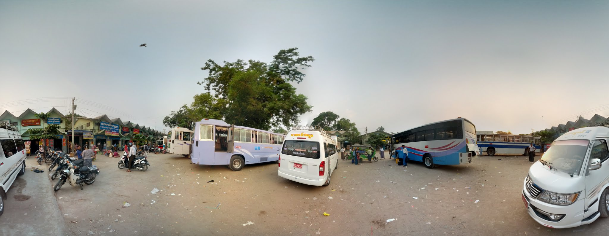
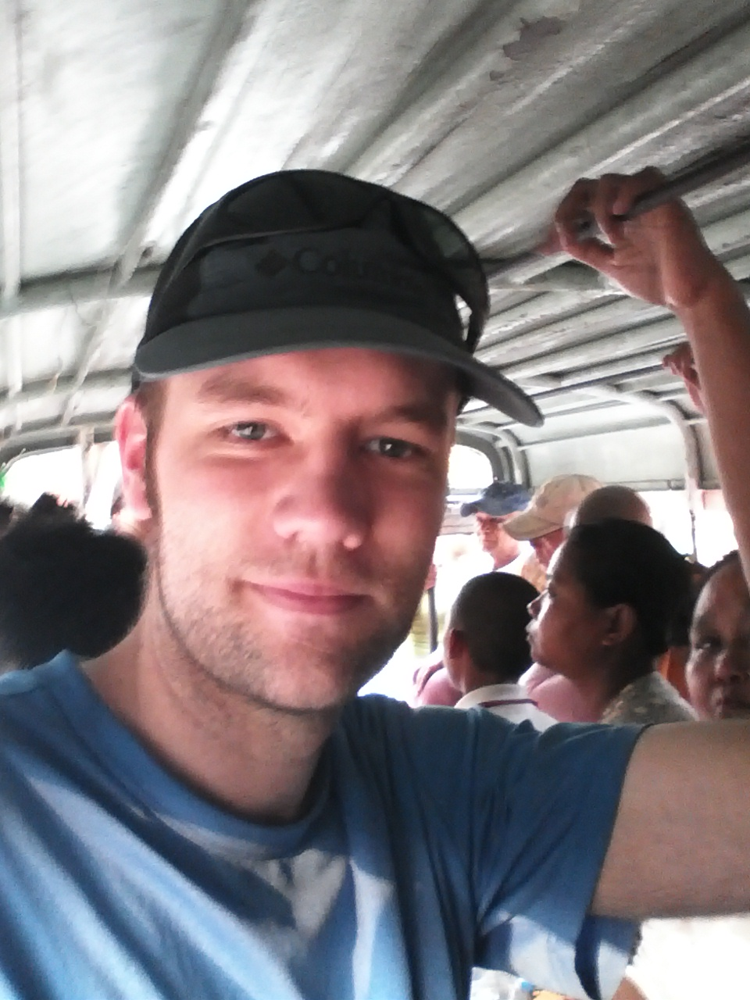
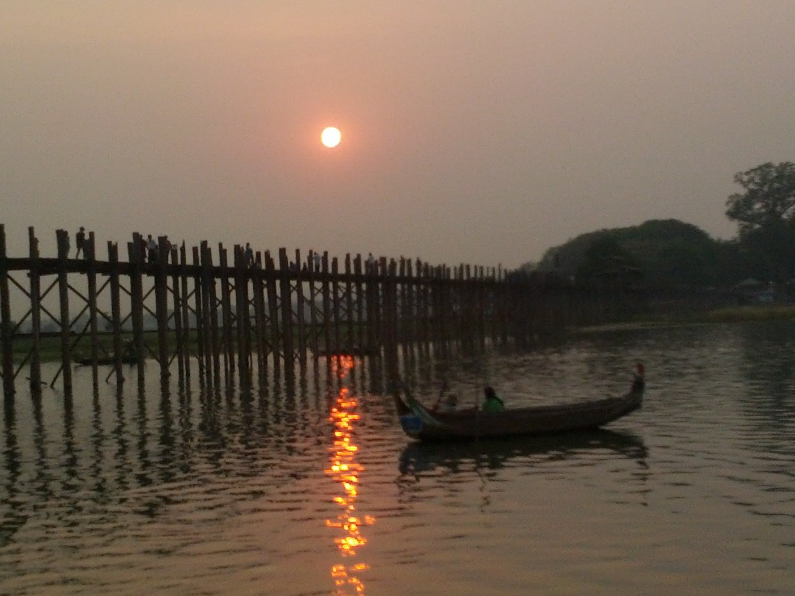
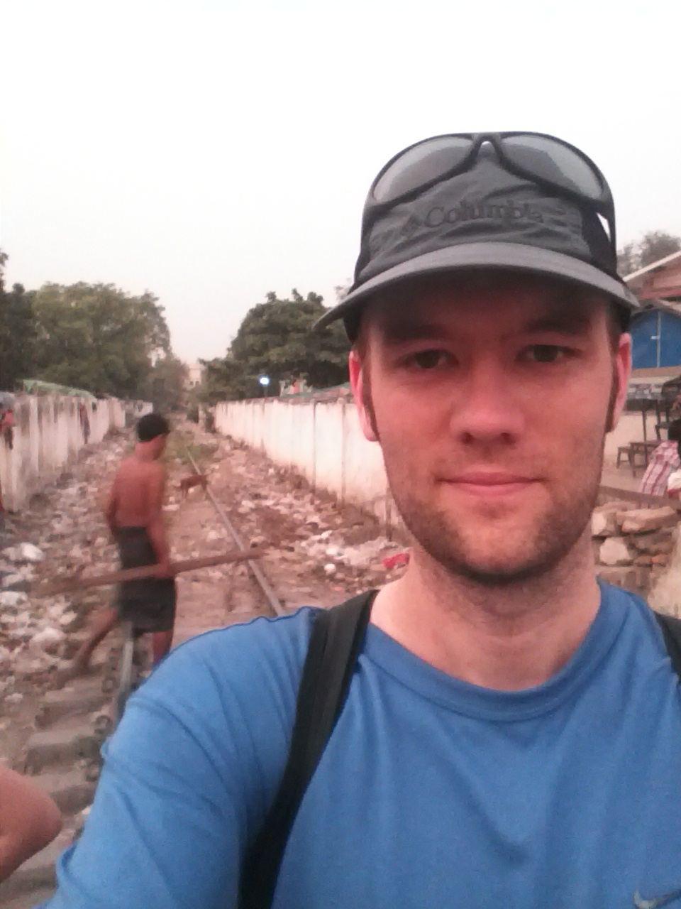

My alarms went off at 5:45, with my bags already packed from the night before. Today would begin my journey back to Mandalay and mark the close of my time in Myanmar. I had desperately wanted to see Bagan after everybody told me how beautiful it was, but travelling there felt too risky during the New Year festivities. On a longer trip, I would have taken the gamble, but not with such a tight schedule.

I ate a quick breakfast on Level 6 of Hotel Chindwan and took a panoramic photo from the roof. By about 6:30, I was downstairs, checked out, and boarding a tuk-tuk for the short ride to the bus station. I waited for 25 minutes, boarded my bus, this time taking a seat in the middle, and set off for Mandalay.

This local bus stopped frequently at the beginning and end of the journey, but only at major intersections in between. It quickly filled to capacity, with people occupying every square inch of the aisle and sitting on every available surface at the back.

The ride was pleasant and quicker than my trip out to Monywa, and I was in a safer part of the bus. Although the roads were not especially winding, they were so bumpy that I could not read for more than 15 minutes at a time. The bus came to a screeching halt only once, when a scooter carrying two people cut directly in front of us. I was almost certain we had clipped them, but they swerved away just in time and the bus continued.

After only three and a half hours, I arrived in Mandalay. The bus station was as chaotic as I remembered, and I slipped down a side street to get away. The tuk-tuk and taxi drivers in Mandalay were much more persistent than those in Yangon, similar to my experiences in Vietnam and Cambodia. I began walking to my hotel, about two kilometres away, and said to myself, "Kelvin, I like walking with you. There is chaos all around, but I can somehow tune it out when we walk together." After 20 minutes, I saw a giant sign reading "ICE CREAM." I could not resist, so I went in and ordered chocolate ice cream with a few finger-shaped pastries, all for $1.50 USD. At that point, I probably would have paid as much simply to sit in an air-conditioned room, so the ice cream was a bonus.

The rest of the walk took me across a hidden bridge near the railway station after I was shooed away from the stairs to another bridge, which I soon saw was incomplete. It felt as though people were always calling out to me, but with good intentions. I reached my hotel, showered, and began walking to a particular corner where a local bus reportedly left for U Bein Bridge.

The corner of 29th and 84th was filled with local buses, none of them marked and most already half full. I approached the first driver, said the name of the town I wanted, and showed him a map on my phone. "That bus," he replied. I walked to where he pointed, confirmed the destination with the next driver, who nodded, and jumped in.

The bus was only half full, with most people sitting on the benches near the door. What did they know that I did not? Would there be fumes? Was it difficult to get out? Was there some unspoken rule? I never found out. The bus filled up and departed, with someone getting off and another person boarding every block or two.

After about 30 minutes, I saw the blue arrow on Google Maps reach the road I intended to follow, so I jumped off. The driver pointed me in the right direction, which was kind of him.

The walk to the bridge was about 1.5 kilometres, and only a few people asked whether I wanted a lift. As I entered part of Amarapura, a sound became clear: click click swoosh, click click swoosh. It came from secluded rooms and garages attached to houses on both sides of the road. I concluded that it was probably made by weaving machines and caught a glimpse of what appeared to be one through a window.

The sun had almost set by the time I reached the famous U Bein Bridge. After declining a guide and a boat ride on the river, I walked halfway across the bridge and down onto a small island. The sun was setting perfectly behind the bridge, giving me time to take photos and admire the view. The bridge did not "wow" me in the way that the Mona Lisa, the Opera House, or even Everest from afar had, but it was still beautiful, except for the rubbish scattered everywhere.

As the sun set, I navigated back through the temples and down several small alleyways. Someone called out after I crossed the railway tracks and, as usual, steered me in the right direction. I emerged onto the main road by the fire station as planned, ready to catch a local bus back to Mandalay. After a basic conversation with the fire-station staff, I learned that the next bus would not arrive for another 20 minutes.

 You can see all my photos from the trip on my [Myanmar album](https://plus.google.com/photos/102101489843655881853/albums/6007323388582033025?authkey=CIWFiI3T_dvXQA) on Google+.
