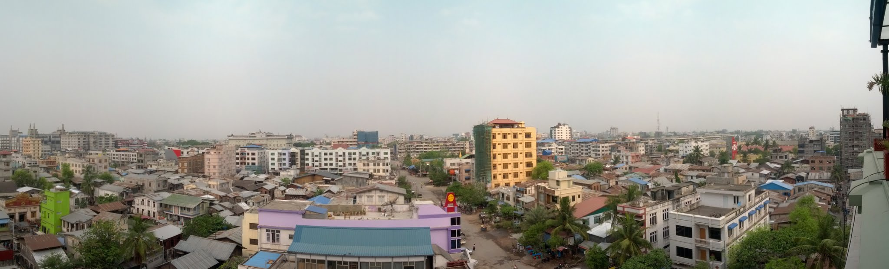
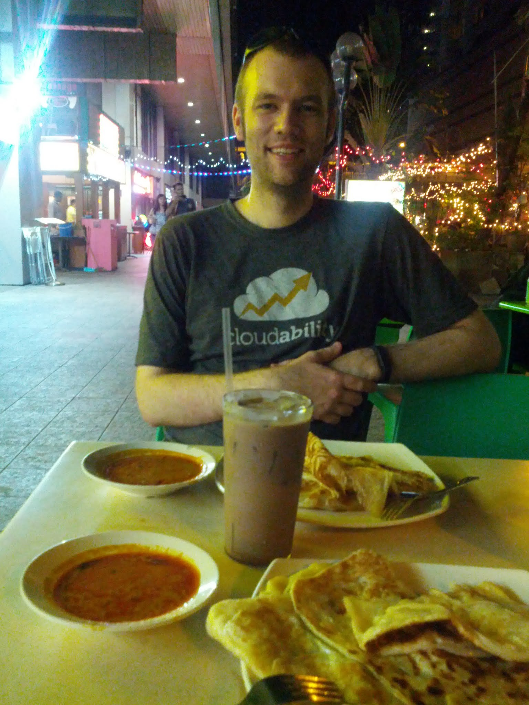

With my brief trip coming to an end, I woke up, had breakfast on the roof of Hotel Yadanarbon, and caught my private shuttle to the airport. The airport was a considerable distance outside the city, about twice as far away as U Bein Bridge.

I arrived at the airport with plenty of time, before check-in had opened, and waited in the downstairs cafe while a group played audio from an iPad at full volume, seemingly indifferent to those around them. Once check-in opened, people cut into the queue from both sides. I eventually boarded my flight and took off for Bangkok.

In Bangkok, I tried to transfer but was stopped because I had not purchased the "transfer option." It had never actually been offered because I had booked two separate tickets, and there was no way to buy it on arrival. Although I had plenty of time, I therefore needed to obtain a $15 USD landing visa for Thailand simply to walk out and back in.

Once back inside, I had a small Japanese lunch and a large Starbucks coffee. My flight to Singapore was called, and a few hours later I was there.

I often forget how modern Singapore is, and it was a relief to return. Airport customs was efficient, the transport was second to none, and I found my hotel immediately. Despite the humidity, I asked the staff for their favourite curry place, walked a few blocks, and ordered plenty of roti. It was a relief to have familiar food again. I walked back to the hotel feeling tired and realised I was coming down with something.

The next day, I woke up, had breakfast at the hotel, and resigned myself to the fact that I was getting sick. I was developing headaches and felt unusually tired. I washed my hands every five minutes, checked out, and hurried to catch the bus.

After locating Buffalo Street near Little India, I found my bus arriving right on time. The driver was courteous and the bus was clean. I was ready for the 375-kilometre journey to Kuala Lumpur. The bus departed at 10:30.

After crossing the border into Malaysia, I reboarded my bus and continued for only a few minutes. It then stopped, and I was moved to another bus that was nearly full, quite dirty, and hot. I realised the company probably wanted to combine the two services, so I tried to make the best of it and settled into my new seat. My headache worsened.

Thirty minutes later, I smelled cigarette smoke. The bus was supposed to be non-smoking, but I initially could not find the culprit. Then I spotted him: the driver. He finished his cigarette, and I assumed it would be a one-off, so I turned up the air conditioning to keep the smoke away from me.

A few minutes later, the bus pulled into a petrol station, apparently in search of fuel. What bus company sends a bus on a journey without enough fuel? For whatever reason, the driver could not fill up there, so we went to a second station and then a third, where he finally began refuelling the bus.

The trip had already soured: we were significantly late, and I smelled of smoke. The driver paid for the fuel, and we set off. Almost immediately, I smelled smoke again, so I grabbed my phone and walked to the front of the bus to question the driver.

"Is this a smoking or non-smoking bus?" I asked.

The driver, cigarette in hand, mumbled, "It is a non-smoking bus."

"So it is non-smoking, but you're smoking?" I replied.

"Yes, but I'm..." [mumbling] "driving the bus."

I walked back to my seat, hoping the conversation would persuade him not to smoke again.

He stopped for several hours, but as the delays mounted, he began smoking heavily again. The bus reached the outer suburbs of Kuala Lumpur at 17:30, seven hours after departing. It dropped off several passengers, and I waited patiently for it to continue to the final terminal, only a few stops from my hotel. Instead, it moved behind a building and stopped. We did not move for 20 minutes, and the driver was nowhere to be seen. Eventually, I spotted him and asked what was happening. "Bus broken, new one coming," he said. "Why did you walk away without saying anything? Why didn't you tell us it was broken?" I asked. Other passengers were beginning to lose patience. I asked someone whether an MRT station was nearby and, when they said yes, immediately grabbed my bags and left the bus. As I took photos of the bus and driver, he appeared close to losing his temper.

I walked quickly to the station, jumped on a train, and arrived at my hotel 30 minutes later. The Hilton was a welcome sight.

I had found a Hilton promotion which, combined with my Hilton Gold card, upgraded me to an executive suite with food, drinks, and 26 floors of distance from the chaos below. I couldn't have imagined a better place to get ill.

I cleaned up, had dinner, and returned to sleep. I stayed in the enormous, clean bed until the next day, had breakfast, and went back to bed until 15:00. My headache was improving by then, but I was still tired. My flight was not until almost 22:00, so I had seven hours to fill. I spent a few hours in the new mall near KL Sentral, eating giant pretzels, and another few hours in the Starbucks at the airport.

I took a nap in the airport after security, where I was probably bitten by a few bugs, and finally made my way to the gate. I boarded, settled into my flat-bed seat, and was soon on my way home.
