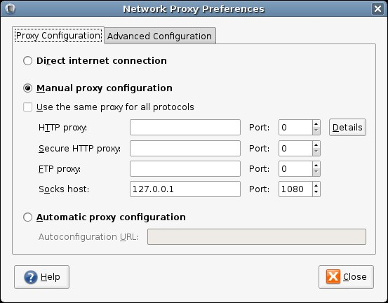
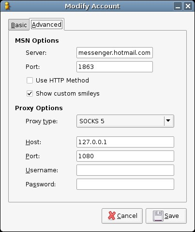
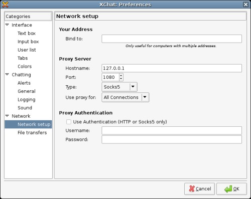
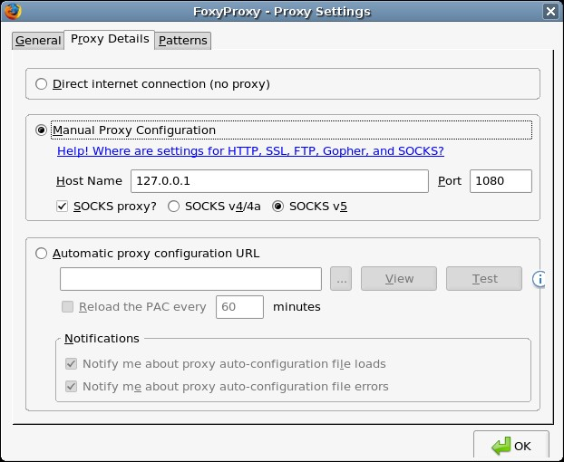
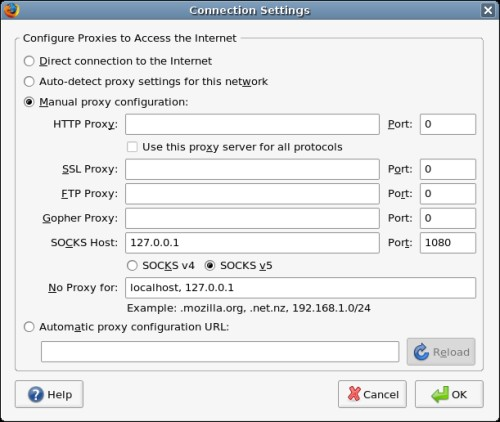

As a rule, whenever I'm online I'm logged into my server back in the States. I'm also usually wireless, which we all know is beyond insecure -- I've found it _especially_ useful to tunnel firefox over SSH. I try my best to tunnel stuff over SSH back, and if you want to also, this is how.  

#### Setup the SSH/SOCKS tunnel

I'm on Linux, so this is pretty darn easy.  
```bash
ssh user@domain.com -D 1080

```  
If the SSH daemon runs on a different port, you'd do something like this:  
```bash
ssh -oPort=1234 user@damon.com -D 1080

```  
Remember ports below 1024 are reserved, and you would need root access. Now it is time to configure the different programs to use the newly created tunnel.  
  

[](gnome-settings.jpg)

#### Setting up Gnome (optional)

[](msn-settings.jpg)

#### Tunneling Pidgen

[](xchat-settings.jpg)

#### Tunneling XChat

**Tunneling Firefox**  
_Note_: I'm going to list two examples, one is with FoxyProxy and the other is with the ordinary proxy settings.  
  

[](foxyproxy-settings.jpg)

#### FoxyProxy

[](firefox-settings.jpg)

#### Normal Proxy

_Make sure the other fields or empty, or you won't connect._  
  
So, there you have it. There are quite a few unix shell providers out there, I'm sure it wouldn't be too hard to spot a link for one. I've seen [QuadSpeedInternet](http://www.quadspeedi.net/?page=services) having SSH access for $3/month, and [JVDS](http://www.jvds.com/freeshells/) or [Lonestar](http://sdf.lonestar.org/) offering possible free shells. Alternatively, you could just get a _really_ inexpensive VPS at [VPSLink](http://www.vpslink.com/vps-hosting/) ($6-$8/month, but they often have 25% off discounts).