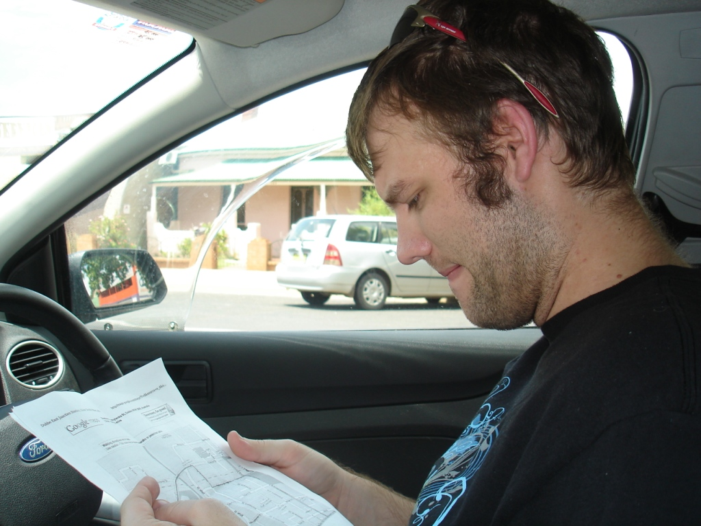
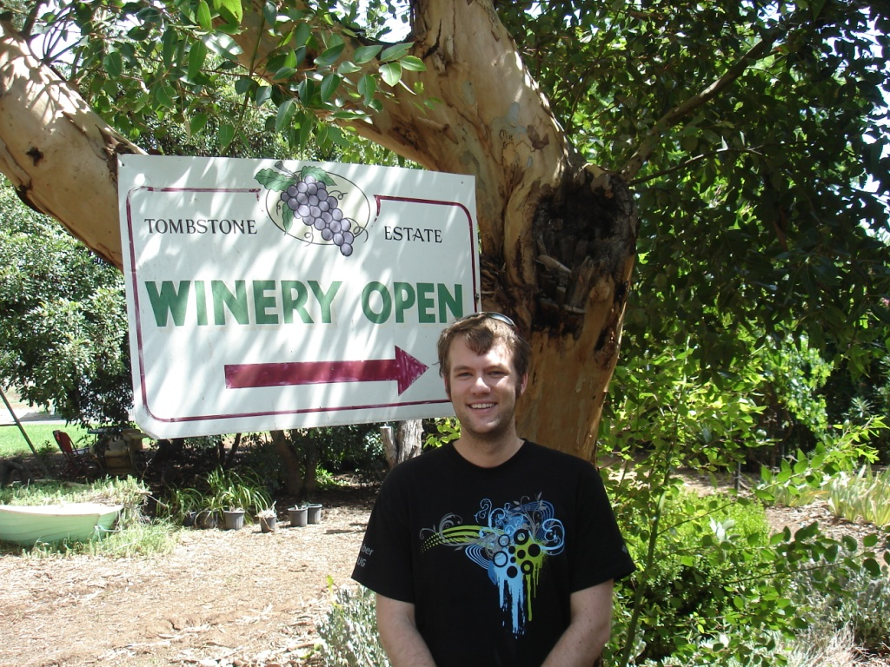
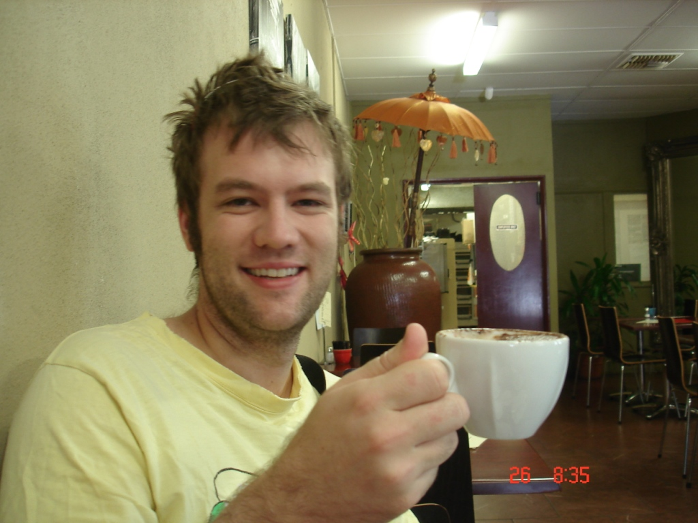
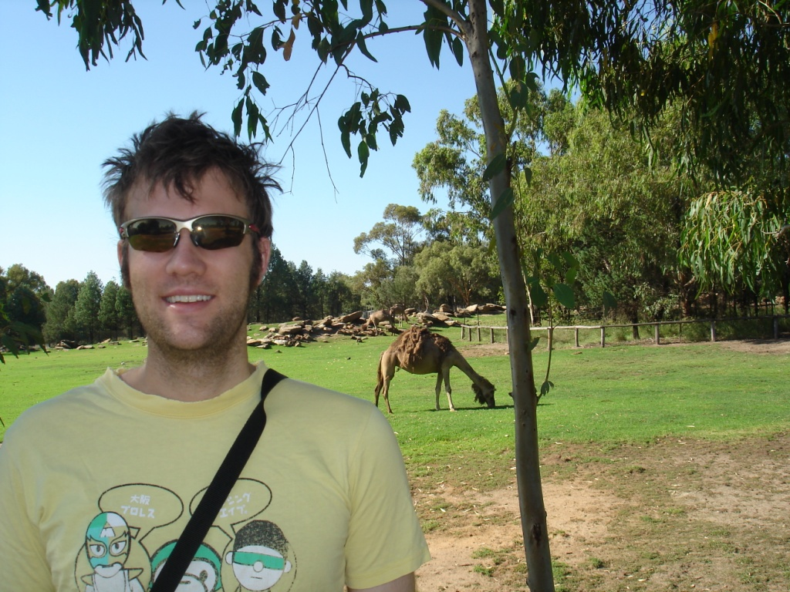

I am a big fan of trains. I especially like sitting back and relaxing, reading a good book, and writing postcards. After my 60-hour train ride through China, the six-hour train ride from Sydney to Dubbo was no problem.

Before visiting Dubbo, I researched how to get around without a car; I like to live green, and renting a car is sometimes a bit expensive. After eventually finding the bus schedule, which didn't even go anywhere near the zoo, I knew I had two options: 1) take taxis and rent a bike, or 2) rent a car. Two bikes for four hours at the zoo cost $30, plus the taxi around the city. Unfortunately, Dubbo is just a bit too big to comfortably walk around, and being in Western NSW, it is 40°C during the summer. I opted to rent a car.

Two blocks from the rail station was Budget, where I had pre-booked a small rental. I quickly visited my hotel, the Cattlemen's Inn, and then went to one of the local vineyards, the Tombstone. I had visited several vineyards in New Zealand, the Hunter Valley, and California. I exited the road into the little gravel yard, and didn't see anybody. After walking around for a few minutes I met a man wearing a motor-racing shirt, who wryly called out, "Don't have kids." I entered the plywood wine tasting hut and embarked on the most unique wine tasting experience possible. My host worked in my suburb as a chef at a local pub, but spent half the year in Dubbo with his family tending the vineyard. We also discussed Dubbo's population, working the vines, and Australia in general. The experience was a bit surreal, but interesting, and I left with a bottle of Shiraz and some good memories.

I next visited the cafe with the "best coffee in Dubbo", but the coffee was easily the worst I'd had in Australia. It had "washing-machine" foam, and the espresso was borderline cold. The coffee in Central Station was even significantly better, and I even get a discount. Leaving unsatisfied, I debated what to do. I looked north and saw a national park that could be interesting, and I left for that. Even just 30 minutes outside Dubbo I started to have a sense of the "real Australia," of Steve Irwin, and then I went back to the hotel.

On the way back I stopped by the local Indian restaurant, which actually had very good curry, and finally settled back in my hotel. I spent the rest of the night watching the Australian Open and the news, eating curry and blue cheese, and finally fell asleep.

The next morning I checked out of the Cattlemen's, which I'd recommend if there is a sale, and drove through the CBD to the only place I found open, a little cafe with a cheerful, distinctly Australian atmosphere. Then again, it was Australia Day, so the flags were out in force. She brought me my cappuccinos, and I had to admit, the other cafe should have its "best coffee" title stripped away. The coffees were not spectacular, but at least they tasted like the cappuccinos in Sydney. The chocolate muffin was even good, and after eating I left for the zoo.

Although the zoo is a bit expensive at $45 per person (I got a student discount), I basically came to Dubbo for no other reason. I'm glad I entered the zoo right at 9:00, because spending the afternoon in 40°C+ heat wouldn't be much fun. I allowed about four hours to travel around the zoo, and unless you're an animal fanatic, I think that's about right. It seemed like I was being passed by more cars than I was passing, so I'm guessing most people did it in far less than four hours. Although I had seen all the animal types before, many in the wild (like the deer my mom shoos away from her garden), I still had fun. If anybody is thinking about visiting the Dubbo Zoo, I would almost recommend walking and leaving the car at the parking lot. It might be a little far, but if you have a hat and lots of water, you'll save yourself a lot of trouble getting in and out of your vehicle.

After the zoo I went to get food at "Hog's Breath", an American-style steak restaurant on the corner of the CBD. Although I should have ordered the 18-hour slow-roasted steak, I opted for a hamburger. One thing to note: if they ask you "do you want avocado or bacon with that?" what that actually means is "if you want avocado or bacon, I'll charge $3.50 for each, even though your burger is only $12". Twelve dollars for a burger felt a little steep - I can get a steak and Guinness at some places in Sydney for that. However, it did taste pretty good, so I left it at that and went to the train station.

I dropped off my backpacks and returned the car a few blocks away, yet nobody was around. I left the keys in the key-deposit slot and walked back to the train station. The train arrived shortly afterwards, I boarded, and six hours later I was home, and the adventure was over. My overall impression? This was a good short adventure to keep the travel bug at bay for a few months.
