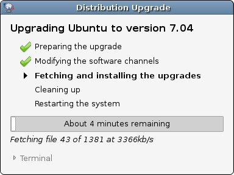
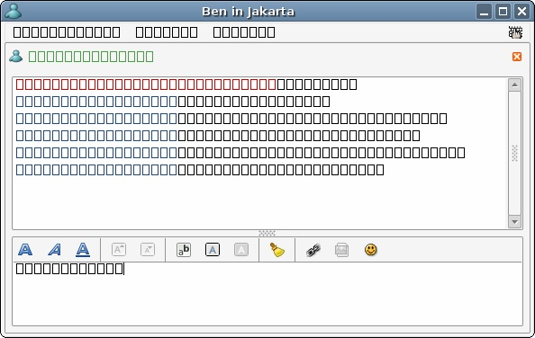

Having been in I.T. for quite a few years, upgrading can sometimes be quite a hassle. Having switched to Linux for many years, the crazy upgrade madness of windows is gone. So, how easy is upgrading in Linux?

  
  
  
  

Yea, pretty darn easy, I must admit. And my system certainly isn't normal! It has been an upgrade from Debian Sarge(ish) -> Ubuntu LTS(ish) -> 6.10 -> 7.04... The only hiccup was at some point when the fonts were reinstalling (I totally ignored the "close all programs" warning:  
  
  
  
