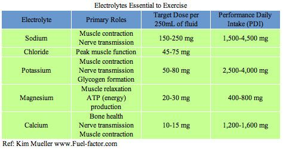

In about 2001 or 2002 I read a book called "Beyond Backpacking - Ray Jardine's Guide to Lightweight Hiking", which set me on a path to being as light as possible. It came in very handy when I did my first section hike of the PCT, about 7 days, and I vaguely remember a total pack weight of about 25 lbs - with 4 litres of water. I was a broke college student then, so I guess clipping toothbrushes and straps really paid off. I also used a weird mesh hammock thing and I think a tarp of some kind. I have been "ultralight" ever since, even when renting equipment in Patagonia.

  

Anyways, the mindset has stuck 20 years later. I now am fortunate enough to have more funds to purchase better equipment, but always keen to read about recommendations on how to have a better experience and maybe even save a little weight.

  

Recently a [series of videos](https://www.youtube.com/channel/UCflIoVkAjQnyAwDKFmhRDDw) was pasted on YouTube that touched on food, and they were _terrific_. I had always been pretty good about choosing which food to take. Here in Australia, my general rule of thumb was to try and get something as close to 2000kJ per 100g as possible, and then 4 or 5 stars. This insured I was getting calorie dense food, but with the videos mentioned above, I think I can now get _the right_ calories.

  

I am pasting my notes below as reference purely for myself, although I might come back around and paste suitable options from Woolies or Coles that are suitable. If you have an hour or two, and like backpacking, then I really encourage you to have a watch.

  

**Breakfast**

  

Mixture of simple (high GI) and complex (low GI) carbs. Simple carbs hand off to complex carbs hand off to fats.

  

Ideal ratio for breakfast:
* 65% calories from fat
* 28% from carbs, ideally split complex/simple, maybe leaning to simple
* 7% from protein

  

**Trail Food**

  

Probably want something in the 5% - 15% calories from sugar range, unless eating smaller portions more often, and then 15% - 25%.

  

Ideal ratio for the trail:

* 65% calories from fat
* 28% from carbs, ideally split complex/simple, maybe leaning to complex
* 7% from protein

  

**Recovery**

*   Drink mix consumed within 15 minutes of finishing for the day.
*   Ideally a carb/protein ratio between 3:1 and 4:1. 
*   Avoid fat. 
*   Glucose and fructose around 3:1. 
*   Frog fuel (collagen) or hydrolysed whey isolate.

  

**Dinner**

  

Between 20 - 30g of _high quality_ protein, the rest of calories rich in fat, and as close to bed time as possible for thermogenic effect.

  

**Electrolytes**

A few key bullet points on usage of electrolytes:

  

Three states of dehydration:
- hypertonic: water loss is greater in comparison to sodium loss, so serum sodium concentration increases
- hypotonic: water loss is accompanied by excessive sodium loss, so serum sodium concentration decreases
- isotonic: water and sodium are lost at the same rate

More notes: 
- Hypernatremia is a _result_ of dehydration.
- Hyponatremia is not a result of dehydration, but a result of treatment of dehydration with fluids that do not contain enough sodium.
- Hiking for 8.5 hours @ 435mg Na/hr = 3600mg lost sodium

Expected losl per hour:
- Na 300 - 500
- K 100 - 160
- Mg 40 - 60
- Ca 20 - 30

More notes:
- Reminder that to monitor water intake, urine frequency and colour is the way to go.
- Condition most likely to encounter on the trail is "exercise-associated hyponatremia", aka drinking plenty of fluids, but not enough electrolytes. One symptom of hyponatremia is swelling, in particular in hands and feet. Ring is a sensitive instrument... "snug fit, time to start taking on electrolytes with water. Loosey goosey? No need to supplement beyond what already get from trail snacks."

Lots of sodium - 4,500mg would be for long days hiking in the heat  

  
**_In Practice_**

Here is a [follow-up comment](https://www.reddit.com/r/Ultralight/comments/i023nd/ultralight_food_performance_nutrition_for/fzp0gf3/) on what that might look like in practice:

Breakfast - a 2-serving Backpacker's Pantry Granola, 1240 Cal, 34g protein

Trail Snacks - your average Kind bar ranks as Light or Very Light, runs close to a 4:1 ratio and has an average 5g protein per 200 Cal, extrapolate for 1000 Cal of same or similar to get another 25g protein

Recovery Shake - Gatorade Recover packet and a Starbucks Via, gives the right ratio for 370 Cal and 21g protein

Dinner - Mountain House Chicken & Dumplings 2-serving pouch, 600 Cal and 33g protein