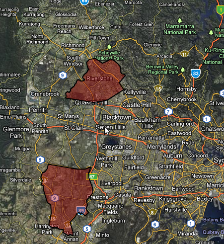
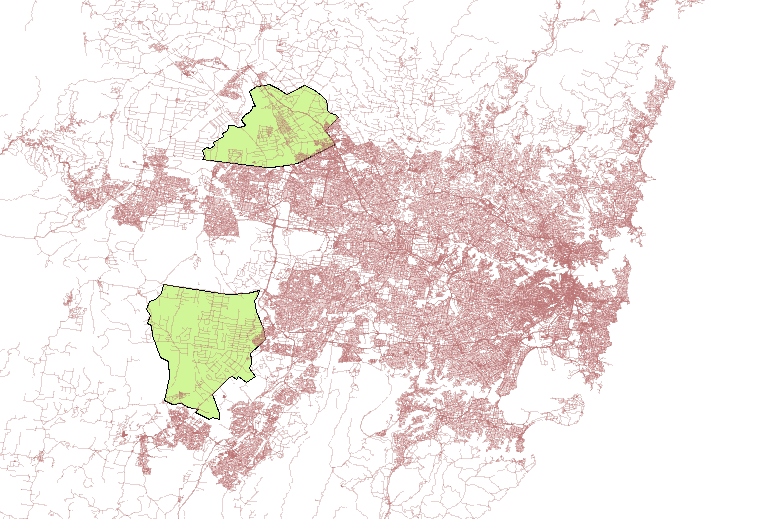
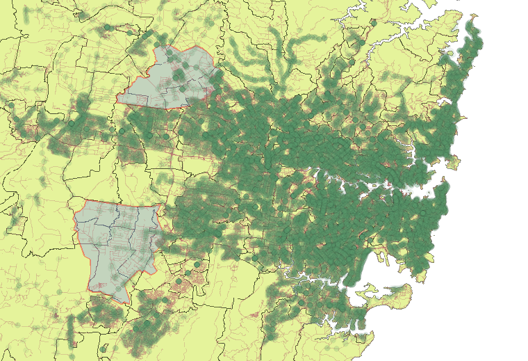

I've had several conversations with neighbors and co-workers about the "lack" of forward thinking, or at least the lack of forward action. Of course, I keep in the back of my mind that we aren't "experts", and the more I learn about transport the more I learn how complex it is. Dr. Sussman's _CLIOS_ process (Complex, Large-  
Scale, Integrated, Open Systems) appears more and more true the longer I work in and study transport. There is a plethora of excuses that can be made, but the general conclusion was that the earlier we prepare the better. I can remember working near Zhongshan 7-8 years ago and driving around on huge roads in the middle of empty fields. There weren't even stoplights at every intersection. It was then that I had an epiphany of how smart the planning was to build the infrastructure _before_ the masses arrived.  
  
Sydney is estimated to increase by some 1.7 million people by 2036, and I can tell you, from a transportation (private and public) standpoint, that sort of scares me. When people ask me why transport is so difficult I justify it by with my uneducated guess that the CBD is next to the ocean, so everybody travels in from just 180 degrees instead of 360. Maybe this is why the NSW government created the "[City of Cities](http://www.metrostrategy.nsw.gov.au/TheStrategy/tabid/38/language/en-US/Default.aspx)" strategy. I realized this within the first few weeks: most people live west but work east.  
  
Tonight (a Saturday) I was bored, and should have been studying, but wanted to create a few visualizations first.  
  
The below maps were created using TDX data released from 131500. After converting it to GTFS I imported it into PostGIS using GTFSDB, and then could serve it via GeoServer. Finally, I could access it via WMS in QGIS. I added the stops into a map of Sydney and added some boundaries, and added the Growth Zones. The result was a map with every bus/train/ferry stop. Darker areas have stops that are closer (not necessarily more frequent service).  
  
  
  
  
  
  
  
  
One of the first things I noticed is that there isn't much physical infrastructure in these areas. There also aren't many transit stops; I suppose this is why the [South West Rail Link](http://en.wikipedia.org/wiki/South_West_railway_line,_Sydney) is going to be so important. I don't know all of the political ramifications, but let's hope the [North West Rail Link](http://en.wikipedia.org/wiki/Proposed_railways_in_Sydney#North_West_Rail_Link_.28NWRL.29) is built as well?